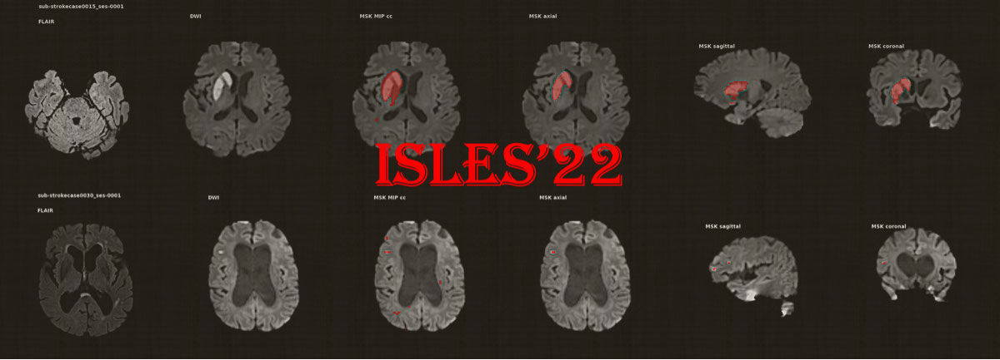
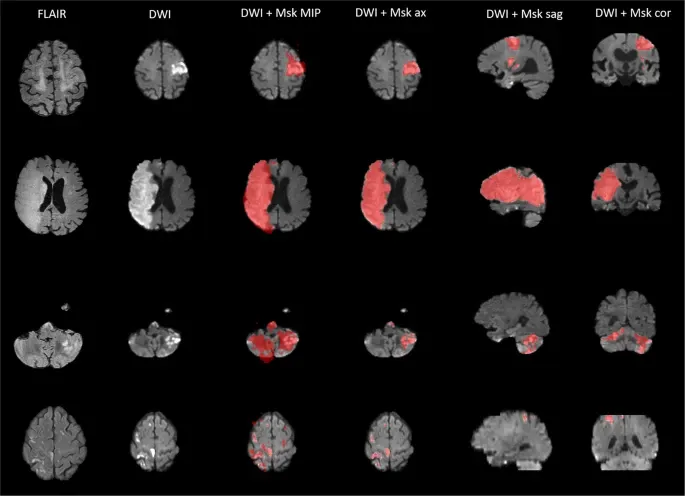
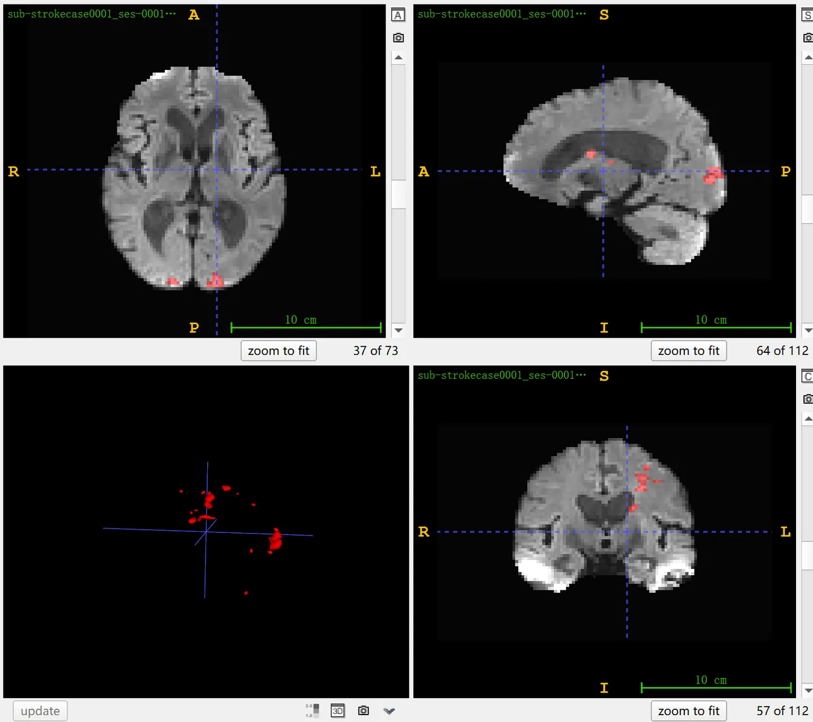

# ISLES22

<div align="center">
    <a href="https://github.com/openmedlab/"></a>
</div>
<p style="text-align:center;font-size:10px;"><em></em></p>

## Dataset Information

**ISLES22** (**I**schemic **S**troke **LE**sion **S**egmentation) aims to automatically segment acute to subacute ischemic stroke lesions using multimodal MR imaging (including FLAIR, DWI, and ADC) and is one of the challenges at MICCAI 2022. This dataset compiles 400 multi-center, multi-device MRI cases, which display a high degree of variability in the size, number, and location of stroke lesions. The dataset is divided into a training set of 250 cases and a test set of 150 cases. All training data is open to the public, while the test data is used solely for model validation and is not disclosed. Stroke is a leading cause of morbidity and mortality worldwide, with up to two-thirds of stroke survivors suffering from permanent disability. The ISLES challenge has been held since 2015, hosting several editions, and has played a significant role in identifying outstanding methods for the segmentation of acute and subacute ischemic stroke lesions. Compared to previous editions of the ISLES challenge, ISLES22 is the largest in scale, with more than six times the data volume of ISLES15, covering not only large infarct lesions but also multiple emboli and cortical infarcts, and has evaluated preoperative and postoperative MR imaging across datasets from multiple centers and scanning devices.

## Dataset Meta Information

| Dimensions | Modality | Task Type | Anatomical Structures | Anatomical Area | Number of Categories | Data Volume                    | File Format |
|------------|----------|-----------|-----------------------|-----------------|--------------------|--------------------------------|-------------|
| 3D         | MR       | Segmentation | Stroke lesions        | Head            | 1                  | 250 for training, 150 for test | .nii.gz     |


### Resolution Details

The size statistics for the DWI modality images are as follows. It should be noted that in the original data, the sizes of DWI, ADC, and GT are aligned within each case, but the size of FLAIR is generally larger. A simple method for use is to resample FLAIR to match the size of the other two modalities.

| Dataset Statistics | spacing (mm)      | size            |
|--------------------|-------------------|-----------------|
| min                | (0.88, 0.88, 2.0) | (112, 112, 25)     |
| median             | (2.0, 2.0, 2.0)   | (112, 112, 72) |
| max                | (2.0, 2.0, 5.0)   | (256, 256, 76) |

The number of 2D slices for the three modalities in the training set of 250 cases: 47,082 (after resampling FLAIR to the same size as DWI).

## Label Information Statistics

| Segmentation Class | Ischemic Stroke Lesion  |
|--------------------|-------------------------|
| Case Count         | 247                     |
| Detection Rate     | 98.8%                   |
| Min Volume (cm³)   | 0.04                    |
| Median Volume (cm³)| 6                       |
| Max Volume (cm³)   | 482                     |

## Visualization

Visualization of dataset, you can use ITK-SNAP to visualize.

Take AutoPET for example:

<div align="center">
    <a href="https://github.com/openmedlab/"></a>
</div>
<p style="text-align:center;font-size:10px;"><em> Paper Visualization: Summarizes four typical types of cerebral infarction images from top to bottom.</em></p>

<div align="center">
    <a href="https://github.com/openmedlab/"></a>
</div>
<p style="text-align:center;font-size:10px;"><em> ITK-SNAP Visualization.</em></p>

## File Structure

The official file structure is as follows, including basic information files such as `LICENSE`, `README`, and `dataset_description.json`. The `participants.tsv` records each patient's age, gender, and weight. Under the `sub-strokecase` folder, the imaging and basic information for each modality of each patient are stored. The `derivatives` folder contains the annotation results for each patient.

``` 
ISLES-2022
|-- LICENSE
|-- README
|-- dataset_description.json
|-- participants.tsv
|
|-- sub-strokecaseXXXX       # From sub-strokecase0001 to sub-strokecase0250, it represents every patient's data.
|   |-- ses-0001
|       |-- anat
|       |   |-- sub-strokecaseXXXX_ses-0001_FLAIR.json
|       |   |-- sub-strokecaseXXXX_ses-0001_FLAIR.nii.gz
|       |
|       |-- dwi
|           |-- sub-strokecaseXXXX_ses-0001_adc.json
|           |-- sub-strokecaseXXXX_ses-0001_adc.nii.gz
|           |-- sub-strokecaseXXXX_ses-0001_dwi.json
|           |-- sub-strokecaseXXXX_ses-0001_dwi.nii.gz
|
|-- derivatives               # Annotation results
    |-- sub-strokecaseXXXX   # From sub-strokecase0001 to sub-strokecase0250
        |-- ses-0001
            |-- sub-strokecaseXXXX_ses-0001_msk.nii.gz
            |-- sub-strokecaseXXXX_ses-0001_snp.png
```

## Authors and Institutions

Ezequiel de la Rosa (icometrix, Belgium / Technical University of Munich, Germany)

Prof. Jan Kirschke (Klinikum rechts der Isar, Technical University of Munich, Germany)

Dr. Benedikt Wiestler (Klinikum rechts der Isar, Technical University of Munich, Germany)

Prof. Bjoern Menze (University of Zurich, Switzerland)

Dr. Mauricio Reyes (University of Bern, Switzerland)

Prof. Roland Wiest (Inselspital Bern, Switzerland)

Dr. Uta Hanning (Department of Diagnostic and Interventional Neuroradiology, University Medical Center Hamburg-Eppendorf, Germany)

Prof. Sook-Lei Liew (University of Southern California, USA)


## Source Information

Official Website: https://isles22.grand-challenge.org/

Download Link: https://doi.org/10.5281/zenodo.7153326

Article Address: https://www.nature.com/articles/s41597-022-01875-5

Publication Date: May, 2022.

## Citation

``` 
@article{hernandez2022isles,
  title={ISLES 2022: A multi-center magnetic resonance imaging stroke lesion segmentation dataset},
  author={Hernandez Petzsche, Moritz R and de la Rosa, Ezequiel and Hanning, Uta and Wiest, Roland and Valenzuela, Waldo and Reyes, Mauricio and Meyer, Maria and Liew, Sook-Lei and Kofler, Florian and Ezhov, Ivan and others},
  journal={Scientific data},
  volume={9},
  number={1},
  pages={762},
  year={2022},
  publisher={Nature Publishing Group UK London}
}
```

Original introduction article is [here](https://zhuanlan.zhihu.com/p/659046146).