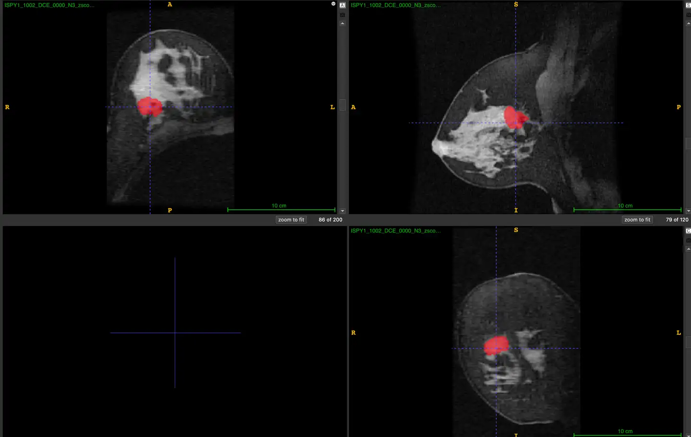

# ISPY1-Tumor-SEG-Radiomics

<div align="center">
    <a href="https://github.com/openmedlab/"></a>
</div>
<p style="text-align:center;font-size:10px;"><em></em></p>

## Dataset Information

The ISPY1-Tumor-SEG-Radiomics dataset is an MRI modality dataset for tumor segmentation, part of the TCIA collections. It includes 483 cases and enhances the ISPY1 dataset by providing uniformly processed imaging data, annotated tumors, and comprehensive quantitative imaging features. Specifically, the dataset includes: a) uniformly processed scans with harmonized intensity and spatial features suitable for computational studies; b) computationally generated and expert-revised tumor region annotations; and c) extensive quantitative imaging features corresponding to these tumor regions. The existing ISPY1/ACRIN 6657 dataset on the TCIA website describes the volume of interest (VOI) and functional tumor volume (FTV) of tumors. The VOI encompasses the enhanced tumor region within a 3D rectangular boundary including surrounding tissues without specific boundaries or shapes, while the FTV describes only the enhanced portions of the tumor. These existing segments do not include the non-enhanced parts of the tumor, which are crucial for understanding and quantifying the disease.

This dataset provides segmentation of the entire 3D primary lesion, including both enhanced and non-enhanced tumor areas, defined as structural tumor volume (STV). These STV annotations are manually delineated, generated after confirming the location of the primary lesion, reviewed, and approved by certified breast radiologists, and significantly differ from the FTV. We believe these STV annotations will aid in analyzing the entire disease burden and tumor heterogeneity, deepening our understanding of disease mechanisms, and thereby improving patient outcomes.

## Dataset Meta Information

| Dimensions | Modality | Task Type    | Anatomical Structures | Anatomical Area | Number of Categories | Data Volume | File Format |
|------------|----------|--------------|-----------------------|-----------------|----------------------|-------------|-------------|
| 3D         | MRI      | Segmentation | Breast tumors         | Chest           | 1                    | 483         | .nii.gz     |


### Resolution Details

| Dataset Statistics | spacing (mm)        | size             |
|--------------------|---------------------|------------------|
| min                | (1.00, 1.00, 1.00)  | (180, 180, 83)   |
| median             | (1.00, 1.00, 1.00)  | (200, 200, 132)  |
| max                | (1.00, 1.00, 1.00)  | (300, 300, 384)  |

Number of 2D slices in the dataset: 67080.

## Label Information Statistics

| Metric              | Breast tumors |
|---------------------|---------------|
| Case Count          | 483           |
| Coverage            | 100%          |
| Min Volume (cm³)    | 0.41          |
| Median Volume (cm³) | 13.47         |
| Max Volume (cm³)    | 486.16        |

## Visualization

<div align="center">
    <a href="https://github.com/openmedlab/"></a>
</div>
<p style="text-align:center;font-size:10px;"><em>Mask is breast tumors.</em></p>

## File Structure

The folders contain various data files, among which annotation is in xlsx.

``` 
Dataset
│
├── images_bias-corrected_nifti
│   ├── ISPY1_1002
│   │   ├── ISPY1_1002_DCE_0000_N3.nii
│   │   ├── ISPY1_1002_DCE_0001_N3.nii
│   │   ├── ISPY1_1002_DCE_0002_N3.nii
│   ├── ISPY1_1003
│   │   ├── ...
├── images_bias-corrected_resampled_zscored_nifti
│   ├── ISPY1_1002
│   │   ├── ISPY1_1002_DCE_0000_N3.nii
│   │   ├── ISPY1_1002_DCE_0001_N3.nii
│   │   ├── ISPY1_1002_DCE_0002_N3.nii
│   ├── ISPY1_1003
│   │   ├── ...
├── masks_ftv
│   ├── ISPY1_1002.nii.gz
│   ├── ISPY1_1003.nii.gz
│   ├── ...
├── masks_stv_manual
│   ├── ISPY1_1002.nii.gz
│   ├── ISPY1_1003.nii.gz
│   ├── ...
├── masks_stv_resunet
│   ├── ISPY1_1002.nii.gz
│   ├── ISPY1_1003.nii.gz
│   ├── ...
├── captk_parameter_file_ispy1.csv
├── ISPY_DataPaper_features.xlsx
```

## Source Information

Official Website: https://www.cancerimagingarchive.net/analysis-result/ispy1-tumor-seg-radiomics/

Download Link: https://www.cancerimagingarchive.net/analysis-result/ispy1-tumor-seg-radiomics/

Publication Date: 2022-06

## Citation

``` 
@article{chitalia2022expert,
  title={Expert tumor annotations and radiomic features for the ispy1/acrin 6657 trial data collection},
  author={Chitalia, R and Pati, S and Bhalerao, M and Thakur, S and Jahani, N and Belenky, JV and McDonald, ES and Gibbs, J and Newitt, D and Hylton, N},
  journal={The Cancer Imaging Archive},
  year={2022}
}
```

Original introduction article is [here](https://zhuanlan.zhihu.com/p/709869028).