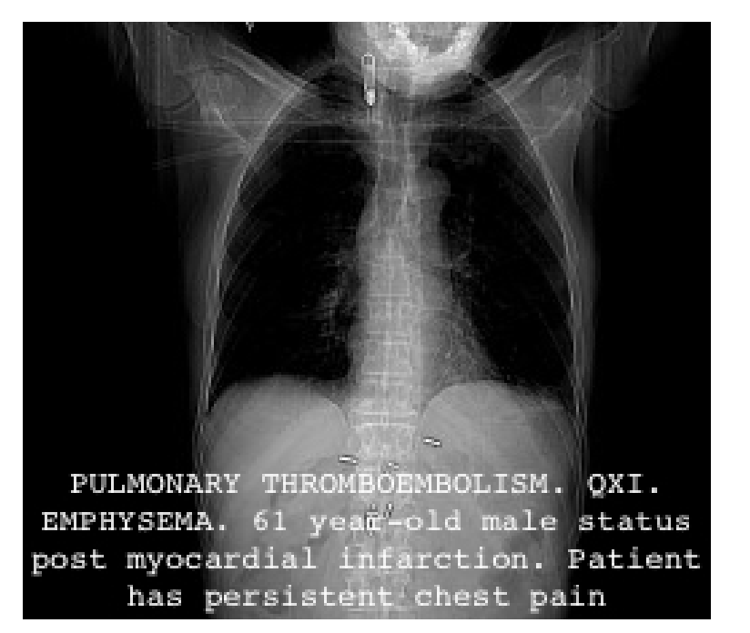
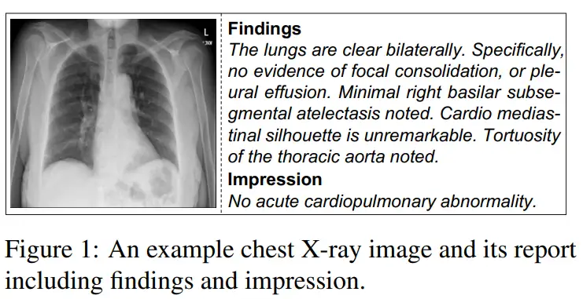

# IU-Xray

<div align="center">
    <a href="https://github.com/openmedlab/"></a>
</div>
<p style="text-align:center;font-size:10px;"><em></em></p>

## Dataset Information

The IU-XRay (Indiana University Chest X-Rays) dataset contains a set of chest X-ray images and their corresponding diagnostic reports, collected by Indiana University. It includes 7,470 frontal or lateral chest X-ray images and 3,955 corresponding reports. Each radiology report includes four sections. The Comparison section contains prior patient information (e.g., previous medical examinations); the Indication section details symptoms (e.g., hypoxia) or reasons for the examination (e.g., age); the Findings section lists radiological observations; the Impression section outlines the final diagnosis. Ideally, a system should generate the Findings and Impression sections, possibly linking them together.

Radiologists or other physicians may need to examine many biomedical images daily, such as PET/CT scans or radiographic images, and write their findings into medical reports. Assisting physicians to focus on areas of interest or to describe findings can reduce medical errors (e.g., by providing diagnostic suggestions to less experienced doctors) and benefit the medical sector by reducing the cost per examination. Despite the importance of biomedical image description, resources are not readily available, which hinders the emergence of new methodologies. IU-XRay is a relatively early dataset that significantly advanced the field of diagnostic report generation at the time. Currently, the dataset is mainly used to evaluate the medical report generation capabilities of large multimodal medical models (such as MedDr, RadFM).

## Dataset Meta Information

| Task Type              | Language  | Train | Val | Test | File Format  | Size |
|------------------------|-----------|-------|-----|------|--------------|------|
| RG (Report Generation) | English   | 5226  | 748 | 1496 | PNG          | 14GB |

## Dataset Information Statistics

| DATASET   | Train  | Val  | Test  |
|-----------|--------|------|-------|
| IMAGE #   | 5,226  | 748  | 1,496 |
| REPORT #  | 2,770  | 395  | 790   |
| PATIENT # | 2,770  | 395  | 790   |
| AVG. LEN. | 37.56  | 36.78| 33.62 |

The first column represents preferred terms from MESH and RadLex. The source of each of post-coordinated terms is given in the second column.

| Code                  | Source(s)          | # Coded reports (% of 2470 non-normal reports) |
|-----------------------|--------------------|-----------------------------------------------|
| Cardiomegaly          | MeSH               | 375 (15.1%)                                   |
| Pulmonary atelectasis | MeSH               | 347 (14.0%)                                   |
| Calcified granuloma   | MeSH/RadLex        | 284 (11.5%)                                   |
| Aorta/tortuous        | MeSH/RadLex        | 253 (10.2%)                                   |
| Lung/hypoinflated     | MeSH/RadLex        | 245 (9.9%)                                    |
| Opacity/lung base     | RadLex             | 203 (8.2%)                                    |
| Pleural effusion      | MeSH               | 172 (6.9%)                                    |
| Lung/ hyperinflation  | MeSH/RadLex        | 164 (6.6%)                                    |
| Cicatrix/lung         | MeSH               | 148 (5.9%)                                    |
| Calcinosi/lung        | MeSH               | 141 (5.7%)                                    |

After excluding normal reports, the encoding and proportions of various diseases in the 2470 abnormal reports are detailed. These include Cardiomegaly, Pulmonary Atelectasis, Calcified Granuloma, Aorta/Tortuous, Lung/Hypoinflated, Opacity at the Lung Base, and Pleural Effusion.

## Visualization

<div align="center">
    <a href="https://github.com/openmedlab/"></a>
</div>
<p style="text-align:center;font-size:10px;"><em></em></p>

## File Structure

The dataset file structure is as follows, with data downloaded from Kaggle. Each image, originally in DICOM format, has been post-processed and converted to PNG format: the top/bottom 0.5% of DICOM pixel values were clipped (to eliminate extremely dark or bright pixel outliers), DICOM pixel values were linearly scaled to fit the 0-255 range, and the shorter side was resized to 2048 pixels (to comply with Kaggle dataset restrictions).

```
.
├── images
│   └── images_normalized
│       ├── 1000_IM-0003-1001
│       ├── 1000_IM-0003-2001
│       ├── 1000_IM-0003-3001
│       ├── 1001_IM-0004-1001
│       └── ...
├── indiana_projections.csv
└── indiana_reports.csv
```

## Authors and Institutions

Dina Demner-Fushman (National Institutes of Health Bldg, USA)

Marc D Kohli (Indiana University School of Medicine, USA)

Marc B Rosenman (Indiana University School of Medicine, USA)

Sonya E Shooshan (National Institutes of Health Bldg, USA)

Laritza Rodriguez (National Institutes of Health Bldg, USA)

Sameer Antani (National Institutes of Health Bldg, USA)

George R Thoma (National Institutes of Health Bldg, USA)

Clement J McDonald (National Institutes of Health Bldg, USA)

## Source Information

Official Website: https://paperswithcode.com/dataset/iu-x-ray

Download Link: https://www.kaggle.com/datasets/raddar/chest-xrays-indiana-university

Article Address: https://pubmed.ncbi.nlm.nih.gov/26133894/

Publication Date: 2016

## Citation

``` 
@article{demner2016preparing,
  title={Preparing a collection of radiology examinations for distribution and retrieval},
  author={Demner-Fushman, Dina and Kohli, Marc D and Rosenman, Marc B and Shooshan, Sonya E and Rodriguez, Laritza and Antani, Sameer and Thoma, George R and McDonald, Clement J},
  journal={Journal of the American Medical Informatics Association},
  volume={23},
  number={2},
  pages={304--310},
  year={2016},
  publisher={Oxford University Press}
}
```

Original introduction article is [here](https://zhuanlan.zhihu.com/p/702545284).