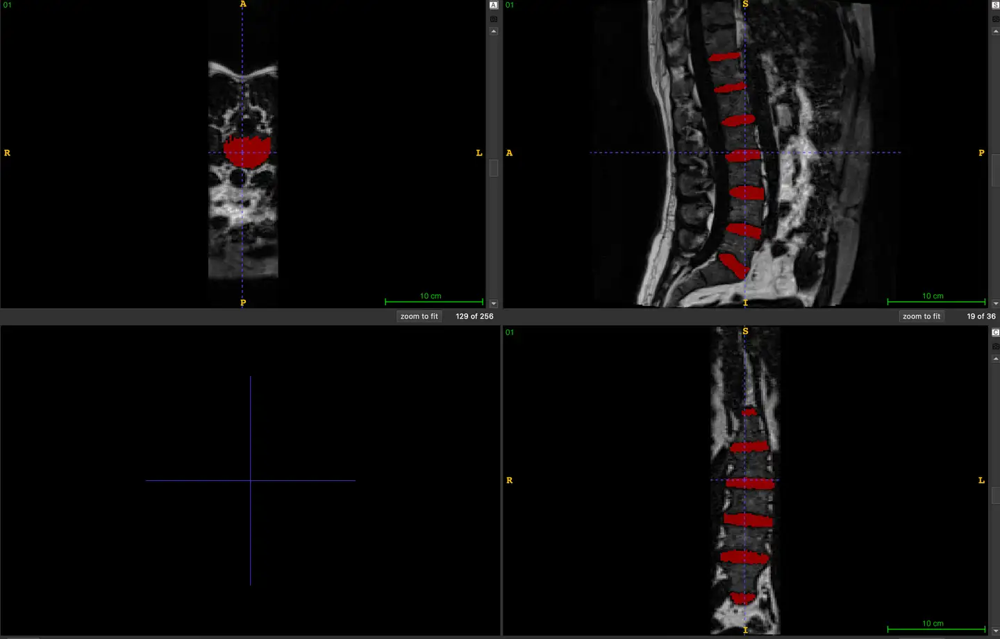

# IVDM3Seg

<div align="center">
    <a href="https://github.com/openmedlab/"></a>
</div>
<p style="text-align:center;font-size:10px;"><em></em></p>

## Dataset Information

The IVDM3Seg dataset is an MRI modality dataset for segmenting intervertebral discs, part of the MICCAI 2018 challenges. It includes 16 cases. Low back pain (LBP) is one of the most common health issues and a major cause of disability affecting work performance and well-being. Numerous clinical studies have repeatedly reported a strong association between LBP and degenerative changes in intervertebral discs (IVDs). Although nearly all medical imaging techniques are used to assess lumbar degenerative disc disease, magnetic resonance imaging (MRI) is widely regarded as the preferred imaging technique for assessing lumbar IVD abnormalities due to its excellent soft tissue contrast and lack of ionizing radiation. This has sparked particular interest in developing automated image analysis and quantification methods for diagnosing lumbar spine MR images.

The goal of the IVDM3Seg dataset challenge is to explore (semi-)automated IVD localization and segmentation algorithms and to provide a standard evaluation framework, including a set of multimodal MR images obtained using the Dixon protocol. Participating teams (each with two co-authors) will be invited to co-author a joint journal paper describing and summarizing the challenge results, and submit it to a high-impact journal in the field. This challenge is supported by the 2018 MICCAI workshop and the Computational Methods and Clinical Applications for Spine Imaging challenge.

## Dataset Meta Information

| Dimensions | Modality | Task Type | Anatomical Structures | Anatomical Area | Number of Categories | Data Volume | File Format |
|------------|----------|-----------|-----------------------|-----------------|----------------------|-------------|-------------|
| 3D         | MRI      | Segmentation | Intervertebral disc   | Bones           | 1                    | 16          | .nii.gz     |


### Resolution Details

| Dataset Statistics | spacing (mm)        | size            |
|--------------------|---------------------|-----------------|
| min                | (2.00, 1.25, 1.24)  | (36, 256, 256)  |
| median             | (2.00, 1.25, 1.25)  | (36, 256, 256)  |
| max                | (2.00, 1.25, 1.25)  | (36, 256, 256)  |

Number of 2D slices in the dataset: 4096.

## Label Information Statistics

| Metric              | Tumor  |
|---------------------|--------|
| Case Count          | 16     |
| Coverage            | 100%   |
| Min Volume (cm³)    | 63.14  |
| Median Volume (cm³) | 88.04  |
| Max Volume (cm³)    | 140.07 |

## Visualization

<div align="center">
    <a href="https://github.com/openmedlab/"></a>
</div>
<p style="text-align:center;font-size:10px;"><em>Red is the intervertebral disc.</em></p>

## File Structure

There are 16 data folders under the main directory, and under the folders are data in `nii` format.

``` 
.
├── 01
│   ├── 01_fat.nii
│   ├── 01_inn.nii
│   ├── 01_Labels.nii
│   ├── 01_opp.nii
│   └── 01_wat.nii
├── 02
│   ├── 02_fat.nii
│   ├── 02_inn.nii
│   ├── 02_Labels.nii
│   ├── 02_opp.nii
│   └── 02_wat.nii
├── 03
│   ├── 03_fat.nii
│   ├── 03_inn.nii
│   ├── 03_Labels.nii
│   ├── 03_opp.nii
│   └── 03_wat.nii
├── 04
│   ├── 04_fat.nii
│   ├── 04_inn.nii
│   ├── 04_Labels.nii
│   ├── 04_opp.nii
│   └── 04_wat.nii
├── 05
│   ├── 05_fat.nii
│   ├── 05_inn.nii
│   ├── 05_Labels.nii
│   ├── 05_opp.nii
│   └── 05_wat.nii
├── 06
│   ├── 06_fat.nii
│   ├── 06_inn.nii
│   ├── 06_Labels.nii
│   ├── 06_opp.nii
│   └── 06_wat.nii
├── 07
│   ├── 07_fat.nii
│   ├── 07_inn.nii
│   ├── 07_Labels.nii
│   ├── 07_opp.nii
│   └── 07_wat.nii
├── 08
│   ├── 08_fat.nii
│   ├── 08_inn.nii
│   ├── 08_Labels.nii
│   ├── 08_opp.nii
│   └── 08_wat.nii
├── 09
│   ├── 09_fat.nii
│   ├── 09_inn.nii
│   ├── 09_Labels.nii
│   ├── 09_opp.nii
│   └── 09_wat.nii
├── 10
│   ├── 10_fat.nii
│   ├── 10_inn.nii
│   ├── 10_Labels.nii
│   ├── 10_opp.nii
│   └── 10_wat.nii
├── 11
│   ├── 11_fat.nii
│   ├── 11_inn.nii
│   ├── 11_Labels.nii
│   ├── 11_opp.nii
│   └── 11_wat.nii
├── 12
│   ├── 12_fat.nii
│   ├── 12_inn.nii
│   ├── 12_Labels.nii
│   ├── 12_opp.nii
│   └── 12_wat.nii
├── 13
│   ├── 13_fat.nii
│   ├── 13_inn.nii
│   ├── 13_Labels.nii
│   ├── 13_opp.nii
│   └── 13_wat.nii
├── 14
│   ├── 14_fat.nii
│   ├── 14_inn.nii
│   ├── 14_Labels.nii
│   ├── 14_opp.nii
│   └── 14_wat.nii
├── 15
│   ├── 15_fat.nii
│   ├── 15_inn.nii
│   ├── 15_Labels.nii
│   ├── 15_opp.nii
│   └── 15_wat.nii
├── 16
│   ├── 16_fat.nii
│   ├── 16_inn.nii
│   ├── 16_Labels.nii
│   ├── 16_opp.nii
│   └── 16_wat.nii
├── dataset
│   ├── 01_fat.nii
│   ├── ...
│   └── 16_wat.nii
└── label
    ├── 01_Labels.nii
    ├── ...
    └── 16_Labels.nii
```

## Authors and Institutions

Introduce authors and their institutions of this dataset.


## Source Information

Official Website: https://ivdm3seg.weebly.com/

Download Link: https://ivdm3seg.weebly.com/data.html

Publication Date: 2018-09

## Citation

``` 
TBD
```

Original introduction article is [here](https://zhuanlan.zhihu.com/p/666852066).