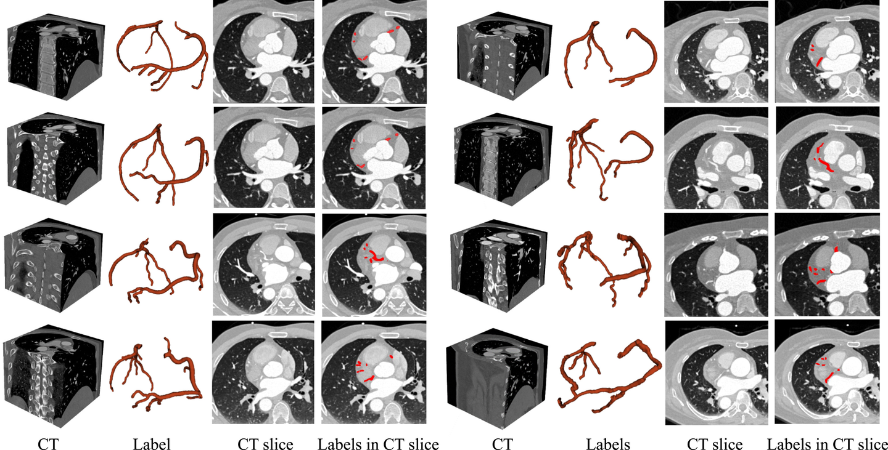
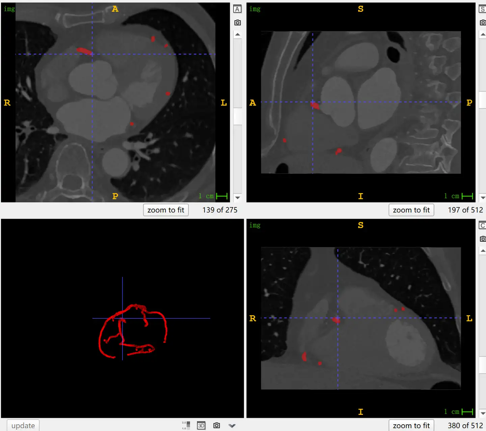

# ImageCAS
<div align="center">
    <a href="https://github.com/openmedlab/"></a>
</div>
<p style="text-align:center;font-size:10px;"><em></em></p>

## Dataset Information

The ImageCAS dataset is a large-scale coronary artery segmentation dataset containing 1,000 cases of 3D CTA images. The data were collected from actual clinical cases at Guangdong Provincial People's Hospital between April 2012 and December 2018. The inclusion criteria were patients aged 18 and above with a history of ischemic stroke, transient ischemic attack, and/or peripheral artery disease. The data were acquired using a Siemens 128-slice dual-source CT scanner. Among the subjects, 414 were female with an average age of 59.98 years, and 586 were male with an average age of 57.68 years. The left and right coronary arteries in each image were independently annotated by two radiologists, and their results were cross-verified. In case of discrepancies, a third radiologist annotated the images, and the final results were determined by consensus. The annotated coronary arteries include the left main (LM), left anterior descending (LAD), left circumflex (LCX), right coronary artery (RCA), first diagonal branch (D1), second diagonal branch (D2), third diagonal branch (D3), first obtuse marginal branch (OM1), second obtuse marginal branch (OM2), third obtuse marginal branch (OM3), ramus intermedius (RI), posterior descending artery (PDA), first acute marginal branch (AM1), and other vessels, following the American Heart Association (AHA) 17-segment naming convention.

Cardiovascular diseases (CVD) account for about half of non-communicable diseases. Coronary artery stenosis is considered a major risk factor for cardiovascular diseases. Due to its excellent image resolution, CT angiography (CTA) is one of the widely used non-invasive imaging examinations in the diagnosis of coronary arteries. Clinically, segmentation of the coronary arteries is crucial for diagnosing and quantitatively evaluating coronary artery disease. Although many efforts have been made to address this issue, most rely on internal datasets, and only a few have publicly released datasets, which typically contain only a few dozen images. The ImageCAS dataset is significantly larger than the existing publicly available datasets.

## Dataset Meta Information

| Dimensions | Modality | Task Type | Anatomical Structures | Anatomical Area | Number of Categories | Data Volume | File Format |
|------------|----------|-----------|-----------------------|-----------------|----------------------|-------------|-------------|
| 3D         | CTA       | Segmentation | Coronary Arteries     | Heart           | 1                    | 1000        | .nii.gz     |


### Resolution Details

| Dataset Statistics | spacing (mm)       | size             |
|--------------------|--------------------|------------------|
| min                | (0.29, 0.29, 0.5)  | (512, 512, 166)  |
| median             | (0.35, 0.35, 0.5)  | (512, 512, 275)  |
| max                | (0.46, 0.46, 0.5)  | (512, 512, 277)  |

Number of 2D slices in the dataset: 257,496

## Label Information Statistics

| Metric               | Coronal Artery |
|----------------------|----------------|
| Case Count           | 1000           |
| Coverage             | 100%           |
| Min Volume (cm³)     | 1.92           |
| Median Volume (cm³)  | 6.74           |
| Max Volume (cm³)     | 16.52          |

## Visualization

<div align="center">
    <a href="https://github.com/openmedlab/"></a>
</div>
<p style="text-align:center;font-size:10px;"><em> Official Paper Visualization.</em></p>

<div align="center">
    <a href="https://github.com/openmedlab/"></a>
</div>
<p style="text-align:center;font-size:10px;"><em> Local ITK-SNAP Visualization.</em></p>

## File Structure

The file structure of the dataset is as follows: each case corresponds to a folder, which contains image files and annotation files.

``` 
ImageCAS/
├── 10016975/
│   ├── img.nii.gz
│   └── label.nii.gz
├── 10017784/
│   ├── img.nii.gz
│   └── label.nii.gz
├── ...
```

## Authors and Institutions

An Zeng (Guangdong University of Technology)

Chunbiao Wu (Guangdong University of Technology)

Guisen Lin (Shenzhen Children’s Hospital)

Wen Xie (Southern Medical University)

Jin Hong (Southern Medical University)

Meiping Huang (Southern Medical University)

Jian Zhuang (Southern Medical University)

Shanshan Bi (Southern Medical University)

Dan Pan (Missouri University of Science and Technology, USA)

Najeeb Ullah (University of Engineering and Technology)

Kaleem Nawaz Khan (University of Notre Dame, USA)

Tianchen Wang (The Hong Kong University of Science and Technology)

Yiyu Shi (University of Notre Dame, USA)

Xiaomeng Li (The Hong Kong University of Science and Technology)

Xiaowei Xu (Southern Medical University)

## Source Information

Official Website: https://github.com/XiaoweiXu/ImageCAS-A-Large-Scale-Dataset-and-Benchmark-for-Coronary-Artery-Segmentation-based-on-CT

Download Link: https://www.kaggle.com/datasets/xiaoweixumedicalai/imagecas/

Article Address: https://www.sciencedirect.com/science/article/abs/pii/S0895611123001052

Publication Date: 2023

## Citation

``` 
@article{zeng2023imagecas,
  title={Imagecas: A large-scale dataset and benchmark for coronary artery segmentation based on computed tomography angiography images},
  author={Zeng, An and Wu, Chunbiao and Lin, Guisen and Xie, Wen and Hong, Jin and Huang, Meiping and Zhuang, Jian and Bi, Shanshan and Pan, Dan and Ullah, Najeeb and others},
  journal={Computerized Medical Imaging and Graphics},
  volume={109},
  pages={102287},
  year={2023},
  publisher={Elsevier}
}
```

Original introduction article is [here](https://zhuanlan.zhihu.com/p/700008381).