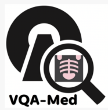
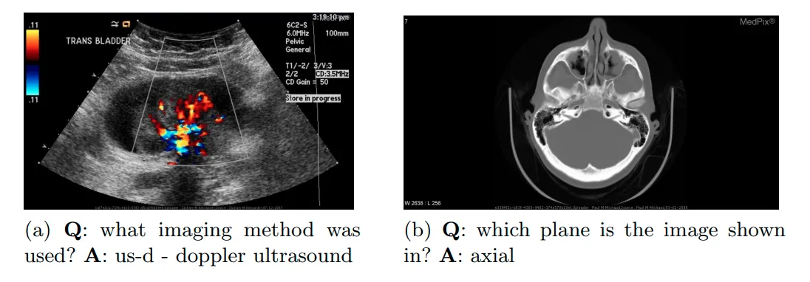
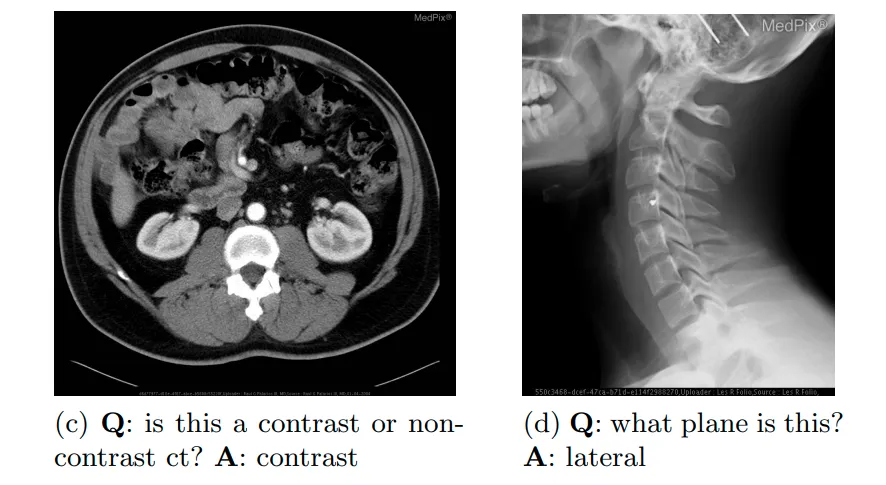
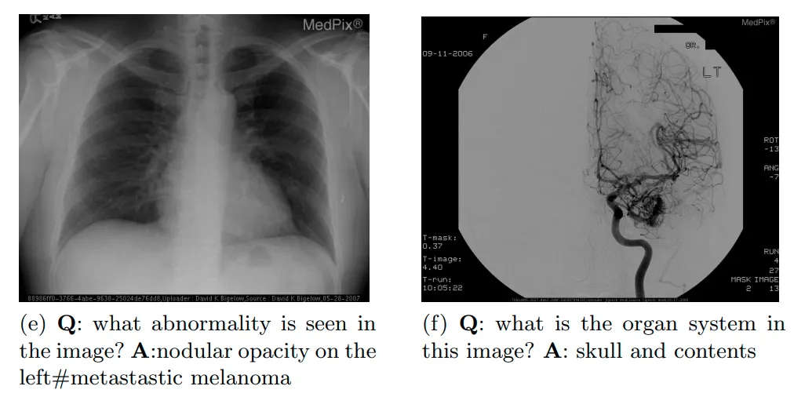
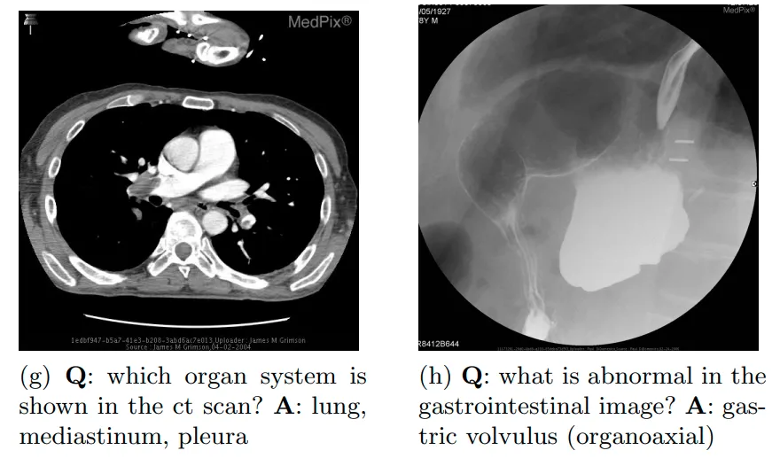

# ImageClef-2019-VQA-Med

<div align="center">
    <a href="https://github.com/openmedlab/"></a>
</div>
<p style="text-align:center;font-size:10px;"><em></em></p>

## Dataset Information

ImageClef-2019-VQA-Med is a unique dataset specifically designed for medical visual question answering tasks, comprising 4,200 carefully selected radiological images and 15,292 meticulously prepared question-answer pairs. The dataset focuses on four key clinical question areas—modality, plane, organ system, and abnormality—each thoughtfully designed to encompass varying levels of difficulty and using categorization and text generation methodologies. The design of these questions ensures that they can be answered directly through the visual content of the images, without relying on additional medical knowledge or domain-specific reasoning.

The construction of the dataset was completed through an automated process, including the use of advanced filtering techniques to select suitable images and annotations, as well as the creation of rational question and answer generation patterns. To ensure its high-quality standards, the test set also underwent strict manual verification by two senior medical doctors. The dataset has been made available to the public, providing researchers and developers with a valuable resource for developing and testing advanced medical image automatic question-answering systems.

The release of the ImageClef-2019-VQA-Med dataset not only plays a pivotal role in the innovative development of medical visual question-answering technologies but also offers researchers a practical platform to apply and test their systems in real-world scenarios. Through such challenges and explorations, we can gain deeper insights and improve the performance of image-based medical Q&A systems, further advancing medical diagnosis and research, and bringing more possibilities and innovations to the medical field.

## Dataset Meta Information

| Task Type | Language | Train | Val | Test | File Format | Size |
|------|----------|-------|----------|------|----|------|
| VQA  | English  | 12792  | 2000   | 500  | .txt，.jpg	 | 186M |

## Dataset Information Statistics

Table 1: VQA-Med-2019 Training Set: the Most Frequent Answers Per Category

| Category     | Most frequent answers (#)                                                                                                                                                                  |
|--------------|--------------------------------------------------------------------------------------------------------------------------------------------------------------------------------------------|
| Modality     | no (554), yes (552), xr-plain film (456), t2 (217), us-ultrasound (183), t1 (137), contrast (107), noncontrast (102), ct noncontrast (84), mr-flair (iv) (50), cta-ct angiogram (45)      |
| Plane        | axial (1558), sagittal (478), coronal (389), ap (197), lateral (151), frontal (120), pa (92), transverse (76), oblique (50)                                                                 |
| Organ System | skull and contents (1216), musculoskeletal (436), gastrointestinal (352), lung, mediastinum, pleura (250), spine and contents (234), genitourinary (214), face, sinuses, and neck (191), vascular and lymphatic (122), heart and great vessels (120), breast (65) |
| Abnormality  | yes (62), no (48), meningioma (30), glioblastoma multiforme (28), pulmonary embolism (16), acute appendicitis (14), arteriovenous malformation (avm) (14), arachnoid cyst (13), schwannoma (13), tuberous sclerosis (13), brain, cerebral abscess (12), ependymoma (12), fibrous dysplasia (12), multiple sclerosis (12), diverticulitis (11), langerhan cell histiocytosis (11), sarcoidosis (11) |


## Dataset Example

<div align="center">
    <a href="https://github.com/openmedlab/"></a>
</div>
<p style="text-align:center;font-size:10px;"><em></em></p>

<div align="center">
    <a href="https://github.com/openmedlab/"></a>
</div>
<p style="text-align:center;font-size:10px;"><em></em></p>

<div align="center">
    <a href="https://github.com/openmedlab/"></a>
</div>
<p style="text-align:center;font-size:10px;"><em></em></p>

<div align="center">
    <a href="https://github.com/openmedlab/"></a>
</div>
<p style="text-align:center;font-size:10px;"><em></em></p>

## File Structure

The dataset is organized into three folders: ImageClef-2019-VQA-Med-Training, ImageClef-2019-VQA-Med-Validation, and VQAMed2019Test. These folders contain information for the training, validation, and testing sets respectively. "QAPairsByCategory" contains the QA pairs information, and "Train_images" contains the images.

``` 
.
├── ImageClef-2019-VQA-Med-Training
│   ├── All_QA_Pairs_train.txt
│   ├── QAPairsByCategory
│   ├── train_ImageIDs.txt
│   └── Train_images
├── ImageClef-2019-VQA-Med-Validation
│   ├── All_QA_Pairs_val.txt
│   ├── QAPairsByCategory
│   ├── val_ImageIDs.txt
│   └── Val_images
└── VQAMed2019Test
    ├── README-VQA-Med-2019-TestSet.txt
    ├── VQAMed2019_Test_Images.zip
    ├── VQAMed2019_Test_Questions.txt
    └── VQAMed2019_Test_Questions_w_Ref_Answers.txt
```

## Authors and Institutions

Ben Abacha, Asma is from the Lister Hill Center, U.S. National Library of Medicine.

Hasan, Sadid A. is affiliated with Philips Research North America, Cambridge, USA.

Datla, Vivek V. also works with Philips Research North America, Cambridge, USA.

Demner-Fushman, Dina is part of the Lister Hill Center, U.S. National Library of Medicine.

Müller, Henning is associated with the University of Applied Sciences and Arts Western Switzerland (HES-SO Valais-Wallis) and the University of Geneva, Switzerland.


## Source Information

Official Website: https://www.imageclef.org/2019/medical/vqa/

Download Link: https://github.com/abachaa/VQA-Med-2019

Article Address: https://arodes.hes-so.ch/record/4214

Publication Date: 2019.9

## Citation

``` 
@Inproceedings{ImageCLEFVQA-Med2019,
        author = {Asma {Ben Abacha} and Sadid A. Hasan and Vivek V. Datla and Joey Liu and Dina Demner-Fushman and Henning M\"uller},
        title = {VQA-Med: Overview of the Medical Visual Question Answering Task at ImageCLEF 2019},
        booktitle = {CLEF 2019 Working Notes},
        series = {{CEUR} Workshop Proceedings},
        year = {2019},
        publisher = {CEUR-WS.org $<$http://ceur-ws.org$>$},
        month = {September 9-12},
        address = {Lugano, Switzerland}
        }
```

Original introduction article is [here](https://zhuanlan.zhihu.com/p/677575319).