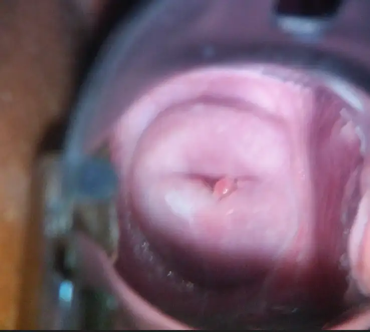

# Intel & MobileODT Cervical Cancer Screening

<div align="center">
    <a href="https://github.com/openmedlab/"></a>
</div>
<p style="text-align:center;font-size:10px;"><em></em></p>

## Dataset Information

The Intel & MobileODT Cervical Cancer Screening dataset is an image-based medical imaging dataset aimed at identifying cervical types through cervical images. The dataset includes three types of cervical images: Type_1, Type_2, and Type_3.

- **Type 1**: Exophytic cervix, fully visible, can be large or small.
- **Type 2**: Has endocervical components, fully visible, may have exocervical components which can be large or small.
- **Type 3**: Has endocervical components, not fully visible, may have exocervical components which can be large or small.

Labeled images are provided for the training set, while only images are provided for the testing set. This is a challenge initiated by Intel and MobileODT on the Kaggle platform. The clinical significance of this dataset lies in improving the early screening and treatment effectiveness of cervical cancer, especially in resource-limited areas. By developing algorithms that accurately identify cervical types, it enhances the quality of telemedicine, helps medical providers make more accurate treatment decisions, avoids ineffective treatments, and provides appropriate referrals for cases that require more advanced treatment. This not only promotes the development of medical AI but also expands medical coverage, helping women worldwide receive more effective cervical cancer prevention and treatment services.

## Dataset Meta Information

| Dimensions | Modality      | Task Type      | Anatomical Structures | Number of Categories | Data Volume | File Format |
|------------|---------------|----------------|-----------------------|----------------------|-------------|-------------|
| 2D         | Hysteroscopy  | Classification | Cervix                | 3                    | 6733        | JPG         |


### Resolution Details


| Dataset Statistics | size         |
|--------------------|--------------|
| min                | [4128, 4160] |
| median             | [3096, 3264] |
| max                | [480, 480]   |

## Label Information Statistics

| Cervical Type    | Type 1       | Type 2       | Type 3       |
|------------------|--------------|--------------|--------------|
| Number of Images | 1191         | 3565         | 1976         |
| Percentage       | 17.68%       | 52.94%       | 29.34%       |
| Minimum Size     | [480, 480]   | [480, 640]   | [480, 640]   |
| Median Size      | [3096, 4128] | [3096, 4128] | [2448, 3264] |
| Maximum Size     | [4128, 4160] | [4128, 4160] | [4128, 4160] |

## Visualization

<div align="center">
    <a href="https://github.com/openmedlab/"></a>
</div>
<p style="text-align:center;font-size:10px;"><em>Type 1.</em></p>

<div align="center">
    <a href="https://github.com/openmedlab/"></a>
</div>
<p style="text-align:center;font-size:10px;"><em>Type 2.</em></p>

<div align="center">
    <a href="https://github.com/openmedlab/"></a>
</div>
<p style="text-align:center;font-size:10px;"><em>Type 3.</em></p>

## File Structure

``` 
Dataset
├── train.7z
│   ├── Type_1
│   │   └── [training images for Type 1]
│   ├── Type_2
│   │   └── [training images for Type 2]
│   └── Type_3
│       └── [training images for Type 3]
├── test.7z
│   └── [all test images in one folder]
├── sample_submission.csv
├── fixed_labels_v2.csv
├── removed_files.csv
├── sample_submission_stg2.csv
├── solution_stg1_release.csv
├── test_stg2.7z
│   └── [stage 2 test images]
└── test_stg2_7z_password.txt
```

## Authors and Institutions

BenO (Kaggle)

jljones (Kaggle)

Kumar H (Kaggle)

Meg Risdal (Kaggle)

MRao (Kaggle)

Vadim Sherman (Kaggle)

Vipul (Kaggle)

Wendy Kan (Kaggle)

Yau Ben-Or (Kaggle)

## Source Information

Official Website: https://kaggle.com/competitions/intel-mobileodt-cervical-cancer-screening

Download Link: https://kaggle.com/competitions/intel-mobileodt-cervical-cancer-screening

Article Address: TBD

Publication Date: 2017-3

## Citation

``` 
@misc{intel-mobileodt-cervical-cancer-screening,
    author = {BenO, jljones, Kumar H, Meg Risdal, MRao, Vadim Sherman, Vipul, Wendy Kan, Yau Ben-Or},
    title = {Intel & MobileODT Cervical Cancer Screening},
    publisher = {Kaggle},
    year = {2017},
    url = {https://kaggle.com/competitions/intel-mobileodt-cervical-cancer-screening}
}
```

Original introduction article is [here](https://zhuanlan.zhihu.com/p/704819287).