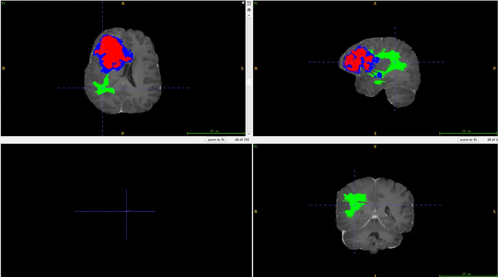

# IvyGAP-Radiomics

<div align="center">
    <a href="https://github.com/openmedlab/"></a>
</div>
<p style="text-align:center;font-size:10px;"><em></em></p>

## Dataset Information

The IvyGAP-Radiomics dataset is an MR modality dataset for segmenting glioblastoma. It is a dataset from TCIA. This dataset includes two paired expert segmentation label sets from the pre-operative multi-institutional scans of tumor subregions from the Ivy Glioblastoma Atlas Project (Ivy GAP). These labels are annotated by independent, board-certified neuroradiologists from the University of Pennsylvania Hospital and Case Western Reserve University, and provide four MRI modalities: T1, T2, T1-Gd, and Flair, with all imaging data provided in NIfTI format.

The purpose of this dataset is to provide expert segmentation labels for quantitative computation and clinical research without the need for repeated manual annotations, while also allowing for cross-study comparisons. It can also serve as the manual annotation gold standard for computational competitions, such as the International Brain Tumor Segmentation Challenge. The provided robust radiomics feature panel can facilitate researchers in conducting studies on molecular markers, clinical outcomes, treatment responses, etc., without a strong computational background.

## Dataset Meta Information

| Dimensions | Modality | Task Type    | Anatomical Structures | Anatomical Area | Number of Categories | Data Volume | File Format |
|------------|----------|--------------|-----------------------|-----------------|----------------------|-------------|-------------|
| 3D         | MRI      | Segmentation | Brain                 | Head and Neck   | 3                    | 31          | .nii.gz     |


### Resolution Details

| Dataset Statistics | spacing (mm)     | size            |
|--------------------|------------------|-----------------|
| min                | (1.0, 1.0, 1.0)  | (240, 240, 155) |
| median             | (1.0, 1.0, 1.0)	 | (240, 240, 155) |
| max                | (1.0, 1.0, 1.0)  | (240, 240, 155) |

Number of 2D slices in the dataset: 4805

## Label Information Statistics

| Anatomical Feature           | Necrotic Tumor Core  | Peritumoral Edema  | Enhancing Tumor |
|------------------------------|----------------------|--------------------|-----------------|
| Number of Cases              | 31                   | 31                 | 31              |
| Segmentation Accuracy        | 100%                 | 100%               | 100%            |
| Min Volume (cm³)             | 0.09                 | 3.73               | 0.77            |
| Median Volume (cm³)          | 15.36                | 67.23              | 33.78           |
| Max Volume (cm³)             | 60.18                | 208.09             | 78.97           |


## Visualization

<div align="center">
    <a href="https://github.com/openmedlab/"></a>
</div>
<p style="text-align:center;font-size:10px;"><em>Green represents peritumoral edema, red represents the necrotic tumor core, and blue represents the enhancing tumor.</em></p>

## File Structure

In the folder, `SRI` corresponds to data annotated by the University of Pennsylvania, and `MNI` corresponds to data annotated by Case Western Reserve University. Each folder contains data for Flair, T1, T2, and T1GD.

``` 
.
├── metadata.csv
├── Multi-institutional\ Paired\ Expert\ Segmentations\ MNI\ images-atlas-annotations
│   ├── 1_Images_MNI
│   │   └── CoRegistered_SkullStripped
│   │       ├── W1
│   │       │   ├── W1_1996.10.25_bias_ss_FLAIR.nii.gz
│   │       │   ├── W1_1996.10.25_bias_ss_T1.nii.gz
│   │       │   └── W1_1996.10.25_bias_ss_T2.nii.gz
│   │       ├── W10
│   │       │   ├── W10_1997.04.29_bias_ss_FLAIR.nii.gz
│   │       │   ├── W10_1997.04.29_bias_ss_T1.nii.gz
│   │       │   └── W10_1997.04.29_bias_ss_T2.nii.gz
│   │       ├── W11
│   │       │   ├── ...
│   ├── 2_Atlas_MNI
│   │   └── mni_icbm152_t1_tal_nlin_asym_09c.nii.gz
│   └── 3_Annotations_MNI
│       └── CWRU
│           ├── W1
│           │   └── W1_1996.10.25_CWRU_labels.nii.gz
│           ├── W10
│           │   └── W10_1997.04.29_CWRU_labels.nii.gz
│           ├── W11
│           │   └── ...
├── Multi-Institutional\ Paired\ Expert\ Segmentations\ Radiomic\ Features\ and\ Reproducibility\ Evaluation\ on\ SRI.zip
└── Multi-Institutional\ Paired\ Expert\ Segmentations\ SRI\ images-atlas-annotations
    ├── 1_Images_SRI
    │   └── CoRegistered_SkullStripped
    │       ├── W1
    │       │   └── W1_1996.10.25
    │       │       ├── W1_1996.10.25_flair_LPS_r_SS.nii.gz
    │       │       ├── W1_1996.10.25_t1gd_LPS_r_SS.nii.gz
    │       │       ├── W1_1996.10.25_t1_LPS_r_SS.nii.gz
    │       │       └── W1_1996.10.25_t2_LPS_r_SS.nii.gz
    │       ├── W10
    │       │   └── W10_1997.04.29
    │       │       ├── W10_1997.04.29_flair_LPS_r_SS.nii.gz
    │       │       ├── W10_1997.04.29_t1gd_LPS_r_SS.nii.gz
    │       │       ├── W10_1997.04.29_t1_LPS_r_SS.nii.gz
    │       │       └── W10_1997.04.29_t2_LPS_r_SS.nii.gz
    │       ├── W11
    │       │   └── W11_1997.05.11
    │       │       ├── ...
    ├── 2_Atlas_SRI
    │   └── spgr_unstrip_lps.nii.gz
    └── 3_Annotations_SRI
        ├── CWRU
        │   ├── W1
        │   │   └── W1_1996.10.25_CWRU_labels.nii.gz
        │   ├── W10
        │   │   └── W10_1997.04.29_CWRU_labels.nii.gz
        │   ├── W11
        │   │   └── ...
        └── UPenn
            ├── W1
            │   └── W1_1996.10.25_UPenn_labels.nii.gz
            ├── W10
            │   └── W10_1997.04.29_UPenn_labels.nii.gz
            ├── W11
            │   └── ...
```

## Authors and Institutions

Sarthak Pati (Center for Biomedical Image Computing & Analytics (CBICA), Department of Radiology, Perelman School of Medicine, University of Pennsylvania, Philadelphia, Pennsylvania, USA)

Ruchika Verma (Department of Biomedical Engineering, Case Western Reserve University, USA)

Hamed Akbari (Center for Biomedical Image Computing & Analytics (CBICA), Department of Radiology, Perelman School of Medicine, University of Pennsylvania, Philadelphia, Pennsylvania, USA)

Michel Bilello (Department of Radiology, Perelman School of Medicine, University of Pennsylvania, Philadelphia, Pennsylvania, USA)

Virginia B. Hill (Department of Radiology, Feinberg School of Medicine, Northwestern University, Chicago, Illinois, USA)

Chiharu Sako (Center for Biomedical Image Computing & Analytics (CBICA), Department of Radiology, Perelman School of Medicine, University of Pennsylvania, Philadelphia, Pennsylvania, USA)

Ramon Correa (Department of Biomedical Engineering, Case Western Reserve University, USA)

## Source Information

Official Website: https://www.cancerimagingarchive.net/analysis-result/ivygap-radiomics/

Download Link: https://www.cancerimagingarchive.net/analysis-result/ivygap-radiomics/

Article Address: https://www.ncbi.nlm.nih.gov/pmc/articles/PMC8382093/

Publication Date: 2023-04

## Citation

``` 
@article{pati2020reproducibility,
  title={Reproducibility analysis of multi-institutional paired expert annotations and radiomic features of the Ivy Glioblastoma Atlas Project (Ivy GAP) dataset},
  author={Pati, Sarthak and Verma, Ruchika and Akbari, Hamed and Bilello, Michel and Hill, Virginia B and Sako, Chiharu and Correa, Ramon and Beig, Niha and Venet, Ludovic and Thakur, Siddhesh and others},
  journal={Medical physics},
  volume={47},
  number={12},
  pages={6039--6052},
  year={2020},
  publisher={Wiley Online Library}
}
```

Original introduction article is [here](https://zhuanlan.zhihu.com/p/703368294).