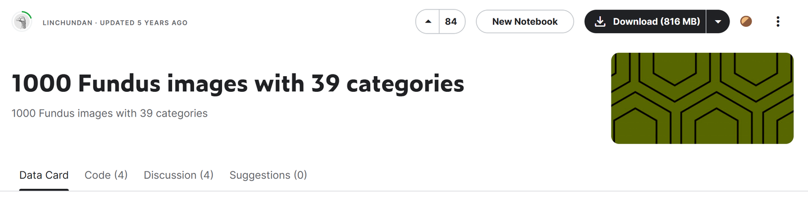
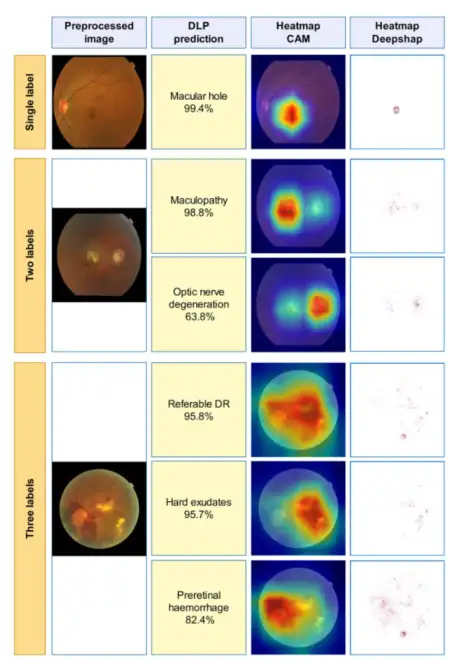

# JSIEC

<div align="center">
    <a href="https://github.com/openmedlab/"></a>
</div>
<p style="text-align:center;font-size:10px;"><em></em></p>

## Dataset Information

The JSIEC dataset consists of a total of 209,494 fundus images, covering 39 categories. This article introduces a subset of the JSIEC dataset, which includes 1,000 fundus images distributed across 39 categories. This dataset collects fundus images from 7 different data sources for the development and validation of deep learning algorithms. The primary datasets for training, validation, and testing come from the Picture Archiving and Communication System (PACS) of the Joint Shantou International Eye Center (JSIEC) in China, China's Lifeline Express Diabetic Retinopathy Screening System (LEDRS), and the Eye Picture Archiving and Communication System (EyePACS) in the USA.

Millions of people worldwide are affected by fundus diseases such as Diabetic Retinopathy (DR), Age-related Macular Degeneration (AMD), Retinal Vein Occlusion (RVO), Retinal Artery Occlusion (RAO), Glaucoma, Retinal Detachment (RD), and fundus tumors. Among these, DR, AMD, and Glaucoma are the most common causes of vision impairment in most populations. Without accurate diagnosis and timely appropriate treatment, these fundus diseases can lead to irreversible blurring of vision, visual distortion, field defects, and even blindness. However, in rural and remote areas, especially in developing countries, there is a lack of ophthalmic services and ophthalmologists, making early detection and timely referral for treatment often inaccessible. Notably, fundus photography provides basic detection of these diseases and is available and affordable in most parts of the world. Non-professionals can handle fundus photographs and send them online to major ophthalmic institutions for follow-up. Artificial intelligence technology can be used to assist in diagnosis.

## Dataset Meta Information

| Dimensions | Modality | Task Type      | Anatomical Structures | Anatomical Area | Number of Categories | Data Volume | File Format |
|------------|----------|----------------|-----------------------|-----------------|----------------------|-------------|-------------|
| 2D         | Fundus   | Classification | Eye                   | Eye             | 39                   | 1000        | JPG         |


### Resolution Details

| Dataset Statistics | size             |
|--------------------|------------------|
| min                | (576, 768, 3)    |
| median             | (2236, 2656, 3)  |
| max                | (2572, 3046, 3)  |

## Label Information Statistics

| Disease                                        | Number of Images | Disease                                 | Number of Images |
|------------------------------------------------|------------------|-----------------------------------------|------------------|
| Normal (0)                                     | 38               | CRVO (20)                               | 22               |
| Tessellated (1)                                | 13               | Yellow-white spots-flecks (21)          | 29               |
| Large optic cup (2)                            | 50               | Cotton-wool spots (22)                  | 10               |
| DR1 (3)                                        | 18               | Vessel tortuosity (23)                  | 14               |
| Possible glaucoma (4)                          | 13               | Chorioretinal atrophy-coloboma (24)     | 15               |
| Optic atrophy (5)                              | 12               | Preretinal hemorrhage (25)              | 10               |
| DR2 (6)                                        | 49               | Fibrosis (26)                           | 10               |
| DR3 (7)                                        | 39               | Laser Spots (27)                        | 20               |
| Severe hypertensive (8)                        | 15               | Silicon oil in eye (28)                 | 19               |
| Disc swelling and elevation (9)                | 13               | Blur fundus without PDR (29)            | 111              |
| Dragged Disc (10)                              | 10               | Blur fundus with suspected PDR (30)     | 45               |
| Congenital disc abnormality (11)               | 10               | RAO (31)                                | 16               |
| Retinitis pigmentosa (12)                      | 22               | Rhegmatogenous RD (32)                  | 57               |
| Bietti Crystalline Dystrophy (13)              | 8                | CSCR (33)                               | 14               |
| Peripheral Retinal Degeneration and Break (14) | 14               | VKH Disease (34)                        | 14               |
| Myelinated Nerve Fiber (15)                    | 11               | Maculopathy (35)                        | 74               |
| Vitreous Particles (16)                        | 14               | ERM (36)                                | 26               |
| Fundus Neoplasm (17)                           | 8                | MH (37)                                 | 23               |
| BRVO (18)                                      | 44               | Pathological Myopia (38)                | 54               |
| Massive Hard Exudates (19)                     | 13               |                                         |                  |

The English equivalents in the table are translated into Chinese as follows:

- (0) Normal - 正常
- (1) Tessellated - 马赛克样
- (2) Large optic cup - 大视盘凹陷
- (3) DR1 - 糖尿病视网膜病变1期
- (4) Possible glaucoma - 可能性青光眼
- (5) Optic atrophy - 视神经萎缩
- (6) DR2 - 糖尿病视网膜病变2期
- (7) DR3 - 糖尿病视网膜病变3期
- (8) Severe hypertensive - 严重高血压性视网膜病变
- (9) Disc swelling and elevation - 视盘肿胀和隆起
- (10) Dragged Disc - 视盘拖曳
- (11) Congenital disc abnormality - 先天性视盘异常
- (12) Retinitis pigmentosa - 色素性视网膜炎
- (13) Bietti crystalline dystrophy - Bietti晶状体营养不良
- (14) Peripheral retinal degeneration and break - 周边视网膜变性和裂孔
- (15) Myelinated nerve fiber - 有髓神经纤维
- (16) Vitreous particles - 玻璃体颗粒
- (17) Fundus neoplasm - 眼底肿瘤
- (18) BRVO - 视网膜分支静脉阻塞
- (19) Massive hard exudates - 大量硬性渗出
- (20) CRVO - 视网膜中央静脉阻塞
- (21) Yellow-white spots-flecks - 黄白点
- (22) Cotton-wool spots - 棉絮斑
- (23) Vessel tortuosity - 血管迂曲
- (24) Chorioretinal atrophy-coloboma - 脉络膜视网膜萎缩-缺损
- (25) Preretinal hemorrhage - 视网膜前出血
- (26) Fibrosis - 纤维化
- (27) Laser Spots - 激光斑点
- (28) Silicon oil in eye - 眼内硅油
- (29) Blur fundus without PDR - 无增殖性糖尿病视网膜病变的模糊眼底
- (30) Blur fundus with suspected PDR - 怀疑有增殖性糖尿病视网膜病变的模糊眼底
- (31) RAO - 视网膜动脉阻塞
- (32) Rhegmatogenous RD - 裂孔性视网膜脱离
- (33) CSCR - 中心性浆液性脉络膜视网膜病变
- (34) VKH disease - Vogt-小柳-原田综合征
- (35) Maculopathy - 黄斑病变
- (36) ERM - 黄斑前膜
- (37) MH - 黄斑裂孔
- (38) Pathological myopia - 病理性近视

## Visualization

<div align="center">
    <a href="https://github.com/openmedlab/"></a>
</div>
<p style="text-align:center;font-size:10px;"><em> Paper Visualization.</em></p>

## File Structure

The file structure of the dataset is as follows: images are stored in the 'images' folder, and annotations for the train and test sets are provided in TXT format.

``` 
JSIEC
├── images
│   ├── xxx.jpg
│   ├── xxx.jpg
│   │    ...
├── train.txt
├── test.txt
```

## Authors and Institutions

Ling-Ping Cen (Joint Shantou International Eye Centre of Shantou University)

Jie Ji ( Network & Information Centre, Shantou University)

## Source Information

Official Website: https://www.kaggle.com/datasets/linchundan/fundusimage1000

Download Link: https://www.kaggle.com/datasets/linchundan/fundusimage1000

Article Address: https://www.nature.com/articles/s41467-021-25138-w#citeas

Publication Date: 2021

## Citation

``` 
@article{cen2021automatic,
  title={Automatic detection of 39 fundus diseases and conditions in retinal photographs using deep neural networks},
  author={Cen, Ling-Ping and Ji, Jie and Lin, Jian-Wei and Ju, Si-Tong and Lin, Hong-Jie and Li, Tai-Ping and Wang, Yun and Yang, Jian-Feng and Liu, Yu-Fen and Tan, Shaoying and others},
  journal={Nature communications},
  volume={12},
  number={1},
  pages={4828},
  year={2021},
  publisher={Nature Publishing Group UK London}
}
```

Original introduction article is [here](https://zhuanlan.zhihu.com/p/703930854).