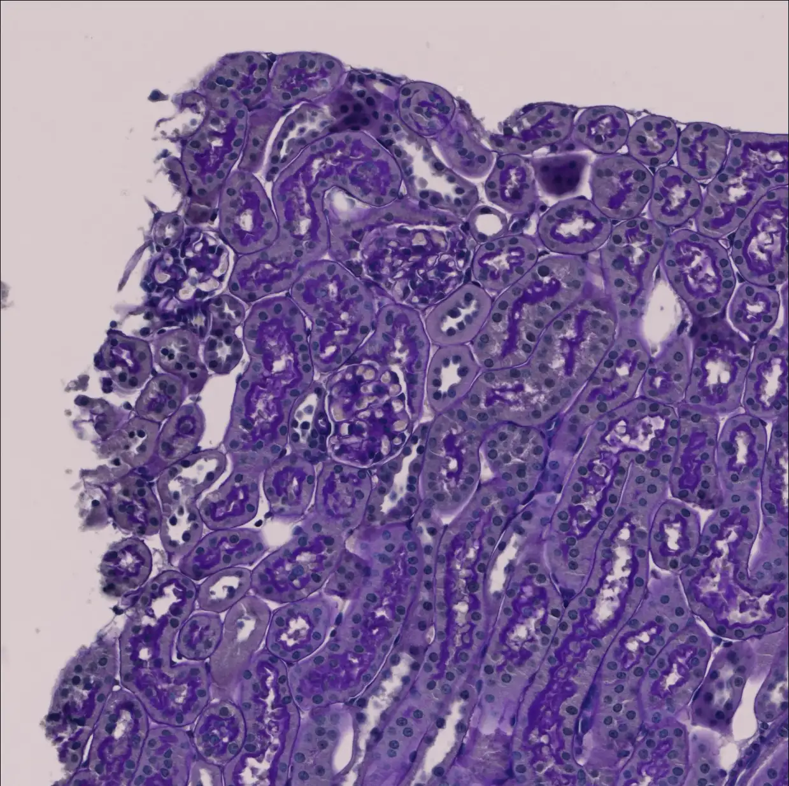

# KPIs

<div align="center">
    <a href="https://github.com/openmedlab/"></a>
</div>
<p style="text-align:center;font-size:10px;"><em></em></p>

## Dataset Information

The KPIs 2024 (Kidney Pathology Image Segmentation Challenge) dataset is a dataset for segmenting glomerular tissue in pathological modalities. It is a challenge of MICCAI 2024. The dataset includes a total of 58 WSI data and 10,428 patches derived from these WSIs, with the validation and test set data yet to be released.

Chronic Kidney Disease (CKD) is a significant global health threat, affecting more than 10% of the global population, or over 800 million people. Meanwhile, kidney biopsy is the gold standard for diagnosing and guiding the treatment of CKD. The rise of deep learning has greatly advanced the development of kidney pathology image segmentation but has also highlighted the lack of comprehensive benchmark tests to develop and evaluate these technologies. Due to the scarcity of large-scale disease data in existing public datasets, coupled with the fact that tissue samples from humans are usually obtained through needle biopsies providing only a small amount of tissue, there is an urgent need to release extensive digital kidney pathology data encompassing various CKD disease models. To address this challenge, the authors have expanded the CKD disease model dataset by utilizing whole kidney slices from diseased rodents. Based on the morphological similarities between rodent and human kidney pathology and the advantage of providing a large amount of tissue content across entire slice images (WSIs), the authors have launched the Kidney Pathology Image Segmentation (KPIs) challenge. This challenge features 10,000 normal and diseased glomeruli from preclinical rodent models, covering multiple specific CKD conditions, marking the first time the MICCAI community has focused on a challenge dedicated to segmenting renal pathological functional units across various CKD disease models.

## Dataset Meta Information

| Dimensions | Modality       | Task Type     | Anatomical Structures | Anatomical Area | Number of Categories | Data Volume                | File Format |
|------------|----------------|---------------|-----------------------|-----------------|----------------------|----------------------------|-------------|
| 2D         | Histopathology | Segmentation  | Kidney                | abdomen         | 1                    | 58 WSIs, 10428 patch jpgs  | tiff, jpg   |


### Resolution Details

| Dataset Statistics | size          |
|--------------------|---------------|
| min                | (2048, 2048)  |
| median             | (2048, 2048)  |
| max                | (2048, 2048)  |

## Label Information Statistics

| Structure        | Glomerulus  | 
|------------------|-------------|
| Occurrences      | 10428       |
| Occurrence Ratio | 100%        |

## Visualization

<div align="center">
    <a href="https://github.com/openmedlab/"></a>
</div>
<p style="text-align:center;font-size:10px;"><em>Original Path.</em></p>

<div align="center">
    <a href="https://github.com/openmedlab/"></a>
</div>
<p style="text-align:center;font-size:10px;"><em>Mask.</em></p>

## File Structure

The official KPIs24 Training Data includes two tasks, `Task1_patch_level` and `Task2_WSI_level`. Each Task contains data content.

``` 
Dataset
│
├── Task1_patch_level
│   ├── data
│   │   ├── 56Nx
│   │   │   ├── 12_116
│   │   │   │   ├── img
│   │   │   │   │   ├── 56Nx_12_116_4_4096_0_img.jpg
│   │   │   │   │   ├── 56Nx_12_116_5_5120_0_img.jpg
│   │   │   │   │   ├── ...
│   │   │   │   ├── mask
│   │   │   │   │   ├── 56Nx_12_116_4_4096_0_img.jpg
│   │   │   │   │   ├── 56Nx_12_116_5_5120_0_img.jpg
│   │   │   │   │   ├── ...
│   │   │   ├── 12_117
│   │   │   ├── ...
│   │   ├── DN
│   │   │   ├── ...
│   │   ├── NEP25
│   │   │   ├── ...
│   │   ├── normal
│   │   │   ├── ...
│   └── ...
├── Task2_WSI_level
│   ├── 56Nx
│   │   ├── 12-116_mask.tiff
│   │   ├── 12-116_wsi.tiff
│   │   ├── ...
│   ├── DN
│   │   ├── 11-356_mask.tiff
│   │   ├── 11-356_wsi.tiff
│   │   ├── ...
│   ├── NEP25
│   │   ├── ...
│   ├── normal
│   │   ├── ...
```

## Authors and Institutions

Tianyuan Yao (Vanderbilt University, USA)

## Source Information

Official Website: https://sites.google.com/view/kpis2024

Download Link: https://www.synapse.org/#!Synapse:syn54077668/wiki/626475

Article Address: TBD

Publication Date: 2024-03

## Citation

``` 
TBD
```

Original introduction article is [here](https://zhuanlan.zhihu.com/p/691259525).