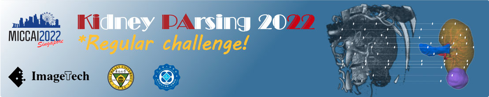
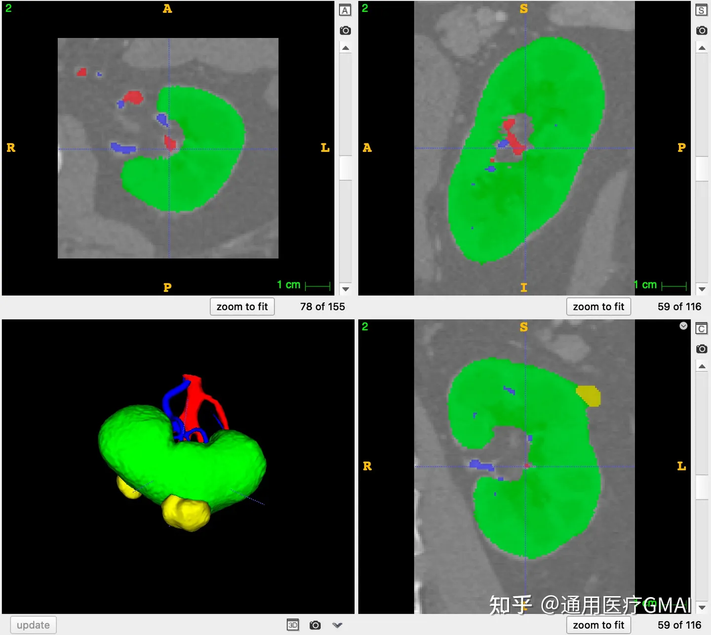

# KiPA22

<div align="center">
    <a href="https://github.com/openmedlab/"></a>
</div>
<p style="text-align:center;font-size:10px;"><em></em></p>

## Dataset Information

KiPA22 (Kidney Parsing 2022) is an abdominal kidney parsing CTA dataset aimed at segmenting 3D kidneys, kidney tumors, arteries, and veins. The dataset includes 130 cases of CT scans with complete annotations. The data is officially divided into 70 cases for the training dataset, 30 cases for the closed testing dataset, and 30 cases for the open testing dataset. In regular challenges, only the training and open testing datasets are provided. A highlight of this dataset is the inclusion of valuable abnormal kidney samples and the annotation of fine renal vascular structures, which is of significant importance for research into diagnostic systems for kidney-related diseases. However, it is important to note that the dataset provided by the officials is not the complete abdominal CT data but rather data cropped around the kidney, hence much smaller in size than typical 3D CT segmentation data.

## Dataset Meta Information

| Dimensions | Modality | Task Type | Anatomical Structures | Anatomical Area | Number of Categories | Data Volume                                      | File Format |
|------------|----------|-----------|-----------------------|-----------------|----------------------|--------------------------------------------------|-------------|
| 3D         | CTA      | Segmentation | Kidney                | abdomen       | 4                    | 70 for training, 30 for validation, 30 for test. | .nii.gz     |

Number of slices in the training set: 13846 (based on 70 available training set statistics).

### Resolution Details

| Dataset Statistics | spacing (mm)     | size             |
|--------------------|------------------|------------------|
| min                | (0.5488, 0.5488, 0.5488)              | (116,116,147)    |
| median             | (0.6328, 0.6328, 0.6328)           | (150, 150, 198)  |
| max                | (0.7793, 0.7793, 0.7793)              | (189, 189, 280)  |

## Label Information Statistics

| Organ/Tissue | renal_vein | kidney | renal_artery | kidney_tumor |
|--------------|----------------------|----------------|---------------------------|---------------------------|
| Case Count   | 70                   | 70             | 70                        | 70                        |
| Coverage     | 100%                 | 100%           | 100%                      | 100%                      |
| Max Volume (cm³) | 14.4             | 247.6          | 6.2                       | 263.9                     |
| Min Volume (cm³) | 1.6              | 96.4           | 0.9                       | 1.9                       |
| Median Volume (cm³) | 5.6           | 142.3          | 3                         | 27.2                      |

## Visualization

<div align="center">
    <a href="https://github.com/openmedlab/"></a>
</div>
<p style="text-align:center;font-size:10px;"><em> ITK-SNAP Visualization.</em></p>

## File Structure

The official file structure is as follows, divided into 2 folders: train/test.

``` 
train
├─image
│  ├─ 0.nii.gz
│  ├─ 1.nii.gz
│  ├─ ...
│  └─ 69.nii.gz	
└─label
    ├─ 0.nii.gz
    ├─ 1.nii.gz
    ├─ ...
    └─ 69.nii.gz
test
├─image
   ├─ 70.nii.gz
   ├─ 71.nii.gz
   ├─ ...
   └─ 99.nii.gz
```

## Authors and Institutions

Yuting He (Key Laboratory of Computer Network and Information Integration, Ministry of Education, Southeast University)

Guanyu Yang (Key Laboratory of Computer Network and Information Integration, Ministry of Education, Southeast University)


## Source Information

Official Website: https://kipa22.grand-challenge.org/

Download Link: https://kipa22.grand-challenge.org/

Article Address: https://www.sciencedirect.com/science/article/abs/pii/S1361841521001018

Publication Date: 2022-04

## Citation

``` 
@article{he2021meta,
  title={Meta grayscale adaptive network for 3D integrated renal structures segmentation},
  author={He, Yuting and Yang, Guanyu and Yang, Jian and Ge, Rongjun and Kong, Youyong and Zhu, Xiaomei and Zhang, Shaobo and Shao, Pengfei and Shu, Huazhong and Dillenseger, Jean-Louis and others},
  journal={Medical image analysis},
  volume={71},
  pages={102055},
  year={2021},
  publisher={Elsevier}
}
@article{he2020dense,
  title={Dense biased networks with deep priori anatomy and hard region adaptation: Semi-supervised learning for fine renal artery segmentation},
  author={He, Yuting and Yang, Guanyu and Yang, Jian and Chen, Yang and Kong, Youyong and Wu, Jiasong and Tang, Lijun and Zhu, Xiaomei and Dillenseger, Jean-Louis and Shao, Pengfei and others},
  journal={Medical image analysis},
  volume={63},
  pages={101722},
  year={2020},
  publisher={Elsevier}
}
@article{shao2011laparoscopic,
  title={Laparoscopic partial nephrectomy with segmental renal artery clamping: technique and clinical outcomes},
  author={Shao, Pengfei and Qin, Chao and Yin, Changjun and Meng, Xiaoxin and Ju, Xiaobing and Li, Jie and Lv, Qiang and Zhang, Wei and Xu, Zhengquan},
  journal={European urology},
  volume={59},
  number={5},
  pages={849--855},
  year={2011},
  publisher={Elsevier}
}
@article{shao2012precise,
  title={Precise segmental renal artery clamping under the guidance of dual-source computed tomography angiography during laparoscopic partial nephrectomy},
  author={Shao, Pengfei and Tang, Lijun and Li, Pu and Xu, Yi and Qin, Chao and Cao, Qiang and Ju, Xiaobing and Meng, Xiaoxin and Lv, Qiang and Li, Jie and others},
  journal={European urology},
  volume={62},
  number={6},
  pages={1001--1008},
  year={2012},
  publisher={Elsevier}
}
```

Original introduction article is [here](https://zhuanlan.zhihu.com/p/656444875).