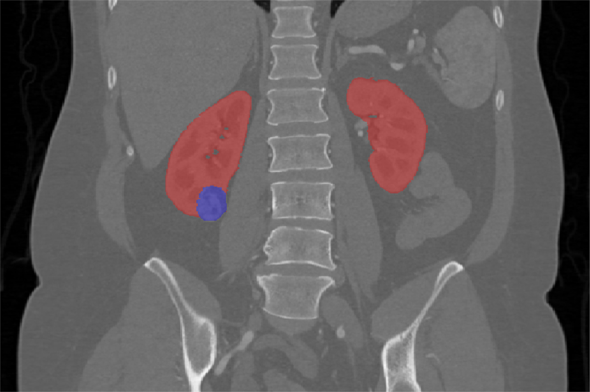

# KiTS19

<div align="center">
    <a href="https://github.com/openmedlab/"></a>
</div>
<p style="text-align:center;font-size:10px;"><em></em></p>

## Dataset Information

The **KiTS19** (Kidney Tumor Segmentation) dataset is a CT dataset for segmenting the kidney and its tumors, used for a challenge at MICCAI 2019. The KiTS challenge has been held three times: KiTS19, KiTS21, and KiTS23. KiTS19, the first edition of the KiTS challenge, focused only on segmenting the kidney and tumors. From KiTS21 onwards, cyst segmentation was added, and these three segmentation categories were further extended in KiTS23. KiTS19 consisted of 210 training cases plus 90 test cases, which have been included in the training set for subsequent competitions.

Kidney tumors are a common type of urinary system tumor, classified as benign or malignant. Benign tumors usually have no symptoms, while malignant tumors can cause hematuria, back pain, and abdominal masses. Globally, the incidence and mortality rates of kidney cancer are increasing at a rate of 2-3% per decade. In China, the incidence of kidney cancer has grown at an average annual rate of 6.5% over the past 20 years and ranks first in mortality related to urinary system tumors. Among patients diagnosed with kidney cancer, 20-30% are in the advanced stages, and about one-quarter already have metastases at the time of initial diagnosis, with a 5-year survival rate of less than 10% for metastatic patients. Early detection and treatment are crucial for improving cure rates and quality of life. Nephrectomy, radiotherapy, and chemotherapy are common treatments. Kidney tumors are clearly imaged in computed tomography (CT) scans, allowing radiologists and surgeons to conduct important work in studying the relationship between the size, shape, and appearance of tumors and their treatment prospects.

## Dataset Meta Information

| Dimensions | Modality | Task Type | Anatomical Structures | Anatomical Area | Number of Categories | Data Volume | File Format |
|------------|----------|-----------|-----------------------|-----------------|----------------------|-------------|-------------|
| 3D         | CT       | Segmentation | Kidney, tumour.       | abdomen       | 2                    | 300         | .nii.gz     |


### Resolution Details

| Dataset Statistics | spacing (mm)     | size            |
|--------------------|------------------|-----------------|
| min                | (0.5,0.44,0.44)             | (29,512,512)     |
| median             | (3.0,0.78,0.78)           | (109,512,512) |
| max                | (5.0,1.04,1.04)             | (1059,512,796) |

Data set 300 examples Number of slices: 153, 884

## Label Information Statistics

| Organ/Tissue | kidney | tumor |
|--------------|------------|-----------|
| Case Count   | 300        | 300       |
| Coverage     | 100%       | 100%      |
| Max Volume (cm³) | 822.58   | 1447.01   |
| Min Volume (cm³) | 104.64   | 0.93      |
| Median Volume (cm³) | 394.87 | 33.39     |


## Visualization

<div align="center">
    <a href="https://github.com/openmedlab/"></a>
</div>
<p style="text-align:center;font-size:10px;"><em> Paper Visualization. Red: kidney; blue: tumor.</em></p>

## File Structure

The official file structure is as follows, providing 210 case training data folders, which contain original images and corresponding segmentation annotation results.

``` 
data
├── case_00000
|   ├── imaging.nii.gz
|   └── segmentation.nii.gz
├── case_00001
|   ├── imaging.nii.gz
|   └── segmentation.nii.gz
...
├── case_00209
|   ├── imaging.nii.gz
|   └── segmentation.nii.gz
└── kits.json
```

## Authors and Institutions

Nicholas Heller (Institute of Robotics, University of Minnesota, USA)

Christopher Weight (Cleveland Clinic, USA)

Nikolaos Papanikolopoulos (Institute of Robotics, University of Minnesota, USA)

Arveen Kalapara (Institute of Robotics, University of Minnesota, USA)

Niranjan Sathianathen (University of Melbourne, Australia)


## Source Information

Official Website: https://kits19.grand-challenge.org/

Download Link: https://github.com/neheller/kits19

Article Address: https://www.sciencedirect.com/science/article/pii/S1361841520301857

Publication Date: 2019-03

## Citation

``` 
@article{heller2023kits19,
    title={The state of the art in kidney and kidney tumor segmentation in contrast-enhanced CT imaging: Results of the KiTS19 challenge},
    journal={Medical Image Analysis},
    volume={67},
    pages={101821},
    year={2021},
    issn={1361-8415},
    doi={10.1016/j.media.2020.101821},
    url={https://www.sciencedirect.com/science/article/pii/S1361841520301857},
    author={Nicholas Heller and Fabian Isensee and Klaus H. Maier-Hein and Xiaoshuai Hou and Chunmei Xie and Fengyi Li and Yang Nan and Guangrui Mu and Zhiyong Lin and Miofei Han and Guang Yao and Yaozong Gao and Yao Zhang and Yixin Wang and Feng Hou and Jiawei Yang and Guangwei Xiong and Jiang Tian and Cheng Zhong and Jun Ma and Jack Rickman and Joshua Dean and Bethany Stai and Resha Tejpaul and Makinna Oestreich and Paul Blake and Heather Kaluzniak and Shaneabbas Raza and Joel Rosenberg and Keenan Moore and Edward Walczak and Zachary Rengel and Zach Edgerton and Ranveer Vasdev and Matthew Peterson and Sean McSweeney and Sarah Peterson and Arveen Kalapara and Niranjan Sathianathen and Nikolaos Papanikolopoulos and Christopher Weight},
}
```

Original introduction article is [here](https://zhuanlan.zhihu.com/p/668838299).