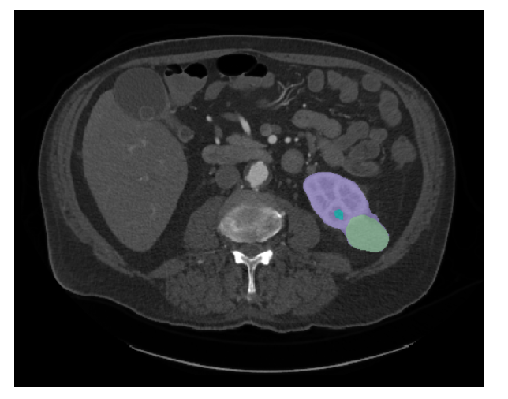
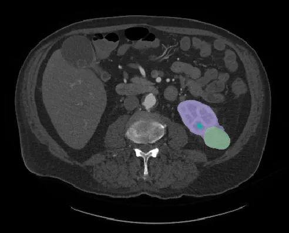
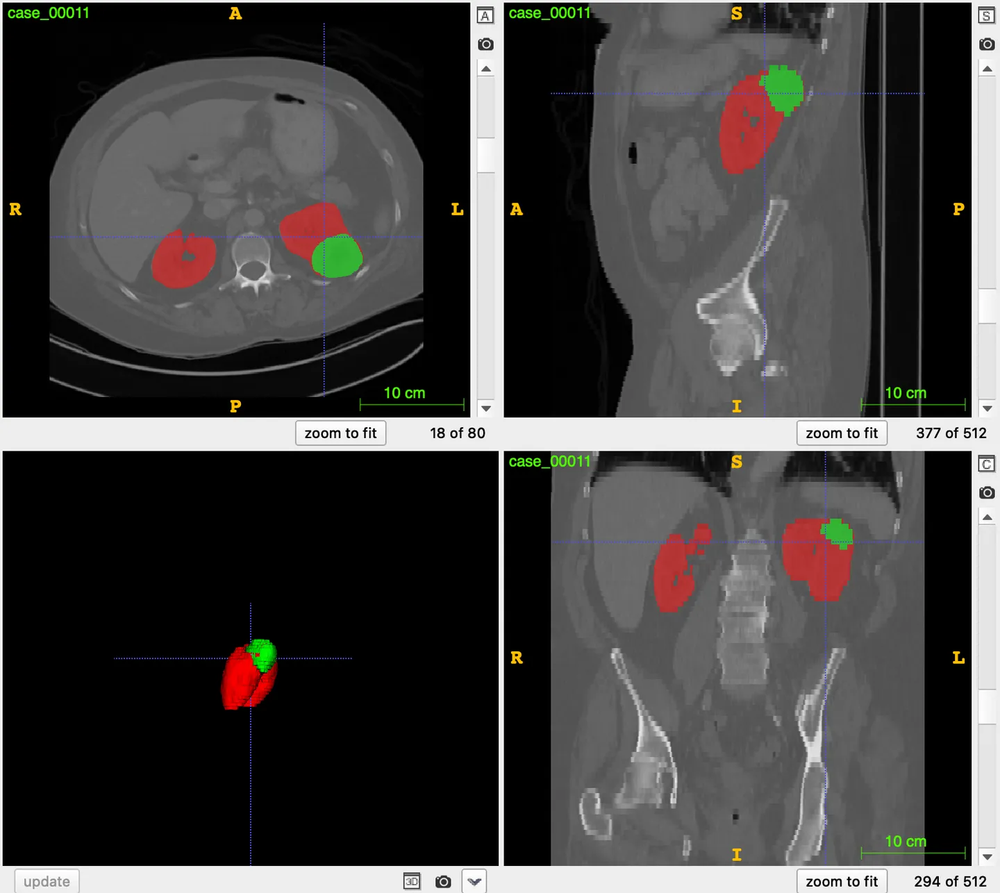

# KiTS21

<div align="center">
    <a href="https://github.com/openmedlab/"></a>
</div>
<p style="text-align:center;font-size:10px;"><em></em></p>

## Dataset Information

KiTS21 (Kidney Tumor Segmentation) is a CT dataset for segmenting kidneys, tumors, and cysts, featured as a challenge for MICCAI 2021. To date, there have been three KiTS challenges: KiTS19, KiTS21, and KiTS23. As the second installment of the KiTS challenge, KiTS21 expanded on KiTS19 by including cyst segmentation in addition to kidney and tumor segmentation, all of which were further incorporated into KiTS23. The KiTS21 data comprises 300 publicly available training cases and 100 non-public testing cases, with the training data consisting of the 210 training cases from KiTS19 combined with 90 testing cases.

Renal cancer is one of the most common malignancies in adults worldwide, and its incidence is believed to be rising. Fortunately, most renal tumors are discovered early while still localized and operable. However, important questions regarding the treatment of localized renal tumors remain unanswered, and metastatic renal cancer is almost always fatal. Renal tumors are prominently imaged in computerized tomography (CT), allowing radiologists and surgeons to perform crucial work in studying the relationship between the tumor's size, shape, appearance, and its prognosis. However, this task is labor-intensive and relies on evaluations that are often subjective and imprecise. Automatic segmentation of renal tumors and surrounding anatomical structures is an effective tool for overcoming these limitations: segmentation-based assessments are objective and inherently well-defined, while automation removes all labor except the push of a button.

## Dataset Meta Information

| Dimensions | Modality | Task Type | Anatomical Structures | Anatomical Area | Number of Categories | Data Volume | File Format |
|------------|----------|-----------|-----------------------|-----------------|----------------------|-------------|-------------|
| 3D         | CT       | Segmentation | Kidney                | abdomen       | 3                    | 400         | .nii.gz     |


### Resolution Details

| Dataset Statistics | spacing (mm)     | size            |
|--------------------|------------------|-----------------|
| min                | (0.5,0.44,0.44)              | (29,512,512)     |
| median             | (3.0,0.78,0.78)           | (109,512,512) |
| max                | (5.0,1.04,1.04)              | (1059,512,796) |

Number of training set slices: 153, 884 (based on 300 available training set statistics)

## Label Information Statistics

| Organ            | kidney | tumor | cyst |
|------------------|-----------|----------|----------|
| Case Count       | 300       | 300      | 148      |
| Coverage         | 100%      | 100%     | 49.33%   |
| Max Volume (cm³) | 822.58  | 1447.01  | 140.94  |
| Min Volume (cm³) | 104.64  | 0.93  | 0.04  |
| Median Volume (cm³)   | 394.87  | 33.39  | 2.96  |


## Visualization

<div align="center">
    <a href="https://github.com/openmedlab/"></a>
</div>
<p style="text-align:center;font-size:10px;"><em> Paper Visualization. Purple: kidney, green: tumor, blue: cyst.</em></p>

<div align="center">
    <a href="https://github.com/openmedlab/"></a>
</div>
<p style="text-align:center;font-size:10px;"><em> ITK-SNAP Visualization.</em></p>

## File Structure

The official file structure is as follows, divided into 2 folders: training images and training labels.

``` 
LNDb
│
├── imagesTr
│   ├── case_00010.nii.gz
│   └── ...
│
├── labelsTr
│   ├── case_00010.nii.gz
│   └── ...
```

## Authors and Institutions

Nicholas Heller (Institute for Robotics, University of Minnesota)

Andrew Wood (Cleveland Clinic)

Fabian Isensee (German Cancer Research Center DKFZ)

Tim Rädsch (German Cancer Research Center DKFZ)

Resha Tejpaul (Institute for Robotics, University of Minnesota)

Nikolaos Papanikolopoulos, PhD -- Computational Chair (Institute for Robotics, University of Minnesota)

Christopher Weight, MD -- Clinical Chair (Cleveland Clinic)


## Source Information

Official Website: https://kits-challenge.org/kits21/

Download Link: https://github.com/neheller/kits21

Article Address: https://arxiv.org/abs/1912.01054

Publication Date: 2021.03

## Citation

``` 
@misc{heller2023kits21,
      title={The KiTS21 Challenge: Automatic segmentation of kidneys, renal tumors, and renal cysts in corticomedullary-phase CT}, 
      author={Nicholas Heller and Fabian Isensee and Dasha Trofimova and Resha Tejpaul and Zhongchen Zhao and Huai Chen and Lisheng Wang and Alex Golts and Daniel Khapun and Daniel Shats and Yoel Shoshan and Flora Gilboa-Solomon and Yasmeen George and Xi Yang and Jianpeng Zhang and Jing Zhang and Yong Xia and Mengran Wu and Zhiyang Liu and Ed Walczak and Sean McSweeney and Ranveer Vasdev and Chris Hornung and Rafat Solaiman and Jamee Schoephoerster and Bailey Abernathy and David Wu and Safa Abdulkadir and Ben Byun and Justice Spriggs and Griffin Struyk and Alexandra Austin and Ben Simpson and Michael Hagstrom and Sierra Virnig and John French and Nitin Venkatesh and Sarah Chan and Keenan Moore and Anna Jacobsen and Susan Austin and Mark Austin and Subodh Regmi and Nikolaos Papanikolopoulos and Christopher Weight},
      year={2023},
      eprint={2307.01984},
      archivePrefix={arXiv},
      primaryClass={cs.CV}
}

@article{heller2023kits19,
    title={The state of the art in kidney and kidney tumor segmentation in contrast-enhanced CT imaging: Results of the KiTS19 challenge},
    journal={Medical Image Analysis},
    volume={67},
    pages={101821},
    year={2021},
    issn={1361-8415},
    doi={10.1016/j.media.2020.101821},
    url={https://www.sciencedirect.com/science/article/pii/S1361841520301857},
    author={Nicholas Heller and Fabian Isensee and Klaus H. Maier-Hein and Xiaoshuai Hou and Chunmei Xie and Fengyi Li and Yang Nan and Guangrui Mu and Zhiyong Lin and Miofei Han and Guang Yao and Yaozong Gao and Yao Zhang and Yixin Wang and Feng Hou and Jiawei Yang and Guangwei Xiong and Jiang Tian and Cheng Zhong and Jun Ma and Jack Rickman and Joshua Dean and Bethany Stai and Resha Tejpaul and Makinna Oestreich and Paul Blake and Heather Kaluzniak and Shaneabbas Raza and Joel Rosenberg and Keenan Moore and Edward Walczak and Zachary Rengel and Zach Edgerton and Ranveer Vasdev and Matthew Peterson and Sean McSweeney and Sarah Peterson and Arveen Kalapara and Niranjan Sathianathen and Nikolaos Papanikolopoulos and Christopher Weight},
}
```

Original introduction article is [here](https://zhuanlan.zhihu.com/p/662478627).
