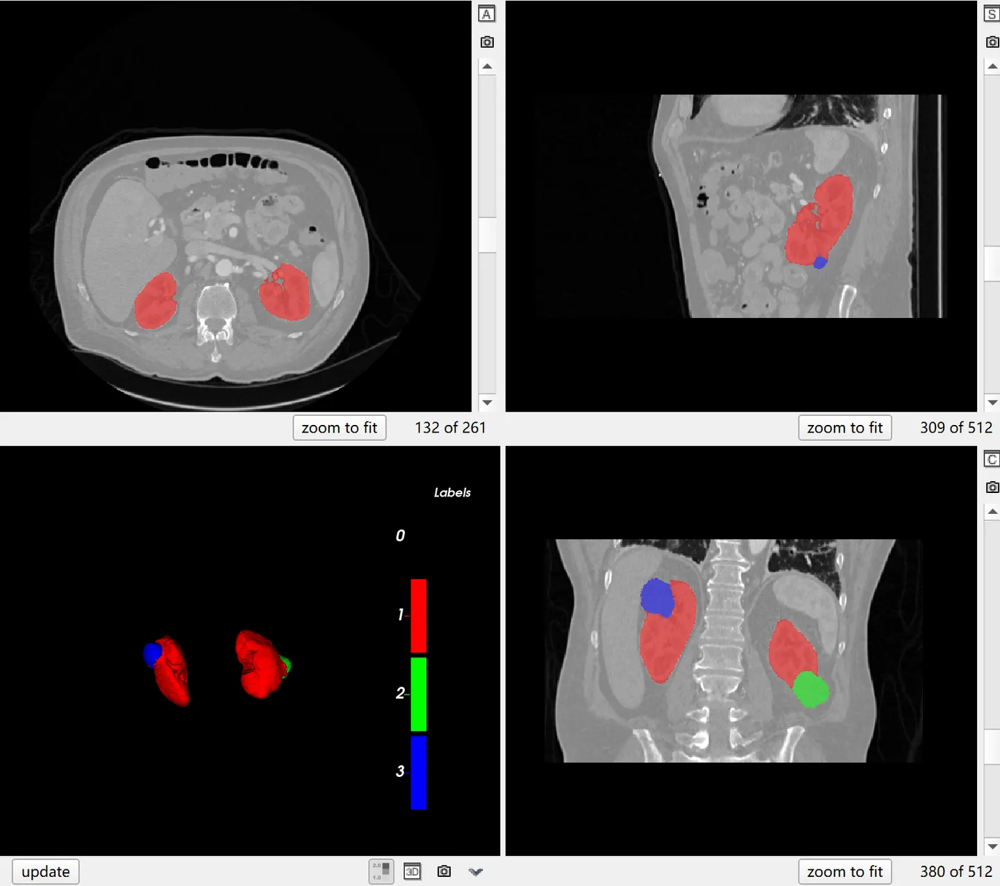

# KiTS23

## Dataset Information

The KiTS23 dataset is dedicated to the CT segmentation of kidneys and their tumors and cysts, and serves as a challenge dataset for MICCAI 2023. The dataset comprises 599 cases, with 489 for training and 110 for testing. These 489 training cases include those previously covered in the training and testing sets of KiTS19 and KiTS21 during the MICCAI challenges. Unlike earlier datasets, KiTS23 incorporates cases from the "nephrogenic contrast phase" in addition to the "late arterial" phase used previously. The 110 testing cases in KiTS23 have never been used in any challenge before.

## Dataset Meta Information

| Dimensions | Modality | Task Type | Anatomical Structures | Anatomical Area | Number of Categories | Data Volume                     | File Format |
|------------|----------|-----------|-----------------------|-----------------|----------------------|---------------------------------|-------------|
| 3D         | CT       | Segmentation | Kidney                | abdomen       | 3                    | 489 for training, 110 for test. | .nii.gz     |

Number of slices based on 489 public training sets: 95,221.

### Resolution Details

| Dataset Statistics | spacing (mm)     | size            |
|--------------------|------------------|-----------------|
| min                | (0.5, 0.3926, 0.3926)              | (29, 512, 512)     |
| median             | (3.0, 0.7813, 0.7813)           | (104, 512, 512) |
| max                | (5.0, 1.0410, 1.0410)              | (1059, 512, 796) |

## Label Information Statistics

| Organ/Structure | Kidney | Tumor | Cyst  |
|-----------------|-----------|-----------|-----------|
| Number of Cases | 489       | 489       | 248       |
| Coverage        | 100%      | 100%      | 50.72%    |
| Min Volume (cm³)| 67.72     | 0.2       | 0.04      |
| Median Volume (cm³)| 395.32 | 32.26     | 4.37      |
| Max Volume (cm³)| 1061.05   | 2590.96   | 937.4     |


## Visualization

<div align="center">
    <a href="https://github.com/openmedlab/"></a>
</div>
<p style="text-align:center;font-size:10px;"><em> ITK-SNAP Visualization. Red: kidney; green: tumor; blue: cyst. </em></p>

## File Structure

The official file structure is located in the `kits23/dataset` directory, which contains 489 subfolders named in the form of `case_XXXXX`. Each subfolder contains `imaging.nii.gz` as the original CT images, `segmentation.nii.gz` as the specific annotation file, and an `instances` subdirectory that stores the annotation results categorized by different annotators.

``` 
kits23/dataset
│
├── case_00000
│   ├── imaging.nii.gz
│   ├── segmentation.nii.gz
│   └── instances
│
...
│
├── case_00537
│   ├── imaging.nii.gz
│   ├── segmentation.nii.gz
│   └── instances
```

## Authors and Institutions

Nicholas Heller (Institute for Robotics, University of Minnesota)

Andrew Wood (Cleveland Clinic)

Fabian Isensee (German Cancer Research Center DKFZ)

Tim Rädsch (German Cancer Research Center DKFZ)

Resha Tejpaul (Institute for Robotics, University of Minnesota)

Nikolaos Papanikolopoulos, PhD -- Computational Chair (Institute for Robotics, University of Minnesota)

Christopher Weight, MD -- Clinical Chair (Cleveland Clinic)


## Source Information

Official Website: https://kits-challenge.org/kits23/, https://github.com/neheller/kits23

Download Link: https://kits-challenge.org/kits23/

Article Address: https://arxiv.org/abs/2307.01984, https://arxiv.org/pdf/1912.01054.pdf, https://www.sciencedirect.com/science/article/abs/pii/S1361841520301857

Publication Date: 2023-04

## Citation

``` 
@misc{heller2023kits21,
      title={The KiTS21 Challenge: Automatic segmentation of kidneys, renal tumors, and renal cysts in corticomedullary-phase CT}, 
      author={Nicholas Heller and Fabian Isensee and Dasha Trofimova and Resha Tejpaul and Zhongchen Zhao and Huai Chen and Lisheng Wang and Alex Golts and Daniel Khapun and Daniel Shats and Yoel Shoshan and Flora Gilboa-Solomon and Yasmeen George and Xi Yang and Jianpeng Zhang and Jing Zhang and Yong Xia and Mengran Wu and Zhiyang Liu and Ed Walczak and Sean McSweeney and Ranveer Vasdev and Chris Hornung and Rafat Solaiman and Jamee Schoephoerster and Bailey Abernathy and David Wu and Safa Abdulkadir and Ben Byun and Justice Spriggs and Griffin Struyk and Alexandra Austin and Ben Simpson and Michael Hagstrom and Sierra Virnig and John French and Nitin Venkatesh and Sarah Chan and Keenan Moore and Anna Jacobsen and Susan Austin and Mark Austin and Subodh Regmi and Nikolaos Papanikolopoulos and Christopher Weight},
      year={2023},
      eprint={2307.01984},
      archivePrefix={arXiv},
      primaryClass={cs.CV}
}

@article{heller2023kits19,
    title={The state of the art in kidney and kidney tumor segmentation in contrast-enhanced CT imaging: Results of the KiTS19 challenge},
    journal={Medical Image Analysis},
    volume={67},
    pages={101821},
    year={2021},
    issn={1361-8415},
    doi={10.1016/j.media.2020.101821},
    url={https://www.sciencedirect.com/science/article/pii/S1361841520301857},
    author={Nicholas Heller and Fabian Isensee and Klaus H. Maier-Hein and Xiaoshuai Hou and Chunmei Xie and Fengyi Li and Yang Nan and Guangrui Mu and Zhiyong Lin and Miofei Han and Guang Yao and Yaozong Gao and Yao Zhang and Yixin Wang and Feng Hou and Jiawei Yang and Guangwei Xiong and Jiang Tian and Cheng Zhong and Jun Ma and Jack Rickman and Joshua Dean and Bethany Stai and Resha Tejpaul and Makinna Oestreich and Paul Blake and Heather Kaluzniak and Shaneabbas Raza and Joel Rosenberg and Keenan Moore and Edward Walczak and Zachary Rengel and Zach Edgerton and Ranveer Vasdev and Matthew Peterson and Sean McSweeney and Sarah Peterson and Arveen Kalapara and Niranjan Sathianathen and Nikolaos Papanikolopoulos and Christopher Weight},
}
```

Original introduction article is [here](https://zhuanlan.zhihu.com/p/656598035).