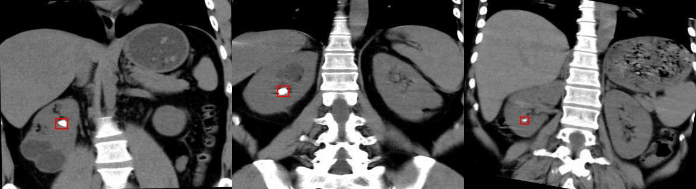
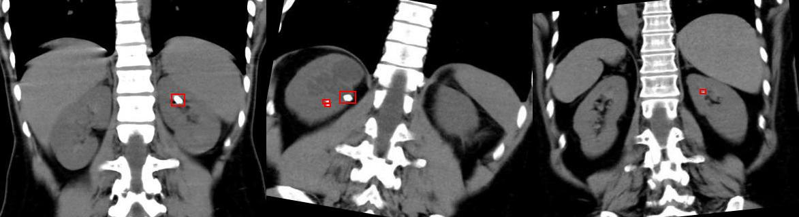

# Kidney Stone Images with Bounding Box Annotations

<div align="center">
    <a href="https://github.com/openmedlab/"></a>
</div>
<p style="text-align:center;font-size:10px;"><em></em></p>

## Dataset Information

The **Kidney Stone Images with Bounding Box Annotations** dataset is specifically designed for object detection methods to identify kidney stones. This dataset is sourced from the Kaggle and Roboflow Universe platforms, with its primary task being the detection of kidney stones in CT scan images. It includes a large collection of CT scan images of kidney stones, covering various sizes and shapes, as well as different locations within the urinary system.

The dataset contains a total of **1,300 images**, divided into training, validation, and test sets in a **7:1.5:1.5 ratio**. Each image is annotated with bounding boxes to accurately locate the kidney stones. The annotations are provided in **YOLO format**, where each image file (in `.jpg` format) has a corresponding text file (in `.txt` format) containing the class and location information of the kidney stones. This format makes it convenient for researchers to use the dataset for training and evaluating various object detection algorithms.

The significance of this dataset lies in its contribution to the research on object detection algorithms in medical imaging. Researchers and healthcare professionals can leverage this dataset to improve and optimize object detection algorithms in medical imaging. By training precise kidney stone detection models, this dataset has the potential to significantly enhance the accuracy and efficiency of kidney stone diagnosis. This can improve the diagnostic and treatment experience for patients, contributing to the early detection and treatment of urinary system diseases.

## Dataset Meta Information

| Dimensions | Modality | Task Type   | Number of Categories | Data Volume | File Format |
|------------|----------|-------------|----------------------|-------------|-------------|
| 2D         | CT       | Detection   | 1                    | 1300        | PNG         |


### Resolution Details

| Dataset Statistics | size (w, h)       | bbox size (w, h)  |
|--------------------|-------------------|-------------------|
| min                | (391.00, 320.00)  | (3.00, 2.00)      |
| median             | (391.00, 320.00)  | (11.00, 9.00)     |
| max                | (391.00, 320.00)  | (137.00, 153.00)  |

## Label Information Statistics

| Label                   | Training Set     | Validation Set   | Test Set        |
|-------------------------|------------------|------------------|-----------------|
| Occurrences             | 1054             | 123              | 123             |
| Percentage              | 81.08%           | 9.46%            | 9.46%           |
| Box Minimum Size (w, h) | (3.00, 2.00)     | (3.00, 2.00)     | (3.00, 2.00)    |
| Box Median Size (w, h)  | (11.00, 10.00)   | (10.00, 8.00)    | (11.00, 10.00)  |
| Box Maximum Size (w, h) | (137.00, 153.00) | (109.00, 104.00) | (113.00, 137.00)|

## Visualization

<div align="center">
    <a href="https://github.com/openmedlab/"></a>
</div>
<p style="text-align:center;font-size:10px;"><em>Data Example 1: The red box is marked as kidney stones.</em></p>

<div align="center">
    <a href="https://github.com/openmedlab/"></a>
</div>
<p style="text-align:center;font-size:10px;"><em>Data Example 2: The red box is marked as kidney stones.</em></p>

## File Structure

``` 
KSI Directory Structure:
└── test/
    ├── images/
    │   ├── 1-3-46-670589-33-1-63703718086120120200001-5487554579919763006_png_jpg.rf.9fd67251e99a47dbe83a5db6efe6c016.jpg
    │   ├── 1-3-46-670589-33-1-63705534438365105500001-5275982036206127404_png_jpg.rf.365c4daf2b772012fe47e07b9daec86e.jpg
    │   ├── ...
    ├── labels/
    │   └── 1-3-46-670589-33-1-63703718086120120200001-5487554579919763006_png_jpg.rf.9fd67251e99a47dbe83a5db6efe6c016.txt
    │   └── 1-3-46-670589-33-1-63705534438365105500001-5275982036206127404_png_jpg.rf.365c4daf2b772012fe47e07b9daec86e.txt
    │   └── ...
└── train/
    ├── images/
    │   ├── 1-3-46-670589-33-1-63700700749865510700001-5062181202000819812_png_jpg.rf.269520bcaab75e008e00f57f3fa98851.jpg
    │   ├── 1-3-46-670589-33-1-63700700749865510700001-5062181202000819812_png_jpg.rf.74493ef7bdab6de49e88f708a5745000.jpg
    │   ├── ...
    ├── labels/
    │   └── 1-3-46-670589-33-1-63700700749865510700001-5062181202000819812_png_jpg.rf.269520bcaab75e008e00f57f3fa98851.txt
    │   └── 1-3-46-670589-33-1-63700700749865510700001-5062181202000819812_png_jpg.rf.74493ef7bdab6de49e88f708a5745000.txt
    │   └── ...
└── valid/
    ├── images/
    │   ├── 1-3-46-670589-33-1-63703718086220125900001-5014104694799407369_png_jpg.rf.964d590909d71e836492f7dcc4cb9fc5.jpg
    │   ├── 1-3-46-670589-33-1-63705534438072088700001-5205898188246698645_png_jpg.rf.75a856d4d26f9f0323b495186912084d.jpg
    │   ├── ...
    ├── labels/
    │   └── 1-3-46-670589-33-1-63703718086220125900001-5014104694799407369_png_jpg.rf.964d590909d71e836492f7dcc4cb9fc5.txt
    │   └── 1-3-46-670589-33-1-63705534438072088700001-5205898188246698645_png_jpg.rf.75a856d4d26f9f0323b495186912084d.txt
    │   └── ...
└── README.dataset.txt
└── README.roboflow.txt
└── data.yaml
```

## Authors and Institutions

TEZ (no specific institution given)

## Source Information

Official Website: https://www.kaggle.com/datasets/safurahajiheidari/kidney-stone-images

Download Link: https://www.kaggle.com/datasets/safurahajiheidari/kidney-stone-images?resource=download&select=README.dataset.txt

Article Address: TBD

Publication Date: 2023-04

## Citation

``` 
@misc{tez_roi_aug_dataset,
  title = {TEZ\_ROI\_AUG Dataset},
  author = {TEZ},
  year = {2023},
  month = {apr},
  note = {Accessed on 2024-10-11},
  howpublished = {\url{https://universe.roboflow.com/tez-nwkf5/tez_roi_aug}},
  url = {https://universe.roboflow.com/tez-nwkf5/tez_roi_aug},
  journal = {Roboflow Universe},
  publisher = {Roboflow},
  type = {Open Source Dataset}
}
```

Original introduction article is [here](https://zhuanlan.zhihu.com/p/942791819).