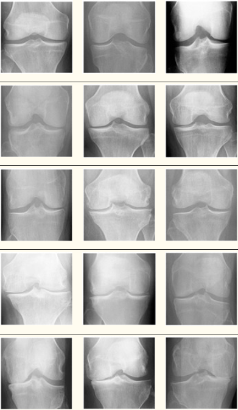
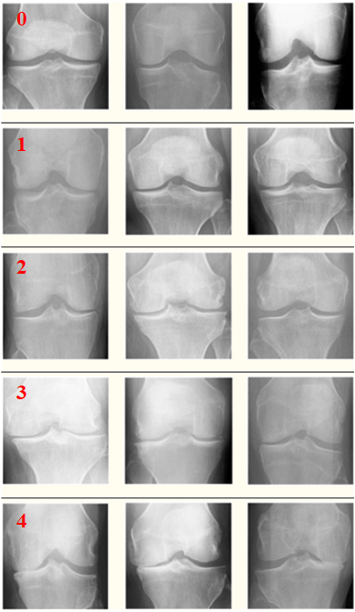

# Knee Osteoarthritis Dataset with Severity Grading

<div align="center">
    <a href="https://github.com/openmedlab/"></a>
</div>
<p style="text-align:center;font-size:10px;"><em></em></p>

## Dataset Information

This article introduces a dataset containing knee joint X-ray data used for knee joint detection and grading according to the Kellgren–Lawrence (KL) grading system. The dataset comprises 9,786 knee joint images categorized into five severity levels based on the KL system: 0 (healthy), 1 (doubtful), 2 (mild), 3 (moderate), and 4 (severe). All images have a resolution of 224 × 224 pixels. Approximately 40% of the dataset images belong to the healthy category, 18% are classified as doubtful, 26% as mild, 13% as moderate, and slightly over 3% as severe.

Knee Osteoarthritis (KOA) is one of the most common diseases among older adults, caused by the wearing down of the articular cartilage in knee joints. The accuracy of severity diagnosis significantly depends on the clinician's diligence and experience. The low reliability of clinicians' grading is attributed to the very subtle differences between X-ray images of adjacent grades. Detection and diagnosis of KOA is one of the fields where Deep Learning (DL) technology is applied. After training, data is fed into models that predict the severity of KOA based on the KL grading system. The high prevalence of KOA necessitates an accurate, reliable, and automated severity classification system, and deep learning offers one such solution.

## Dataset Meta Information

| Dimensions | Modality | Task Type      | Anatomical Structures   | Number of Categories | Data Volume | File Format |
|------------|----------|----------------|-------------------------|----------------------|-------------|-------------|
| 2D         | X-Ray    | Classification | Knee                    | 5                    | 9786        | PNG         |


### Resolution Details

| Dataset Statistics | size        |
|--------------------|-------------|
| min                | (224, 224)  |
| median             | (224, 224)  |
| max                | (224, 224)  |

## Label Information Statistics

| Severity Grade | Label | Image Count |
|----------------|-------|-------------|
| Normal         | 0     | 3857        |
| Doubtful       | 1     | 1770        |
| Mild           | 2     | 2578        |
| Moderate       | 3     | 1286        |
| Severe         | 4     | 295         |


## Visualization

<div align="center">
    <a href="https://github.com/openmedlab/"></a>
</div>
<p style="text-align:center;font-size:10px;"><em>0-4 represents different levels from normal to severe.</em></p>

## File Structure

``` 
Dataset
|-- images
|   |-- train
|      |-- 0
|        |-- xxx.png
|        |-- ...
|        |-- xxx.png
|      |-- 1
|        |-- xxx.png
|        |-- ...
|        |-- xxx.png
|      |-- ...
|      |-- 5
|        |-- xxx.png
|        |-- ...
|        |-- xxx.png
|   |-- val
|      |-- 0
|        |-- xxx.png
|        |-- ...
|        |-- xxx.png
|      |-- 1
|        |-- xxx.png
|        |-- ...
|        |-- xxx.png
|      |-- ...
|      |-- 5
|        |-- xxx.png
|        |-- ...
|        |-- xxx.png
|   |-- test
|      |-- 0
|        |-- xxx.png
|        |-- ...
|        |-- xxx.png
|      |-- 1
|        |-- xxx.png
|        |-- ...
|        |-- xxx.png
|      |-- ...
|      |-- 5
|        |-- xxx.png
|        |-- ...
|        |-- xxx.png
```

## Authors and Institutions

Abdul Sami Mohammed (Prince Mohammad Bin Fahd University)

Ahmed Abul Hasanaath (Prince Mohammad Bin Fahd University)

## Source Information

Official Website: https://data.mendeley.com/datasets/56rmx5bjcr/1

Download Link: https://data.mendeley.com/datasets/56rmx5bjcr/1

Article Address: https://www.ncbi.nlm.nih.gov/pmc/articles/PMC10137589/

Publication Date: 2020.6.23

## Citation

``` 
Chen, Pingjun (2018), “Knee Osteoarthritis Severity Grading Dataset”, Mendeley Data, V1, doi: 10.17632/56rmx5bjcr.1
```

Original introduction article is [here](https://zhuanlan.zhihu.com/p/718997129).