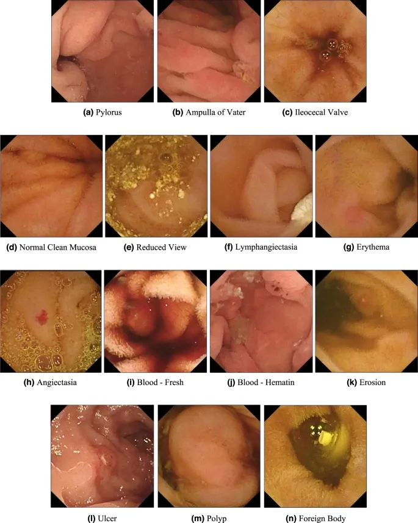

# Kvasir-Capsule

<div align="center">
    <a href="https://github.com/openmedlab/"></a>
</div>
<p style="text-align:center;font-size:10px;"><em></em></p>

## Dataset Information

The Kvasir-Capsule dataset is a detection dataset from Video Capsule Endoscopy (VCE) technology collected from a hospital in Norway, containing 117 videos with a total of 4,741,504 frames of images. Out of these, 47,238 frames contain annotations for 14 different categories of lesions, and there are an additional 4,694,266 unannotated frames. This dataset is crucial for improving the efficiency and accuracy of VCE technology in detecting intestinal abnormalities, significantly reducing the workload of medical staff, and driving the development of related AI algorithms.

Video Capsule Endoscopy (VCE) technology offers new possibilities for doctors to explore the hard-to-reach small intestine in depth. As a critical digestive organ, any abnormalities in the small intestine can lead to serious health risks. Since the early 2000s, VCE technology has been used to aid diagnosis, especially for gastrointestinal bleeding. However, doctors face significant and error-prone work pressure due to the massive amount of image frames that need to be analyzed. With the introduction of the Kvasir-Capsule dataset, automated image and video analysis technologies can utilize this valuable resource, and a substantial improvement in the accuracy and efficiency of disease detection is anticipated.

## Dataset Meta Information

| Type | Dimension | Annotated | Categories | Total Frames | Format   |
|------|-----------|-----------|------------|--------------|----------|
| 2D   | Endoscopy | Yes       | 14         | 4,741,504    | mp4, png |


### Resolution Details

The Video Capsule Endoscopy (VCE) videos of the Kvasir-Capsule dataset were collected during continuous clinical examinations conducted at Bærum Hospital, Vestre Viken Hospital Trust in Norway, from February 2016 to January 2018. The videos were recorded using the Olympus Endocapsule 10 system, with a frame rate of 2 frames per second and a resolution of 336×336, encoded in H.264.

## Label Information Statistics

The dataset contains a total of 47,238 frames with annotations for 14 different categories of lesions. The label information statistics are as follows:

| Label | Category             | Detection Count | Detection Rate |
|-------|----------------------|-----------------|----------------|
| 0     | Ampulla of Vater     | 10              | 0.02%          |
| 1     | Angiectasia          | 866             | 1.86%          |
| 2     | Blood - fresh        | 446             | 0.96%          |
| 3     | Blood - hematin      | 12              | 0.03%          |
| 4     | Erosion              | 506             | 1.09%          |
| 5     | Erythema             | 159             | 0.34%          |
| 6     | Foreign body         | 776             | 1.67%          |
| 7     | Ileocecal valve      | 4,189           | 9.02%          |
| 8     | Lymphangiectasia     | 592             | 1.27%          |
| 9     | Normal clean mucosa  | 34,338         | 73.93%         |
| 10    | Polyp                | 55              | 0.12%          |
| 11    | Pylorus              | 1,529           | 3.29%          |
| 12    | Reduced mucosal view | 2,906          | 6.26%          |
| 13    | Ulcer                | 854             | 1.84%          |


## Visualization

<div align="center">
    <a href="https://github.com/openmedlab/"></a>
</div>
<p style="text-align:center;font-size:10px;"><em></em></p>

## File Structure

This dataset includes labeled images (`labelled_images`), labeled videos (`labelled_videos`), and unlabeled videos (unlabelled_videos), where the labeled images are derived from the labeled videos.

The official file structure is as follows:

``` 
Kvasir-Capsule Dataset
│
├── labelled_images
│   ├── ampulla_of_vater.tar.gz
│   ├── angiectasia.tar.gz
│   └── ...
├── labelled_videos
│   ├── 04a78ef00c5245e0.mp4
│   ├── 0531325b64674948.mp4
│   └── ...
├── unlabelled_videos
│   ├── 055bbbec392b4f3a.mp4
│   ├── 08d09e4d7aa140f7.mp4
│   └── ...
├── metadata.csv
└── metadata.json
```

## Authors and Institutions

Pia H. Smedsrud (SimulaMet, Augere Medical AS, University of Oslo, Norway)

Vajira Thambawita (SimulaMet, Oslo Metropolitan University, Norway)

Steven A. Hicks (SimulaMet, Oslo Metropolitan University, Norway)

Debesh Jha (SimulaMet, UIT The Arctic University of Norway, Norway)

Thomas de Lange (Department of Medical Research, Bærum Hospital, Augere Medical AS, Norway)

Michael A. Riegler (SimulaMet, Norway)

Pål Halvorsen (SimulaMet, Oslo Metropolitan University, Norway)


## Source Information

Official Website: https://datasets.simula.no/kvasir-capsule/

Download Link: https://datasets.simula.no/kvasir-capsule/

Article Address: https://www.nature.com/articles/s41597-021-00920-z

Publication Date: 2021-05

## Citation

``` 
@article{smedsrud2021kvasir,
  title={Kvasir-Capsule, a video capsule endoscopy dataset},
  author={Smedsrud, Pia H and Thambawita, Vajira and Hicks, Steven A and Gjestang, Henrik and Nedrejord, Oda Olsen and N{\ae}ss, Espen and Borgli, Hanna and Jha, Debesh and Berstad, Tor Jan Derek and Eskeland, Sigrun L and others},
  journal={Scientific Data},
  volume={8},
  number={1},
  pages={142},
  year={2021},
  publisher={Nature Publishing Group UK London}
}
```

Original introduction article is [here](https://zhuanlan.zhihu.com/p/665935273).