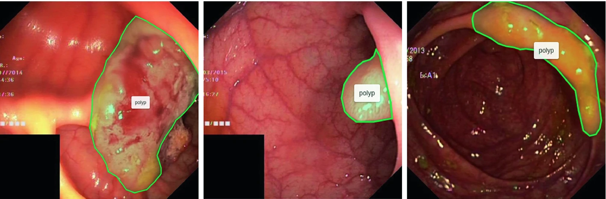
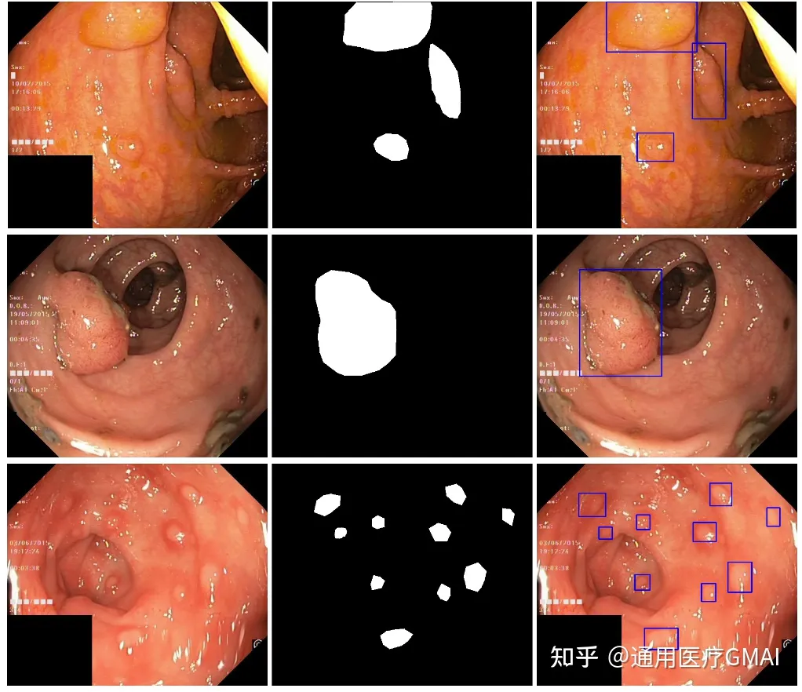

# Kvasir-SEG

<div align="center">
    <a href="https://github.com/openmedlab/"></a>
</div>
<p style="text-align:center;font-size:10px;"><em></em></p>

## Dataset Information

Kvasir-SEG is an endoscopic dataset for pixel-level segmentation of colon polyps, which was used in the MediaEval 2020 competition. It includes 1000 gastroenterological polyp images and their corresponding segmentation masks, all annotated and verified by experienced gastroenterological experts. The official data repository provides a training and validation data split in an 880:120 ratio to fairly compare various methods. This dataset aims to promote research and innovation in segmentation, detection, localization, and classification methods for colon polyps.

## Dataset Meta Information

| Dimensions | Modality  | Task Type | Anatomical Structures | Anatomical Area | Number of Categories | Data Volume                                         | File Format |
|------------|-----------|-----------|-----------------------|-----------------|----------------------|-----------------------------------------------------|-------------|
| 2D         | Endoscopy | Segmentation | Polyp                 | Colon           | 1                    | 880 for training, 120 for validation, 160 for test  | jpg     |


### Resolution Details

| Dataset Statistics | size         |
|--------------------|--------------|
| min                | (487, 332)   |
| median             | (528, 622)   |
| max                | (1072, 1920)   |

## Label Information Statistics

| Category      | polyp |
|---------------|-----------|
| Detection Count | 1000      |
| Detection Rate | 100%      |
| Max Area Size | 1,094,201 |
| Min Area Size | 849       |
| Median Area Size | 36,887  |


## Visualization

<div align="center">
    <a href="https://github.com/openmedlab/"></a>
</div>
<p style="text-align:center;font-size:10px;"><em> Kvasir-SEG data set example, the left picture is the endoscopic view, the middle is the mask view, the right is the bounding box view, the bounding box coordinates are given by the json file.</em></p>

## File Structure

In the official dataset, both the images and masks are in jpg format. They are stored in two separate folders, but the filenames are the same. Additionally, the official dataset provides bounding box coordinates for the polyp locations in each image, and this information is saved in a json file.

``` 
Kvasir-SEG Dataset
|
|-- Images Folder
|   |-- image1.jpg
|   |-- image2.jpg
|   |-- ...
|
|-- Masks Folder
|   |-- mask1.jpg
|   |-- mask2.jpg
|   |-- ...
|
|-- kavsir_bboxes.json
```

## Source Information

Official Website: https://datasets.simula.no/kvasir-seg/, https://github.com/DebeshJha/2020-MediaEval-Medico-polyp-segmentation/tree/master

Download Link: https://datasets.simula.no/downloads/kvasir-seg.zip, https://datasets.simula.no/downloads/kvasir-sessile.zip

Article Address: https://link.springer.com/chapter/10.1007/978-3-030-37734-2_37

Publication Date: 2019-11

## Citation

``` 
@inproceedings{jha2020kvasir,
  title={Kvasir-seg: A segmented polyp dataset},
  author={Jha, Debesh and Smedsrud, Pia H and Riegler, Michael A and Halvorsen, P{\aa}l and de Lange, Thomas and Johansen, Dag and Johansen, H{\aa}vard D},
  booktitle={MultiMedia Modeling: 26th International Conference, MMM 2020, Daejeon, South Korea, January 5--8, 2020, Proceedings, Part II 26},
  pages={451--462},
  year={2020},
  organization={Springer}
}
```

Original introduction article is [here](https://zhuanlan.zhihu.com/p/655128183).