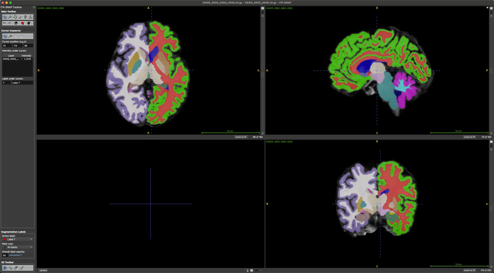
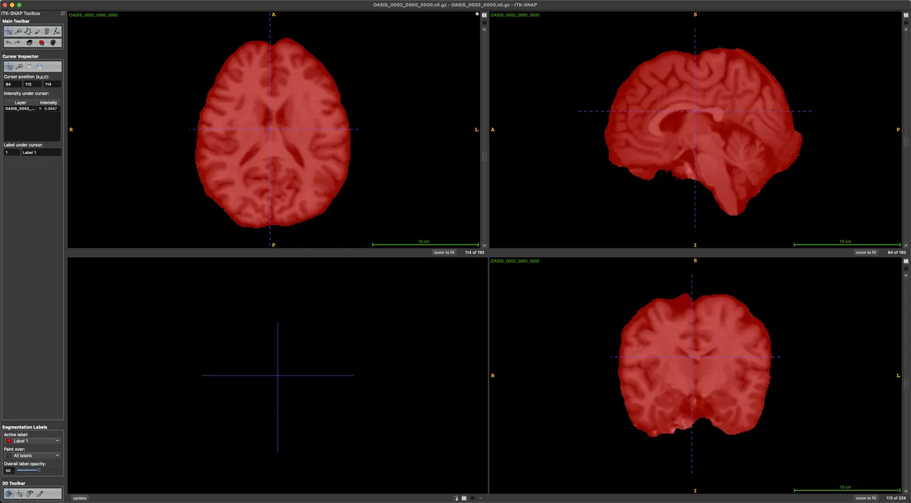

# L2R-OASIS

<div align="center">
    <a href="https://github.com/openmedlab/"></a>
</div>
<p style="text-align:center;font-size:10px;"><em></em></p>

## Dataset Information

The Open Access Series of Imaging Studies (OASIS) is a project aimed at providing the scientific community with free access to neuroimaging datasets for the purpose of advancing discoveries in basic and clinical neuroscience. There are four versions available on the OASIS official website, and this description refers to the OASIS dataset version used in [the L2R Challenge](https://link.zhihu.com/?target=https%3A//learn2reg.grand-challenge.org/Description/) (Medical Image Registration in MELBA). This dataset is used for segmentation and registration and contains a total of 416 3D MR datasets, with label masks for segmentation and masks for registration.

The dataset consists of 35 label classes, which are as follows: 1 left cerebral white matter, 2 left cerebral cortex, 3 left lateral ventricle, 4 left inferior lateral ventricle, 5 left cerebellar white matter, 6 left cerebellar cortex, 7 left thalamus, 8 left caudate, 9 left putamen, 10 left pallidum, 11 third ventricle, 12 fourth ventricle, 13 brain stem, 14 left hippocampus, 15 left amygdala, 16 left accumbens area, 17 left ventral DC, 18 left vessels, 19 left choroid plexus, 20 right cerebral white matter, 21 right cerebral cortex, 22 right lateral ventricle, 23 right inferior lateral ventricle, 24 right cerebellar white matter, 25 right cerebellar cortex, 26 right thalamus, 27 right caudate, 28 right putamen, 29 right pallidum, 30 right hippocampus, 31 right amygdala, 32 right accumbens area, 33 right ventral DC, 34 right vessels, 35 right choroid plexus. Hosted by [central.xnat.org](central.xnat.org), the OASIS dataset provides the community with an important open-access platform of neuroimaging data and post-processed imaging data covering a broad demographic, cognitive, and genetic spectrum, which can be used for neuroimaging, clinical, and cognitive studies on normal aging and cognitive decline. All data is accessible via [www.oasis-brains.org](www.oasis-brains.org).

## Dataset Meta Information

| Dimensions | Modality | Task Type                  | Anatomical Structures | Anatomical Area | Number of Categories | Data Volume | File Format |
|------------|----------|----------------------------|-----------------------|-----------------|----------------------|-------------|-------------|
| 3D         | MR       | Registration, Segmentation | Brain                 | Head and Neck   | 35                   | 416         | .nii.gz     |


### Resolution Details

| Dataset Statistics | spacing (mm)     | size            |
|--------------------|------------------|-----------------|
| min                | (1, 1, 1)              | (160, 224, 192)     |
| median             | (1, 1, 1)           | (160, 224, 192) |
| max                | (1, 1, 1)              | (160, 224, 192) |

Number of 2D slices in the dataset: 79,488 (based on the actual count from the training set of 414 cases that we downloaded).

## Label Information Statistics

| Label                                 | Cases | Percentage | Max Volume (cm³) | Min Volume (cm³) | Median Volume (cm³) |
|---------------------------------------|-------|------------|------------------|------------------|---------------------|
| left_cerebral_white_matter            | 414   | 100.00%    | 310.84           | 218.81           | 267.775             |
| left_cerebral_cortex                  | 414   | 100.00%    | 368.4            | 216.04           | 298.06              |
| left_lateral_ventricle                | 414   | 100.00%    | 85.84            | 5.61             | 14.525              |
| left_inferior_horn_of_the_lateral_ventricle | 414   | 100.00%    | 6.98             | 0.06             | 0.45                |
| left_cerebellar_white_matter          | 414   | 100.00%    | 22.23            | 11.34            | 15.815              |
| left_cerebellar_cortex                | 414   | 100.00%    | 83.69            | 50.26            | 66.615              |
| left_thalamus                         | 414   | 100.00%    | 10.36            | 6.38             | 8.52                |
| left_caudate_nucleus                  | 414   | 100.00%    | 7.06             | 3.04             | 4.735               |
| left_putamen                          | 414   | 100.00%    | 9.72             | 4.16             | 6.93                |
| left_globus_pallidus                  | 414   | 100.00%    | 2.75             | 1.44             | 2.13                |
| third_ventricle                       | 414   | 100.00%    | 5.19             | 0.87             | 1.59                |
| fourth_ventricle                      | 414   | 100.00%    | 4.79             | 1.2              | 2.29                |
| brainstem                                   | 414   | 100.00%    | 32.2             | 18.33            | 25.01               |
| left_hippocampus                            | 414   | 100.00%    | 7.36             | 2.88             | 5.375               |
| left_amygdala                               | 414   | 100.00%    | 2.57             | 0.92             | 2.01                |
| left_septal_area                            | 414   | 100.00%    | 1.31             | 0.48             | 0.9                 |
| left_ventricle                              | 414   | 100.00%    | 5.9              | 2.62             | 4.86                |
| left_vessels                                | 413   | 99.76%     | 0.43             | 0.0              | 0.06                |
| left_choroid_plexus                         | 414   | 100.00%    | 3.22             | 0.35             | 1.01                |
| right_cerebral_white_matter                 | 414   | 100.00%    | 320.36           | 223.78           | 269.05              |
| right_cerebral_cortex                       | 414   | 100.00%    | 360.81           | 208.48           | 296.715             |
| right_lateral_ventricle                     | 414   | 100.00%    | 78.74            | 5.14             | 13.1                |
| right_inferior_horn_of_the_lateral_ventricle| 414   | 100.00%    | 7.29             | 0.1              | 0.51                |
| right_cerebellar_white_matter               | 414   | 100.00%    | 21.26            | 10.99            | 15.565              |
| right_cerebellar_cortex                     | 414   | 100.00%    | 84.79            | 49.67            | 66.265              |
| right_thalamus                              | 414   | 100.00%    | 10.04            | 6.28             | 8.34                |
| right_caudate_nucleus  | 414   | 100.00%    | 7.4              | 3.21             | 4.96                |
| right_putamen          | 414   | 100.00%    | 9.29             | 4.13             | 6.895               |
| right_globus_pallidus  | 414   | 100.00%    | 2.74             | 1.32             | 2.13                |
| right_hippocampus      | 414   | 100.00%    | 7.11             | 2.32             | 5.445               |
| right_amygdala         | 414   | 100.00%    | 2.9              | 1.01             | 2.21                |
| right_septal_area      | 414   | 100.00%    | 1.19             | 0.41             | 0.81                |
| right_ventricle        | 414   | 100.00%    | 5.63             | 2.74             | 4.715               |
| right_vessels          | 411   | 99.28%     | 1.53             | 0.0              | 0.05                |
| right_choroid_plexus   | 414   | 100.00%    | 3.65             | 0.46             | 1.31                |

## Visualization

<div align="center">
    <a href="https://github.com/openmedlab/"></a>
</div>
<p style="text-align:center;font-size:10px;"><em> Segmentation data.</em></p>

<div align="center">
    <a href="https://github.com/openmedlab/"></a>
</div>
<p style="text-align:center;font-size:10px;"><em> Registration mask data.</em></p>

## File Structure

In the dataset, imagesTr are the training set brain MR files, imagesTs are the test set brain MR files, labelsTr are the training set labels, and maskTr and maskTs are the mask files used for registration in the test set.

``` 
Dataset
├── changelog.txt
├── OASIS_dataset.json
├── imagesTr
│   ├── OASIS_0001_0000.nii.gz
│   ├── OASIS_0002_0000.nii.gz
│   ├── ...
├── imagesTs
│   ├── OASIS_0415_0000.nii.gz
│   ├── OASIS_0416_0000.nii.gz
│   ├── ...
├── labelsTr
│   ├── OASIS_0001_0000.nii.gz
│   ├── OASIS_0002_0000.nii.gz
│   ├── ...
├── masksTr
│   ├── OASIS_0001_0000.nii.gz
│   ├── OASIS_0002_0000.nii.gz
│   ├── ...
├── masksTr
│   ├── OASIS_0415_0000.nii.gz
│   ├── OASIS_0416_0000.nii.gz
│   ├── ...
└── README.txt
```

## Authors and Institutions

Daniel S. Marcus (Washington University)

Tracy H. Wang (Washington University)

Jamie Parker (Harvard University)

John G. Csernansky (Washington University)

John C. Morris (Washington University)

Randy L. Buckner (Harvard University, Massachusetts General Hospital, Howard Hughes Medical Institute)


## Source Information

Official Website: https://learn2reg.grand-challenge.org/Datasets/

Download Link: https://www.oasis-brains.org/#data

Article Address: https://dash.harvard.edu/bitstream/handle/1/33896768/Buckner_OpenAccess.pdf?sequence=2

Publication Date: 2007

## Citation

``` 
@article{marcus2007open,
  title={Open Access Series of Imaging Studies (OASIS): cross-sectional MRI data in young, middle aged, nondemented, and demented older adults},
  author={Marcus, Daniel S and Wang, Tracy H and Parker, Jamie and Csernansky, John G and Morris, John C and Buckner, Randy L},
  journal={Journal of cognitive neuroscience},
  volume={19},
  number={9},
  pages={1498--1507},
  year={2007},
  publisher={MIT Press One Rogers Street, Cambridge, MA 02142-1209, USA journals-info~…}
}
```

Original introduction article is [here](https://zhuanlan.zhihu.com/p/680891795).