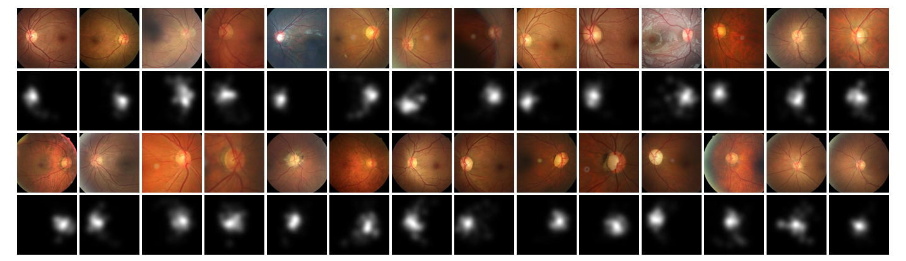
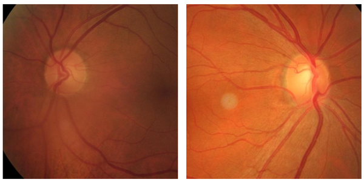
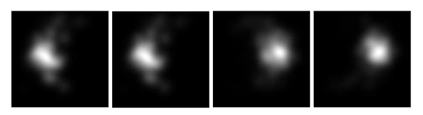

# LAG

<div align="center">
    <a href="https://github.com/openmedlab/"></a>
</div>
<p style="text-align:center;font-size:10px;"><em></em></p>

## Dataset Information

The LAG dataset is a collection of 11,760 fundus images specifically designed for the early detection and study of glaucoma. The images in this dataset are derived from routine fundus examinations and are categorized into two sample types: 4,878 images as suspicious-glaucoma samples, and 6,882 images as non-glaucoma samples. Each image is accompanied by detailed diagnostic labels, where "0" indicates a non-glaucoma sample, and "1" indicates a suspicious-glaucoma sample.

Additionally, 5,824 images in the LAG dataset have further been annotated with attention maps. These annotations highlight areas of high risk identified by medical experts in the fundus images. Among these annotated images, 2,392 are positive for glaucoma, while the remaining 3,432 are classified as non-glaucoma.

The LAG dataset not only includes a large number of expert-annotated suspicious and negative samples but also features eye-tracking-related attention map annotations. This provides robust support for deep learning-based fundus image analysis and automated diagnostics, aiding the advancement of early screening and prevention systems for glaucoma, ultimately improving the management of ophthalmic diseases worldwide.

## Dataset Meta Information

| Dimensions | Modality | Task Type      | Anatomical Structures | Anatomical Area | Number of Categories | Data Volume   | File Format |
|------------|----------|----------------|-----------------------|-----------------|----------------------|---------------|-------------|
| 2D         | Fundus   | Classification | Retina                | Head and Neck   | 2                    | 11760         | JPG         |


### Resolution Details

| Dataset Statistics | size        |
|--------------------|-------------|
| min                | (112, 112)  |
| median             | (500, 500)  |
| max                | (500, 500)  |

## Label Information Statistics

| Description       | Non-Glaucoma | Suspicious-Glaucoma |
|-------------------|--------------|---------------------|
| Number of Images  | 6882         | 4878                |
| Percentage (%)    | 58.5         | 41.5                |
| Resolution (cm²)  | (112, 112)   | (112, 112)          |
| Medium Resolution | (500, 500)   | (500, 500)          |
| High Resolution   | (500, 500)   | (500, 500)          |


## Visualization

<div align="center">
    <a href="https://github.com/openmedlab/"></a>
</div>
<p style="text-align:center;font-size:10px;"><em>Non-glaucoma.</em></p>

<div align="center">
    <a href="https://github.com/openmedlab/"></a>
</div>
<p style="text-align:center;font-size:10px;"><em>Suspected glaucoma.</em></p>

<div align="center">
    <a href="https://github.com/openmedlab/"></a>
</div>
<p style="text-align:center;font-size:10px;"><em>Focus Area Map.</em></p>

## File Structure

``` 
LAG/
├── non_glaucoma/
│   ├── attention_map/
│   │   ├── image1.jpg
│   │   ├── image2.jpg
│   │   └── ...
│   ├── image/
│   │   ├── image1.jpg
│   │   ├── image2.jpg
│   │   └── ...
│   └── label/
│       ├── 0001.txt
│       ├── 0002.txt
│       └── ...
├── suspicious_glaucoma/
│   ├── attention_map/
│   │   ├── image5.jpg
│   │   ├── image8.jpg
│   │   └── ...
│   ├── image/
│   │   ├── image5.jpg
│   │   ├── image8.jpg
│   │   └── ...
│   └── label/
│       ├── 0005.txt
│       ├── 0008.txt
│       └── ...
```

## Source Information

Official Website: https://github.com/smilell/AG-CNN?tab=readme-ov-file

Download Link: https://github.com/smilell/AG-CNN?tab=readme-ov-file

Article Address: https://arxiv.org/abs/1903.10831

Publication Date: 2019-03

## Citation

``` 
@InProceedings{Li_2019_CVPR,
author = {Li, Liu and Xu, Mai and Wang, Xiaofei and Jiang, Lai and Liu, Hanruo},
title = {Attention Based Glaucoma Detection: A Large-Scale Database and CNN Model},
booktitle = {The IEEE Conference on Computer Vision and Pattern Recognition (CVPR)},
month = {June},
year = {2019}
}
```

Original introduction article is [here](https://zhuanlan.zhihu.com/p/717695163).
