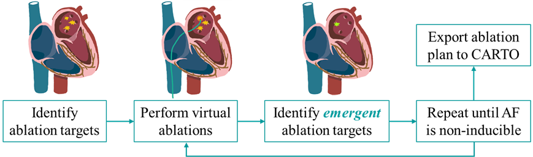
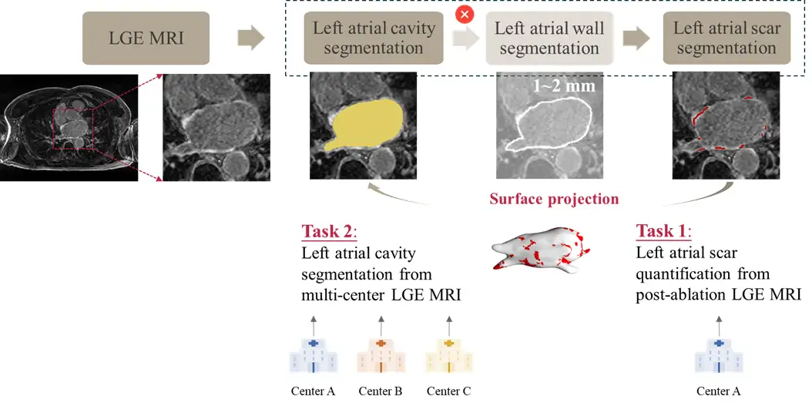

# MICCAI 2024 CARE LAScarQS++

<div align="center">
    <a href="https://github.com/openmedlab/"></a>
</div>
<p style="text-align:center;font-size:10px;"><em></em></p>

## Competition Vision

Atrial fibrillation (AF), the most common cardiac arrhythmia, is on the rise due to population aging. Radiofrequency catheter ablation is a common treatment for AF, yet faces the challenge of high recurrence rates. Cardiac digital twin technology, offering personalized virtual representations of the heart and inferring multiscale attributes related to cardiac mechanisms, has shown great potential in personalized targeted ablation treatment for persistent AF (see Figure 1). The creation of digital twins hinges on the accurate reconstruction of the left atrium (LA) geometry and identification of scar locations using late gadolinium-enhanced magnetic resonance imaging (LGE MRI). However, automated quantification and analysis of LA scars remain challenging due to poor image quality, thin cardiac walls, interference from surrounding enhancement areas, and complex scar distributions in LGE MRI. Despite the potential shown by deep learning (DL) methods in LGE MRI analysis, they often perform poorly on unfamiliar data from new centers due to domain shifts. LAScarQS++ aims to address these issues by advancing deep learning models that can precisely delineate the left atrial chamber and scars, thereby fundamentally transforming the traditional approach to AF treatment.

<div align="center">
    <a href="https://github.com/openmedlab/"></a>
</div>
<p style="text-align:center;font-size:10px;"><em>Figure 1: Application of cardiac digital twin technology in personalized targeted ablation treatment.</em></p>

## Competition Content

The two objectives of this track are to automatically segment the left atrial (LA) chamber and quantify left atrial scars from LGE MRI, as shown in Figure 2. This track will provide over 200 LGE MRI datasets from multiple imaging centers worldwide, aiming to develop new algorithms that can accurately quantify or segment the left atrial chamber and scars. This track offers an open and fair platform for research teams to test and validate their methods. To ensure data privacy, the platform supports remote training and testing, allowing datasets to be processed locally at different centers.

<div align="center">
    <a href="https://github.com/openmedlab/"></a>
</div>
<p style="text-align:center;font-size:10px;"><em>Figure 2: Details of Task 1 for quantification of left atrial scars and Task 2 for chamber segmentation.</em></p>

## Dataset Information

The dataset provided by this track consists of multi-center LGE MRIs from various countries. All data has been ethically approved and anonymized to meet privacy and ethical standards. Below are the details of these LGE MRIs:

Center A: 154 LGE MRIs
These data originally come from Utah NAMIC-CARMA, which had obtained publication permission. The data set from the 2018 atrial fibrillation segmentation challenge was optimized before its final release. Therefore, we have used the optimized dataset and further fixed resolution inconsistencies found in the dataset. Clinical images were acquired using Siemens Avanto 1.5T or Vario 3T during free breathing (FB) with navigator gating. The spatial resolution of a 3D LGE MRI scan is 0.625 × 0.625 × 2.5 mm. Patients underwent MR examinations before RF ablation or 3-6 months post-operatively.

Center B: 20 LGE MRIs
These data originally come from Beth Israel Deaconess Medical Center and were used in the ISBI2012 Left Atrial Fibrosis and Scarring Segmentation Challenge. We selected some data from this challenge’s dataset and manually optimized it before publication. Clinical images were acquired using Philips Acheiva 1.5T during free breathing and navigator gating. The spatial resolution of a 3D LGE MRI scan is 1.4 × 1.4 × 1.4 mm. Patients underwent MR examinations before RF ablation or 1 month post-operatively.

Center C: 20 LGE MRIs
These data originally come from King’s College London and were used in the ISBI2012 Left Atrial Fibrosis and Scarring Segmentation Challenge. We selected some data from this challenge’s dataset and manually optimized it before publication. Clinical images were also acquired using Philips Acheiva 1.5T during free breathing and navigator gating. The spatial resolution of a 3D LGE MRI scan is 1.3 × 1.3 × 4.0 mm. Patients underwent MR examinations before RF ablation or 3-6 months post-operatively.

## File Structure

Our challenge is divided into two tasks. For Task 1, 60 LGE MRIs from Center A are used as the training set, 10 LGE MRIs from Center A as the validation set, and 24 LGE MRIs from Center A as the test set. For Task 2, 130 LGE MRIs from Center A are used as the training set, 10 LGE MRIs from Center A and 10 LGE MRIs from Center C as the validation set, and 14 LGE MRIs from Center A, 20 LGE MRIs from Center B, and 10 LGE MRIs from Center C as the test set.

Each patient's LGE MRI and gold standard labels will be provided in NIfTI format, as follows:

``` 
enhanced.nii.gz (LGE MRI)
atriumSegImgMO.nii.gz (Left Atrial Chamber Gold Standard)
scarSegImgM.nii.gz (Left Atrial Scar Gold Standard, used only for Task 1)
```

The format for predictions submitted by participants can be named as follows:

```
LA_predict.nii.gz (Predicted Left Atrial Chamber Label)
scar_predict.nii.gz (Predicted Left Atrial Scar Label, used only for Task 1)
```

## Authors and Institutions

Xiahai Zhuang, Sihan Wang, Yang Zhang (School of Data Science, Fudan University, Shanghai, China)

Lei Li (School of Electronics and Computer Science, University of Southampton)

Xingtao Lin (School of Physics and Information Engineering, Fuzhou University, Fuzhou, China)

## Source Information

Official Website: http://zmic.org.cn/care_2024/track2/

Download Link: Download the User Agreement Terms and Data Access Agreement form from the official website, fill it out and send it to the organizer to obtain the data download link.

Article Address: TBD

Publication Date: 2024-05-10

## Citation

``` 
TBD
```

Original introduction article is [here](https://zhuanlan.zhihu.com/p/706727623).