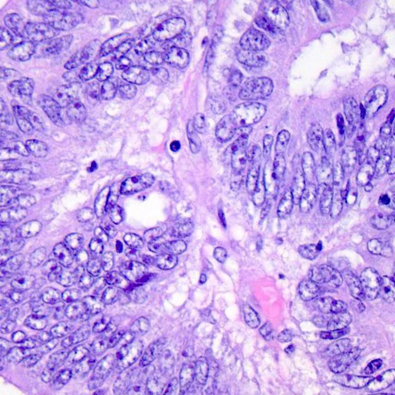
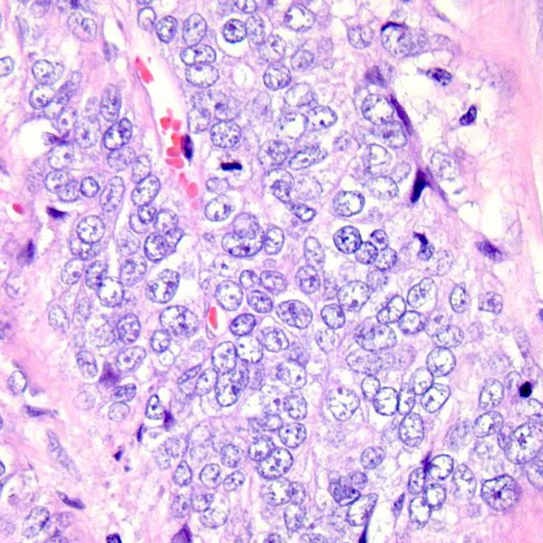
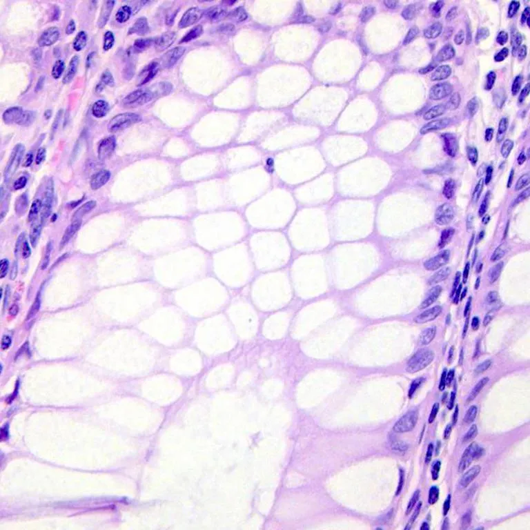
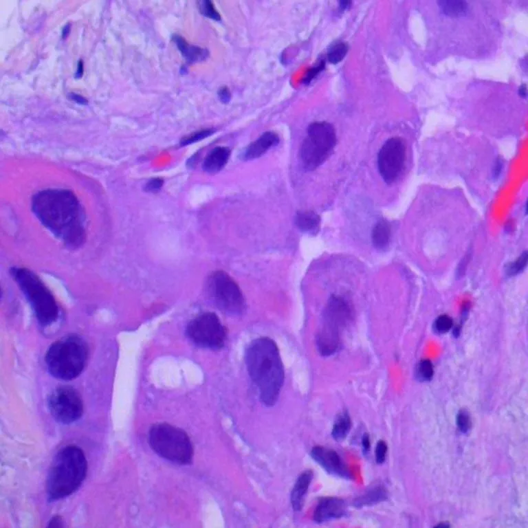
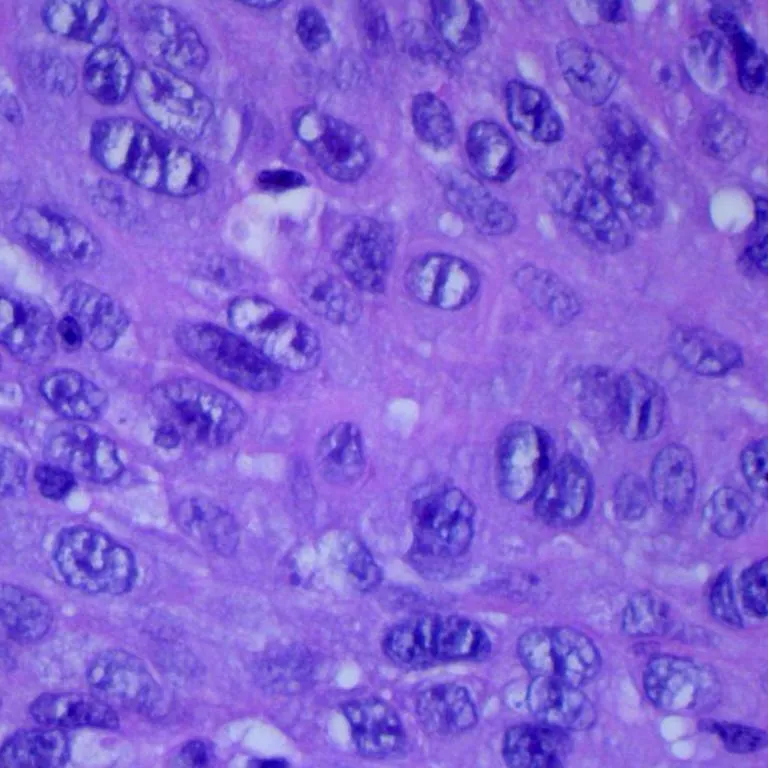
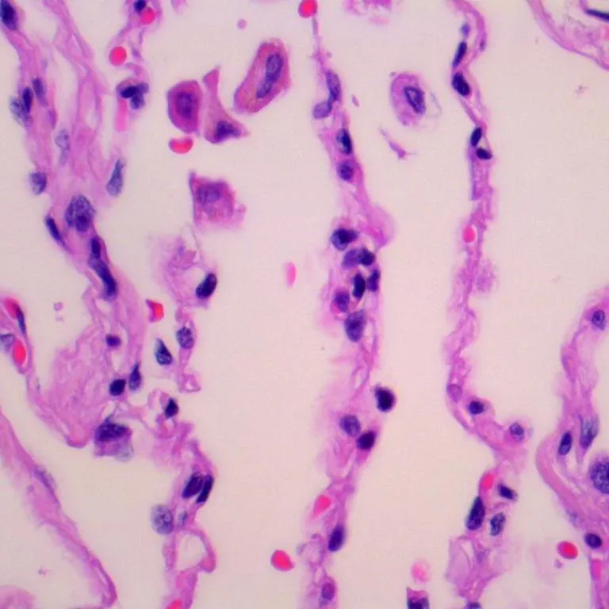

# LC25000

<div align="center">
    <a href="https://github.com/openmedlab/"></a>
</div>
<p style="text-align:center;font-size:10px;"><em></em></p>

## Dataset Information

The LC25000 (Lung and Colon) dataset contains 25,000 histopathological images, all of which are 768 x 768 pixels in size. This dataset is divided into 5 categories: colon adenocarcinoma, benign colon tissue, lung adenocarcinoma, lung squamous cell carcinoma, and benign lung tissue, with 5,000 images for each category. Artificial intelligence technologies represented by deep learning algorithms are actively promoting the development of medical imaging, but such technology requires extensive clinical data for support. Lung cancer and colon cancer are two common types of cancer in clinical practice, yet publicly available imaging data for researchers in this field is extremely scarce. Therefore, with the support and assistance of James A. Haley Veterans' Hospital, the authors completed the image collection and annotation for this dataset and allow everyone to download it for free to aid in the innovation and application of artificial intelligence technology in this field.

## Dataset Meta Information

| Dimensions | Modality         | Task Type      | Anatomical Structures | Anatomical Area | Number of Categories | Data Volume | File Format |
|------------|------------------|----------------|-----------------------|-----------------|----------------------|-------------|-------------|
| 2D         | Tissue Pathology | Classification | Tissue                | Tissue          | 5                    | 25000       | .jpeg       |


### Resolution Details

| Dataset Statistics | size       |
|--------------------|------------|
| min                | [768,768]  |
| median             | [768,768]  |
| max                | [768,768]  |
## Label Information Statistics

| Category                 | Number |
|--------------------------|--------|
| Colon Adenocarcinoma     | 5000   |
| Benign Colonic Tissue    | 5000   |
| Lung Adenocarcinoma      | 5000   |
| Lung Squamous Cell Carcinoma | 5000   |
| Benign Lung Tissue       | 5000   |

## Visualization


<div align="center">
    <a href="https://github.com/openmedlab/"></a>
</div>
<p style="text-align:center;font-size:10px;"><em> Example of Colon Adenocarcinoma Histopathology Image.</em></p>

<div align="center">
    <a href="https://github.com/openmedlab/"></a>
</div>
<p style="text-align:center;font-size:10px;"><em> Example of Benign Colonic Tissue Histopathology Image.</em></p>

<div align="center">
    <a href="https://github.com/openmedlab/"></a>
</div>
<p style="text-align:center;font-size:10px;"><em> Example of Lung Adenocarcinoma Histopathology Image.</em></p>

<div align="center">
    <a href="https://github.com/openmedlab/"></a>
</div>
<p style="text-align:center;font-size:10px;"><em> Example of Lung Squamous Cell Carcinoma Histopathology Image.</em></p>

<div align="center">
    <a href="https://github.com/openmedlab/"></a>
</div>
<p style="text-align:center;font-size:10px;"><em> Example of Benign Lung Tissue Histopathology Image.</em></p>

## File Structure

The file structure of the data set is as follows, including folders that save images of 4 categories.

``` 
LC25000 Dataset
├── colon_image_sets
│   ├── colon_aca
│   │   ├── colonca1.jpeg
│   │   ├── colonca2.jpeg
│   │    ...
│   ├── colon_n
│   │   ├── colonn1.jpeg
│   │   ├── colonn2.jpeg
│   ├── ...
├── lung_image_sets
│   ├── lung_aca
│   │   ├── lungaca1.jpeg
│   │   ├── lungaca2.jpeg
│   │   ├── ...
│   ├── lung_n
│   │   ├── lungn1.jpeg
│   │   ├── lungn2.jpeg
│   │   ├── ...
│   ├── lung_scc
│   │   ├── lungscc1.jpeg
│   │   ├── lungscc2.jpeg
│   │   ├── ...
```

## Authors and Institutions

Andrew A. Borkowski (James A. Haley Veterans’ Hospital, USA; University of South Florida, USA)

Marilyn M. Bui (University of South Florida, USA; Moffitt Cancer Center, USA)

L. Brannon Thomas (James A. Haley Veterans’ Hospital, USA; University of South Florida, USA)

Catherine P. Wilson (James A. Haley Veterans’ Hospital, USA)

Lauren A. DeLand (James A. Haley Veterans’ Hospital, USA)

Stephen M. Mastorides (James A. Haley Veterans’ Hospital, USA; University of South Florida, USA)


## Source Information

Official Website: https://github.com/tampapath/lung_colon_image_set

Download Link: https://github.com/tampapath/lung_colon_image_set

Article Address: https://arxiv.org/pdf/1912.12142v1.pdf

Publication Date: 2020-01-06

## Citation

``` 
@article{borkowski2019lung,
  title={Lung and colon cancer histopathological image dataset (lc25000)},
  author={Borkowski, Andrew A and Bui, Marilyn M and Thomas, L Brannon and Wilson, Catherine P and DeLand, Lauren A and Mastorides, Stephen M},
  journal={arXiv preprint arXiv:1912.12142},
  year={2019}
}
```

Original introduction article is [here](https://zhuanlan.zhihu.com/p/673572009).