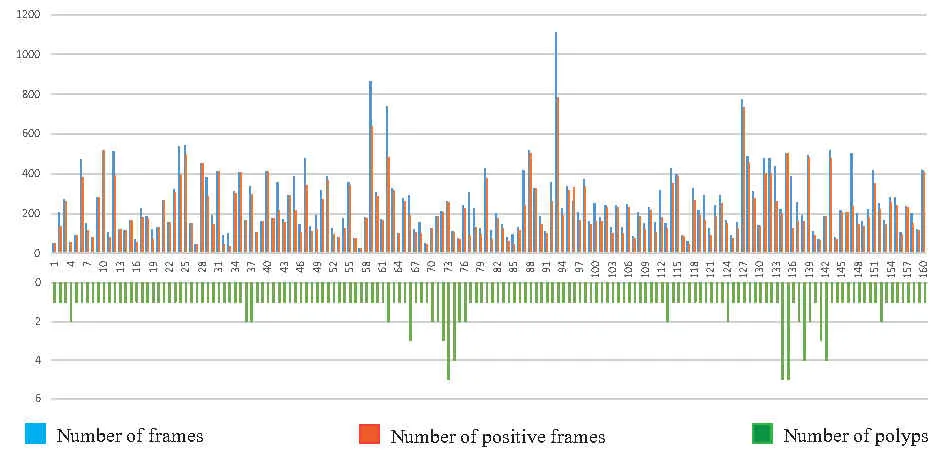
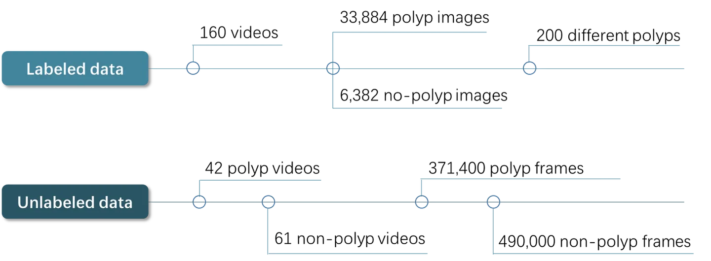
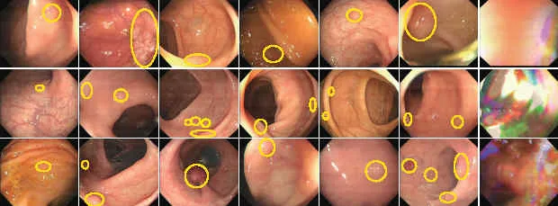
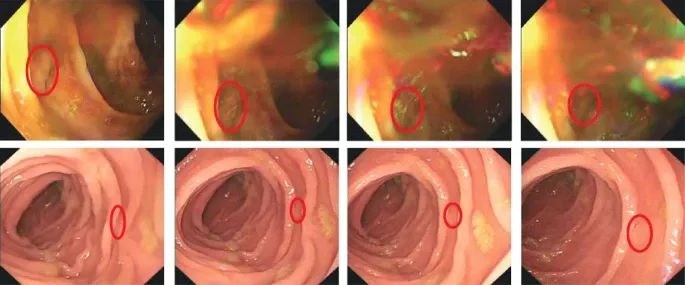

# LDPolypVideo

<div align="center">
    <a href="https://github.com/openmedlab/"></a>
</div>
<p style="text-align:center;font-size:10px;"><em></em></p>

## Dataset Information

The LDPolypVideo dataset is a dataset for polyp detection in colonoscopy. It contains a large and diverse set of colonoscopy videos that can be used for training and evaluating polyp detection algorithms. The LDPolypVideo dataset includes a total of 160 videos and 40,266 frames of images, of which 33,884 frames contain at least one polyp, and a total of 200 marked polyps, which is nearly four times the size and over 11 times the number of polyps than the largest existing colonoscopy video dataset, CVC-ClinicVideoDB. Additionally, the dataset provides 103 videos (comprising 861,400 frames) that are not fully annotated, each marked whether it contains polyps or not, enriching the diversity of the data and supporting unsupervised and semi-supervised methods.

The LDPolypVideo dataset provides a large-scale and diverse set of colon polyp data that can be used to improve the accuracy and efficiency of computer-aided diagnostic systems in polyp detection, which is critical for colorectal cancer screening and prevention. Furthermore, this dataset challenges the existing state-of-the-art polyp detection methods, highlighting the difficulties in polyp detection during clinical examinations, thereby advancing research and development in the field.

## Dataset Meta Information

| Type | Dimension | Task Type                          | Category           | Total Images | Format |
|------|-----------|------------------------------------|--------------------|--------------|--------|
| 2D   | Endoscopy | Polyp Detection | rectum/colon | 40,266 labeled, 861,400 unlabeled        | jpg    |

### Resolution Details

| Dataset Statistics | size      |
|--------------------|-----------|
| min                | 560 x 480 |
| median             | 560 x 480 |
| max                | 560 x 480 |

## Label Information Statistics

<div align="center">
    <a href="https://github.com/openmedlab/"></a>
</div>
<p style="text-align:center;font-size:10px;"><em></em></p>

<div align="center">
    <a href="https://github.com/openmedlab/"></a>
</div>
<p style="text-align:center;font-size:10px;"><em></em></p>

## Visualization

<div align="center">
    <a href="https://github.com/openmedlab/"></a>
</div>
<p style="text-align:center;font-size:10px;"><em> Paper Visualization. Examples of images and polyp annotations from the LDPolypVideo dataset. The last column displays some challenging frames with motion blur.</em></p>

<div align="center">
    <a href="https://github.com/openmedlab/"></a>
</div>
<p style="text-align:center;font-size:10px;"><em> Paper Visualization. Video frames with motion blur and reflection (above) and examples of polyps that are difficult to detect due to colon folds.</em></p>

## File Structure

The official release consists of four separate compressed files that need to be downloaded individually: `TrainValid.rar`, `Test.rar`, `videos with polyps.zip`, and `videos without polyps.zip`. Under the `Annotations` folder, the `.txt` files contain the bounding box coordinates for polyps. If the first line of a `.txt` file is 0, it means that there are no polyps in the image. If the first line is 1, it indicates the presence of polyps, and their bounding box coordinates are given on the second line.

``` 
Dataset
│
├── TrainValid
│   ├── Annotations
│   │   ├── 1
│   │   │   ├──0001.txt
│   │   │   ├──0002.txt
│   │   │   ├──...
│   │   ├── 2
│   │   ├── ...
│   ├── Images
│   │   ├── 1
│   │   │   ├──0001.jpg
│   │   │   ├──0002.jpg
│   │   │   ├──...
│   │   ├── 2
│   │   ├── ...
├── Test
│   ├── Annotations
│   │   ├── 101
│   │   │   ├──0001.txt
│   │   │   ├──0002.txt
│   │   │   ├──...
│   │   ├── 102
│   │   ├── ...
│   ├── Images
│   │   ├── 101
│   │   │   ├──0001.jpg
│   │   │   ├──0002.jpg
│   │   │   ├──...
│   │   ├── 102
│   │   ├── ...
```

## Authors and Institutions

Yiting Ma (University of Science and Technology of China, National Engineering Laboratory for Brain-inspired Intelligence Technology and Applications)

Xuejin Chen (University of Science and Technology of China, National Engineering Laboratory for Brain-inspired Intelligence Technology and Applications)

Kai Cheng (University of Science and Technology of China, National Engineering Laboratory for Brain-inspired Intelligence Technology and Applications)

Yang Li (The First Affiliated Hospital of Anhui Medical University)

Bin Sun (The First Affiliated Hospital of Anhui Medical University)


## Source Information

Official Website: https://github.com/dashishi/LDPolypVideo-Benchmark

Download Link: https://github.com/dashishi/LDPolypVideo-Benchmark

Article Address: https://link.springer.com/chapter/10.1007/978-3-030-87240-3_37

Publication Date: 2021-09

## Citation

``` 
@inproceedings{ma2021ldpolypvideo,
  title={LDPolypVideo benchmark: a large-scale colonoscopy video dataset of diverse polyps},
  author={Ma, Yiting and Chen, Xuejin and Cheng, Kai and Li, Yang and Sun, Bin},
  booktitle={Medical Image Computing and Computer Assisted Intervention--MICCAI 2021: 24th International Conference, Strasbourg, France, September 27--October 1, 2021, Proceedings, Part V 24},
  pages={387--396},
  year={2021},
  organization={Springer}
}
```

Original introduction article is [here](https://zhuanlan.zhihu.com/p/670997382).