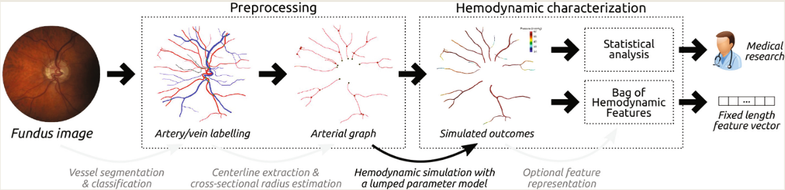
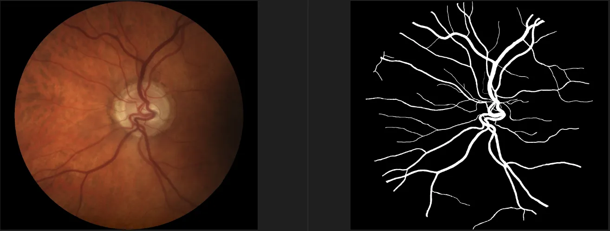

# LES-AV

<div align="center">
    <a href="https://github.com/openmedlab/"></a>
</div>
<p style="text-align:center;font-size:10px;"><em></em></p>

## Dataset Information

Glaucoma is a major cause of irreversible yet preventable blindness worldwide. The primary treatable risk factor is intraocular pressure, although other biomarkers are being explored to enhance the understanding of the disease's pathophysiology. The LES-AV dataset contains fundus images of 22 different patients, among which 21 images have a 30-degree field of view (FOV) and a resolution of 1444×1620 pixels, while the other image has a 45-degree field of view and a resolution of 1958×2196 pixels, with each pixel measuring 6 micrometers in size.

## Dataset Meta Information

| Dimensions | Modality | Task Type | Anatomical Structures | Anatomical Area | Number of Categories | Data Volume | File Format |
|------------|----------|-----------|-----------------------|-----------------|----------------------|-------------|-------------|
| 2D         | Retinal Image   | Segmentation | Vessel                | Eye             | 1                    | 22          | PNG         |


### Resolution Details

| Dataset Statistics | size          |
|--------------------|---------------|
| min                | (1444, 1620)  |
| median             | (1444, 1620)  |
| max                | (1958, 2196)  |

## Label Information Statistics

| Category          | Retinal Vessel |
|-------------------|----------------|
| Number of Images  | 22             |
| Availability      | 100%           |
| Small Vessel Count| 98082        |
| Medium Vessel Count| 151940        |
| Large Vessel Count| 321981        |

## Visualization

<div align="center">
    <a href="https://github.com/openmedlab/"></a>
</div>
<p style="text-align:center;font-size:10px;"><em> Local Visualization.</em></p>

## File Structure

The LES-AV dataset contains two main directories: `image` and `mask`. The `image` directory contains the original images, and the `mask` directory contains the corresponding segmentation annotation images.

``` 
ORVS
│
├── images
│       ├── LES-AV_xx.png
│       ├── LES-AV_xx.png
│       ├── ...
│       ├── LES-AV_xx.png
│
├── masks
│       ├── LES-AV_xx.png
│       ├── LES-AV_xx.png
│       ├── ...
│       ├── LES-AV_xx.png
```

## Authors and Institutions

José Ignacio Orlando, CONICET - Platema Institute (Argentina)

João Barbosa Breda, Research Group Ophthalmology, KU Leuven, Leuven (University of Leuven Ophthalmology Research Group)

Karel van Keer, Research Group Ophthalmology, KU Leuven, Leuven (University of Leuven Ophthalmology Research Group)

Matthew B. Blaschko, ESAT-PSI, KU Leuven, Leuven (Belgium)

Pablo J. Blanco, National Laboratory for Scientific Computing (Brazil)

Carlos A. Bulant, CONICET - Platema Institute (Argentina)


## Source Information

Official Website: https://ignaciorlando.github.io/

Download Link: https://ignaciorlando.github.io/

Article Address: https://arxiv.org/pdf/1805.10273.pdf

Publication Date: 2018

## Citation

``` 
@inproceedings{orlando2018towards,
  title={Towards a glaucoma risk index based on simulated hemodynamics from fundus images},
  author={Orlando, Jos{\'e} Ignacio and Barbosa Breda, Jo{\~a}o and Van Keer, Karel and Blaschko, Matthew B and Blanco, Pablo J and Bulant, Carlos A},
  booktitle={Medical Image Computing and Computer Assisted Intervention--MICCAI 2018: 21st International Conference, Granada, Spain, September 16-20, 2018, Proceedings, Part II 11},
  pages={65--73},
  year={2018},
  organization={Springer}
}
```

Original introduction article is [here](https://zhuanlan.zhihu.com/p/672504941).