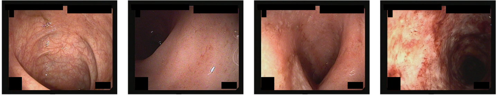

# LIMUC
<div align="center">
    <a href="https://github.com/openmedlab/"></a>
</div>
<p style="text-align:center;font-size:10px;"><em></em></p>

## Dataset Information

The LIMUC dataset is a dataset of ulcerative colitis developed by the Gastroenterology Department of Marmara University Faculty of Medicine. The dataset contains 11,276 images from 1,043 colonoscopy examinations performed on 564 patients between December 2011 and July 2019. All images were classified by two experienced gastroenterologists according to the Mayo Endoscopic Score (MES), and images with discrepancies were independently assessed by a third expert.

The clinical significance of the LIMUC dataset lies in providing a large-scale, expert-annotated dataset for the development and validation of computer-aided diagnostic systems for the assessment of ulcerative colitis. With the use of deep learning and other advanced image processing technologies, this dataset helps to reduce subjectivity and inter-observer variability in endoscopic assessment, thereby improving the accuracy and reliability of clinical decision-making.
## Dataset Meta Information

| Dimensions | Modality | Task Type | Anatomical Structures          | Number of Categories | Data Volume | File Format |
|------------|----------|-----------|--------------------------------|----------------------|-------------|-------------|
| 2D         | Endoscopy       | Detection | colon | 4                    | 11276        | bmp         |


### Resolution Details

| Dataset Statistics | size      |
|--------------------|-----------|
| min                | 352 x 288 |
| median             | 352 x 288 |
| max                | 352 x 288 |

## Label Information Statistics

In this dataset, the Mayo Endoscopic Score is used as the label:

0 points: Normal or inactive disease, or minor inflammation (such as increased vascular pattern without bleeding).
1 point: Mild inflammation (e.g., loss of vascular pattern, slight erythema, edema, or bleeding).
2 points: Moderate inflammation (e.g., marked erythema, edema, bleeding, or erosion).
3 points: Severe inflammation (e.g., presence of ulcers, spontaneous bleeding, or significant swelling of the colon wall).

| Mayo Score | Count | Percentage |
|------------|-------|------------|
| Mayo 0     | 6105  | 54.14%     |
| Mayo 1     | 3052  | 27.70%     |
| Mayo 2     | 1254  | 11.12%     |
| Mayo 3     | 865   | 7.67%      |

## Visualization

<div align="center">
    <a href="https://github.com/openmedlab/"></a>
</div>
<p style="text-align:center;font-size:10px;"><em></em></p>

## File Structure

The official files are provided as `train_and_validation_sets.zip`, `test_set.zip`, and `patient_based_classified_images.zip`. The file structure for `patient_based_classified_images.zip` and `test_set.zip` is as follows:

```
Dataset
│
├── train_and_validation_sets
│   ├── Mayo 0
│   │   ├── UC_patient_100_15.bmp
│   │   ├── UC_patient_100_17.bmp
│   │   ├── ...
│   ├── Mayo 1
│   │   ├── ...
│   ├── ...

```

The data structure of `patient_based_classified_images.zip` is as follows:

``` 
Dataset
│
├── patient_based_classified_images
│   ├── 10
│   │   ├── Mayo 0
│   │   │   │   ├── UC_patient_10_2.bmp
│   │   │   │   ├── ...
│   │   ├── Mayo 1
│   │   │   │   ├──  UC_patient_10_16.bmp
│   │   │   │   ├── ...
│   │   ├── ...
│   ├── 100
│   │   ├── Mayo 0
│   │   │   │   ├──  UC_patient_100_15.bmp
│   │   │   │   ├── ...
│   │   ├── Mayo 1
│   │   │   │   ├──  UC_patient_100_1.bmp
│   │   │   │   ├── ...
│   │   ├── ...
│   ├── ...
```

## Authors and Institutions

Gorkem Polat (Graduate School of Informatics, Middle East Technical University)

Haluk Tarik Kani (Department of Gastroenterology, Faculty of Medicine, Marmara University)

Ilkay Ergenc (Department of Gastroenterology, Faculty of Medicine, Marmara University)

Yesim Ozen Alahdab (Graduate School of Informatics, Middle East Technical University)

Ozlen Atug (Department of Gastroenterology, Faculty of Medicine, Marmara University)


## Source Information

Official Website: https://github.com/GorkemP/labeled-images-for-ulcerative-colitis

Download Link: https://zenodo.org/records/5827695#.Yi8GJ3pByUk

Article Address: https://academic.oup.com/ibdjournal/article-abstract/29/9/1431/6830946?login=false

Publication Date: 2022-11

## Citation

``` 
@article{polat2022improving,
  title={Improving the computer-aided estimation of ulcerative colitis severity according to mayo endoscopic score by using regression-based deep learning},
  author={Polat, Gorkem and Kani, Haluk Tarik and Ergenc, Ilkay and Ozen Alahdab, Yesim and Temizel, Alptekin and Atug, Ozlen},
  journal={Inflammatory Bowel Diseases},
  pages={izac226},
  year={2022},
  publisher={Oxford University Press US}
}
```

Original introduction article is [here](https://zhuanlan.zhihu.com/p/672089679).