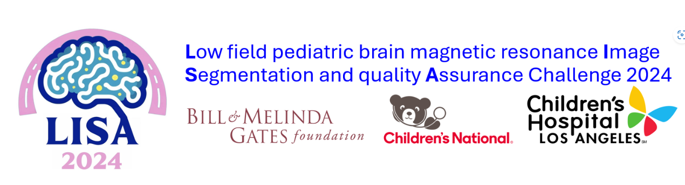
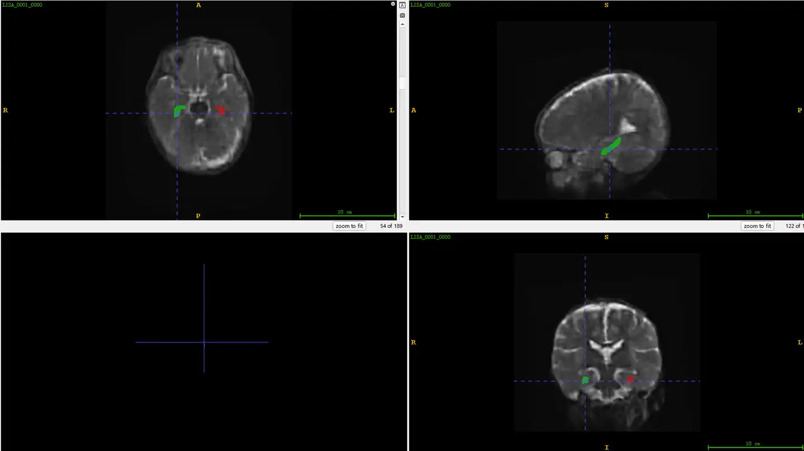

# MICCAI 2024 LISA 2024 Task2

<div align="center">
    <a href="https://github.com/openmedlab/"></a>
</div>
<p style="text-align:center;font-size:10px;"><em></em></p>

## Dataset Information

The LISA 2024 dataset is part of the MICCAI 2024 challenge, and this article presents Task 2, a segmentation dataset focusing on the hippocampus, consisting of 63 training samples. In Task 2 of the LISA 2024 challenge, participants are tasked with developing an automatic method to segment the hippocampus from 0.064T magnetic resonance images. The hippocampus is a critical subcortical structure in the brain associated closely with cognitive and memory functions, often crucial in abnormal neural development. This task involves using ultra-low-field T2-weighted magnetic resonance imaging technology, which is significant for early childhood brain research.

The dataset includes high-field T2 data and paired low-field Hyperfine scans from several countries and institutions, including Kawempe National Referral Hospital in Uganda, CUBIC at the University of Cape Town in South Africa, and the Warren Alpert Medical School at Brown University along with the Advanced Baby Imaging Lab at Rhode Island Hospital in the USA. All images were collected by experienced MRI technicians, and each low-field image has been matched with the corresponding high-field T2 scans through nine-point linear registration. Moreover, all bilateral hippocampal segmentations have been reviewed by medical image assessment experts. Through this approach, the challenge aims to utilize and enhance deep learning tools to improve the capability for precise analysis of children's brains in resource-limited settings.

## Dataset Meta Information

| Dimensions | Modality | Task Type     | Anatomical Structures  | Anatomical Area | Number of Categories | Data Volume | File Format |
|------------|----------|---------------|------------------------|-----------------|----------------------|-------------|-------------|
| 3D         | MRI      | Segmentation  | Hippocampus            | Brain           | 2                    | 63          | .nii.gz     |


### Resolution Details

| Dataset Statistics | spacing (mm)     | size            |
|--------------------|------------------|-----------------|
| min                | (195, 233, 159)  | (1.0, 1.0, 1.0) |
| median             | (195, 233, 159)  | (1.0, 1.0, 1.0) |
| max                | (197, 233, 189)  | (1.0, 1.0, 1.0) |

Number of 2D slices in the dataset: 10497.

## Label Information Statistics

| Hippocampus Side     | Left Hippocampus   | Right Hippocampus   |
|----------------------|--------------------|---------------------|
| Number of Samples    | 63                 | 63                  |
| Completeness         | 100.00%            | 100.00%             |
| Minimum Volume (cm³) | 0.61               | 0.68                |
| Median Volume (cm³)  | 1.21               | 1.28                |
| Maximum Volume (cm³) | 2.07               | 2.32                |


## Visualization

<div align="center">
    <a href="https://github.com/openmedlab/"></a>
</div>
<p style="text-align:center;font-size:10px;"><em>Green is the left hippocampus, red is the right hippocampus.</em></p>

## File Structure

``` 
.
├── dataset.json
├── imagesTr
│   ├── LISA_0001_0000.nii.gz
│   ├── ...
│   └── LISA_0063_0000.nii.gz
└── labelsTr
    ├── LISA_0001.nii.gz
    ├── LISA_0002.nii.gz
    ├── ...
    └── LISA_0063.nii.gz
```

## Authors and Institutions

Here is the translation of the names and affiliations:

Natasha Lepore (University of Southern California, USA)

Marius George Linguraru (George Washington University School of Medicine and Health Sciences, USA)

Steven Williams (King's College London, UK)

Sean Deoni (Warren Alpert Medical School of Brown University, USA)

Jeffrey Tanedo (Children's Hospital Los Angeles, USA)

Rahimeh Rouhi (Children's Hospital Los Angeles, USA)

Shreyash Zanjal (Children's Hospital Los Angeles, USA)

Austin Tapp (National Children's Hospital, USA)

Kirsty Donald (University of Cape Town, South Africa)

Victoria Nankabirwa (Makerere University, Uganda)

## Source Information

Official Website: https://www.synapse.org/Synapse:syn55249552/wiki/

Download Link: https://www.synapse.org/Synapse:syn55249552/wiki/627179

Article Address: TBD

Publication Date: 2024-05

## Citation

``` 
TBD
```

Original introduction article is [here](https://zhuanlan.zhihu.com/p/716262106).