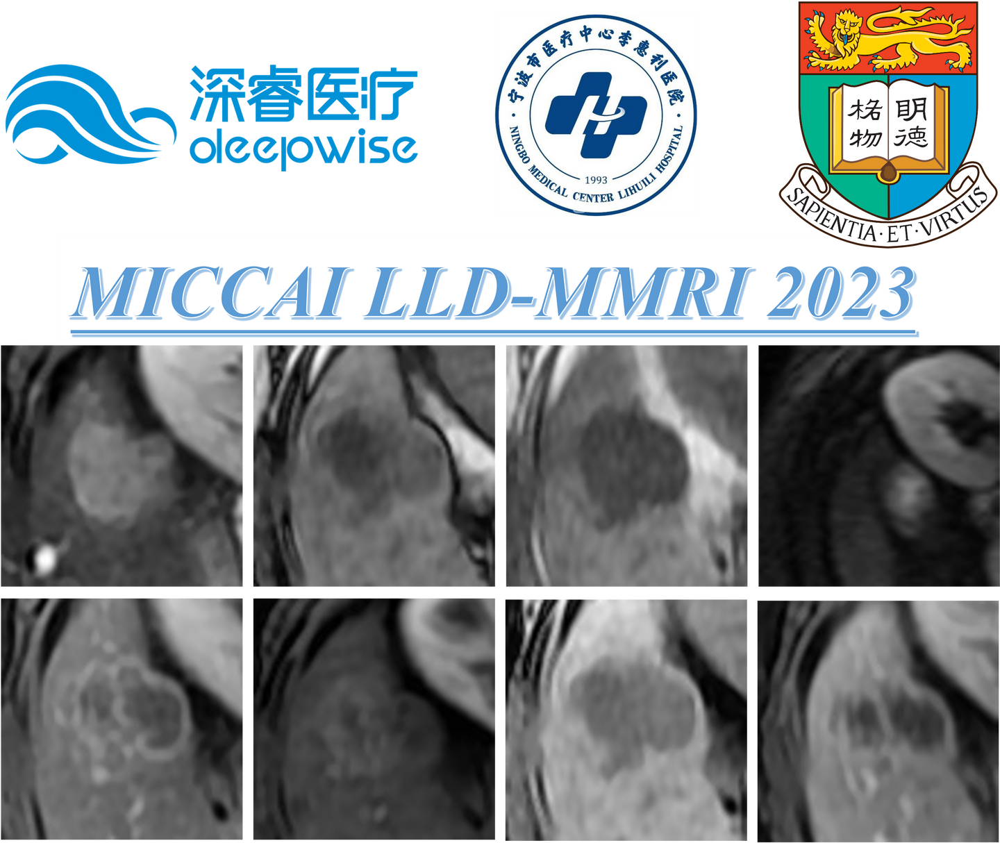
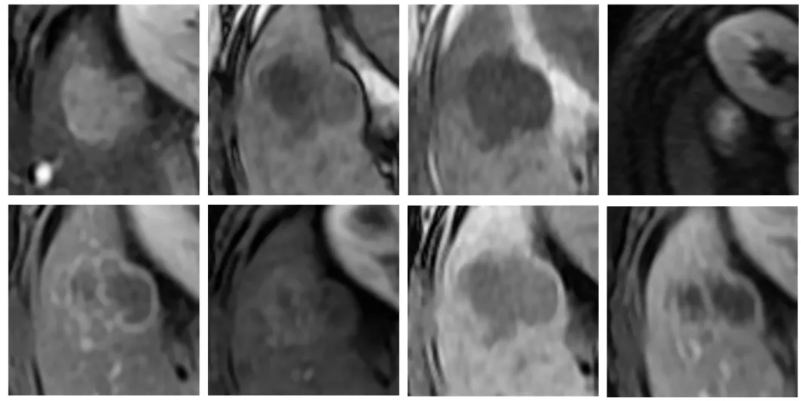
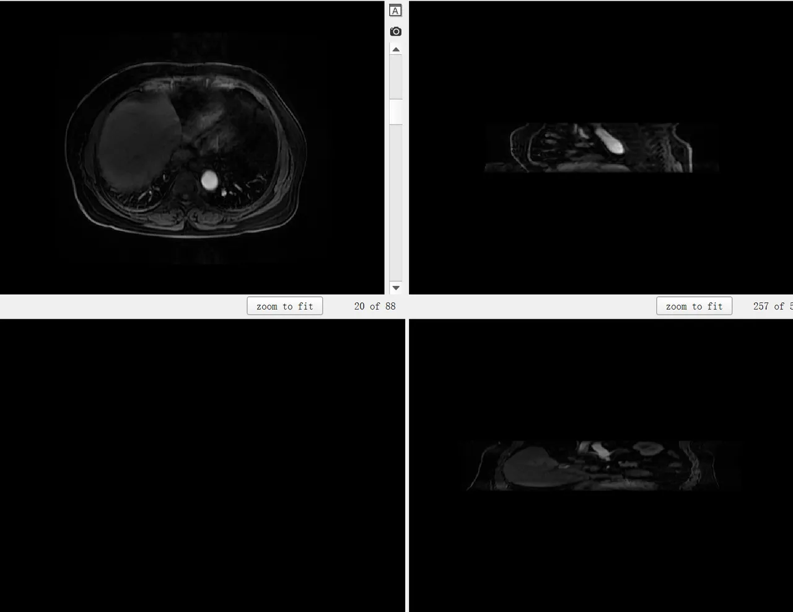

# LLD-MMRI2023

<div align="center">
    <a href="https://github.com/openmedlab/"></a>
</div>
<p style="text-align:center;font-size:10px;"><em></em></p>


## Dataset Information

The LLD-MMRI2023 (Liver Lesion Diagnosis Challenge on Multi-phase MRI) dataset is an MRI dataset intended to enhance the accuracy of liver lesion diagnosis and advance the development of computer-assisted diagnosis systems. Unlike traditional MRI det tasks, LLD-MMRI2023 features MRI data with 8 registered phases, providing rich multimodal visual cues. The LLD-MMRI2023 dataset contains complete voxel data, lesion bounding boxes, and pre-cropped ROIs (prepared by the publishers based on the bounding boxes). It covers 7 different types of liver lesions, including 4 benign types (hemangioma, abscess, cyst, and focal nodular hyperplasia) and 3 malignant types (intrahepatic cholangiocarcinoma, metastasis, and hepatocellular carcinoma). Participants are required to diagnose the type of liver lesion in each case. The dataset distribution includes 316 training cases, 78 validation cases, and 104 test cases.

Compared to previous datasets such as CHAOS and BraTS, the LLD-MMRI2023 dataset offers multimodal data with a greater variety of modalities, establishing a new benchmark for testing the capabilities of multimodal models. Additionally, at a time when there is increasing attention on foundation models, this dataset, with its paired data featuring similar semantics, also provides valuable resources for the continued pre-training and fine-tuning of image models in the medical field.

## Dataset Meta Information

| Dimensions | Modality | Task Type | Anatomical Structures | Anatomical Area | Number of Categories | Data Volume | File Format |
|------------|----------|-----------|-----------------------|-----------------|----------------------|-------------|-------------|
| 3D         | MRI      | Detection | Liver                 | Abdomen         | 7                    | 394         | .nii.gz     |


### Resolution Details

| Dataset Statistics | spacing (mm)     | size            |
|--------------------|------------------|-----------------|
| min                | (1.00, 1.00, 1.00)              | (432, 432, 50)  |
| median             | (1.00, 1.00, 1.00)           | (480, 480, 70)  |
| max                | (1.00, 1.00, 1.00)              | (640, 640, 98)  |

Number of two-dimensional slices in the training set: 22026.

## Label Information Statistics

Proportion refers to the proportion in the training data set.

| Disease                        | Cases | Percentage |
|--------------------------------|-------|------------|
| Hepatic hemangioma             | 50    | 15.82%     |
| Intrahepatic cholangiocarcinoma | 37    | 11.71%     |
| Hepatic abscess                | 34    | 10.76%     |
| Hepatic metastasis             | 32    | 10.13%     |
| Hepatic cyst                   | 34    | 10.76%     |
| Focal nodular hyperplasia      | 29    | 9.18%      |
| Hepatocellular carcinoma       | 100   | 31.65%     |

## Visualization

<div align="center">
    <a href="https://github.com/openmedlab/"></a>
</div>
<p style="text-align:center;font-size:10px;"><em> Images of 8 MRI modalities, the specific modalities are MR_C+A, MR_C+DELAY, MR_C+V, MR_C-PRE, MR_DWI, MR_INPHASE, MR_OUTPHASE, MR_T2WI.</em></p>

<div align="center">
    <a href="https://github.com/openmedlab/"></a>
</div>
<p style="text-align:center;font-size:10px;"><em></em></p>

## File Structure

The data set file structure is as follows: images and labels are original data, including the original nifti file and a large Annotation record of all bboxes; classification_dataset is the officially processed ROI images and labels, and there is split under the labels folder.

``` 
├── images
    ├── MR-a
        ├── a-seriesID
            ├── aa.nii.gz
            ├── ab.nii.gz
            ├── ac.nii.gz
    ├── ...
├── labels
    ├── Annotation.json
├── classification_dataset
    ├── images
        ├── MRxxx
            ├── C+A.nii.gz  
            ├── C+Delay.nii.gz  
            ├── C-pre.nii.gz  
            ├── C+V.nii.gz  
            ├── DWI.nii.gz  
            ├── In Phase.nii.gz  
            ├── Out Phase.nii.gz  
            ├── T2WI.nii.gz
        ├── ...
    ├── labels
            ├── labels_val_inaccessible.txt  
            ├── labels.txt    
            ├── train_fold1.txt  
            ├── train_fold2.txt  
            ├── train_fold3.txt  
            ├── train_fold4.txt  
            ├── train_fold5.txt  
            ├── val_fold1.txt 
            ├── val_fold2.txt     
            ├── val_fold3.txt  
            ├── val_fold4.txt
            ├── val_fold5.txt
```

## Authors and Institutions

Meng Lou (Deepwise Hea)

Xiaoqing Liu (Deepwise Hea)

Yuqing Zhang (Ningbo Medical Center Lihuili Hospital)

Yizhou Yu (The University of Hong Kong)

Hong-Yu Zhou (The University of Hong Kong)


## Source Information

Official Website: https://github.com/LMMMEng/LLD-MMRI2023/tree/main?tab=readme-ov-file

Download Link: https://github.com/LMMMEng/LLD-MMRI2023/tree/main?tab=readme-ov-file

Article Address: https://zenodo.org/records/7852363

Publication Date: 2023/02

## Citation

``` 
TBD
```

Original introduction article is [here](https://zhuanlan.zhihu.com/p/683302517).