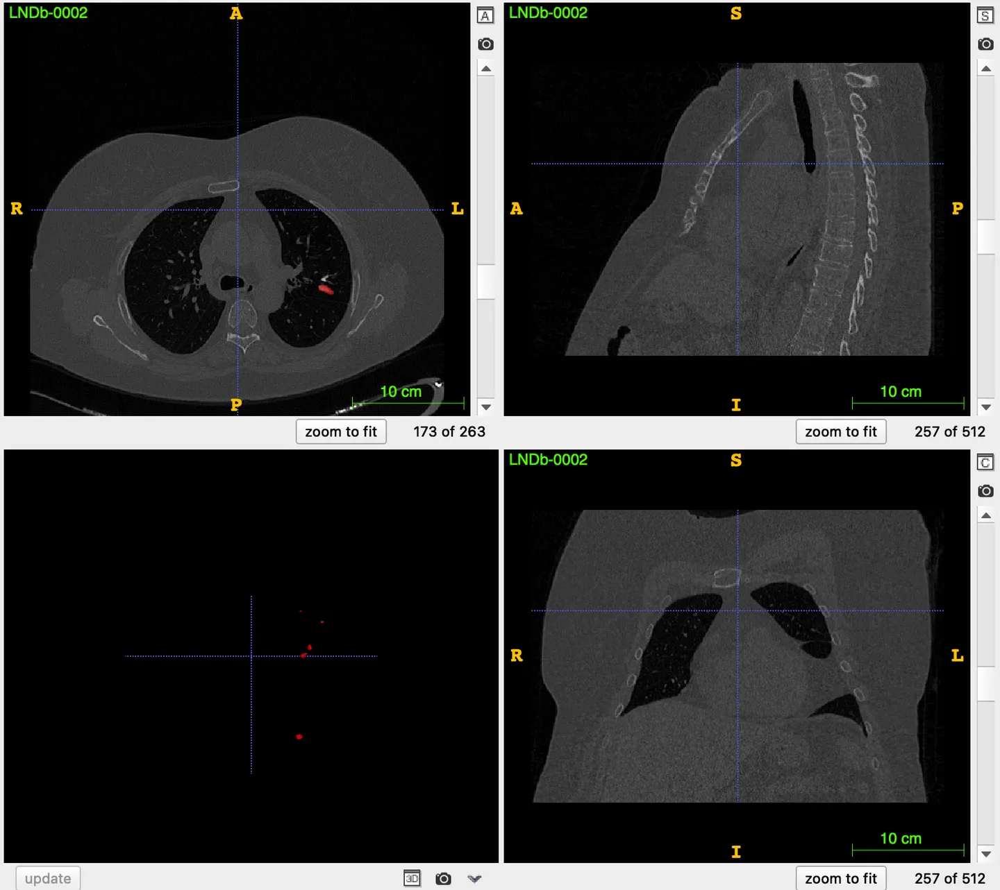

# LNDb

<div align="center">
    <a href="https://github.com/openmedlab/"></a>
</div>
<p style="text-align:center;font-size:10px;"><em></em></p>

## Dataset Information

The **LNDb** (Lung Nodule Database) is a dataset containing 294 cases of lung CT scans. These scans were retrospectively collected by the Centro Hospitalar Universitário São João (CHUSJ) in Porto, Portugal, between the years 2016 and 2018. Radiologists meticulously annotated each scan, with the primary aim of identifying and describing lung nodules and other suspected lesions. To ensure patient privacy, all data was anonymized after being approved and collected by the CHUSJ ethics committee, retaining only the patients' birth year and gender information. Lung cancer is one of the deadliest cancers globally. Compared to other cancers, the pace of improvement in lung cancer survival rates has been slow, largely due to late diagnosis of the disease. For a long time, the medical community has considered low-dose CT as an effective means of early screening. The release of the LNDb dataset is intended to further support and promote the application and research of this screening method.

## Dataset Meta Information

| Dimensions | Modality | Task Type | Anatomical Structures | Anatomical Area | Number of Categories | Data Volume                   | File Format |
|------------|----------|-----------|-----------------------|-----------------|--------------------|-------------------------------|-------------|
| 3D         | CT       | Segmentation | Lung Nodule           | Chest           | 1                  | 236 for training, 58 for test | .nii.gz     |

Number of training set slices: 75,646 (based on statistics from 236 available training cases).

### Resolution Details

| Dataset Statistics | spacing (mm)     | size            |
|--------------------|------------------|-----------------|
| min                | (0.43,0.43,0.5)              | (512,512,251)     |
| median             | (0.64,0.64,1.0)           | (512,512,317) |
| max                | (0.89,0.89,1.40)              | (804,512,631) |

## Label Information Statistics

| Segmentation Class | lung_node |
|--------------------|----------------|
| Case Count         | 217            |
| Detection Rate     | 91.95%         |
| Max Volume (cm³)   | 23.89          |
| Min Volume (cm³)   | <0.01          |
| Median Volume (cm³)| 0.21           |

## Visualization

<div align="center">
    <a href="https://github.com/openmedlab/"></a>
</div>
<p style="text-align:center;font-size:10px;"><em> ITK-SNAP Visualization.</em></p>

## File Structure

The official file structure is as follows, divided into three folders: training images, training labels, and test images.

``` 
LNDb
│
├── imagesTr
│   ├── LNDb-0001.nii.gz
│   └── ...
│
├── labelsTr
│   ├── LNDb-0001.nii.gz
│   └── ...
│
├── imagesTs
│   ├── LNDb-0006.nii.gz
│   └── ...
```

## Authors and Institutions

João Pedrosa, PhD - INESC TEC

Carlos Ferreira, PhD student - INESC TEC and Faculty of Engineering of Universidade do Porto

Guilherme Aresta, PhD student - INESC TEC and Faculty of Engineering of Universidade do Porto


## Source Information

Official Website: https://lndb.grand-challenge.org/

Download Link: https://zenodo.org/record/7153205#.Yz_oVHbMJPZ

Article Address: https://doi.org/10.5281/zenodo.7153205

Publication Date: November, 2019.

## Citation

``` 
@dataset{pedrosa2022lndb,
  title={LNDb Dataset},
  author={Pedrosa, João and Guilherme and Carlos and Márcio and Patrícia and André and João and Eduardo and Isabel and António and Aurélio},
  year={2022},
  publisher={Zenodo},
  version={ICIA R 2020},
  note={17th International Conference on Image Analysis and Recognition},
  url={https://doi.org/10.5281/zenodo.7153205}
}
```

Original introduction article is [here](https://zhuanlan.zhihu.com/p/661103408).