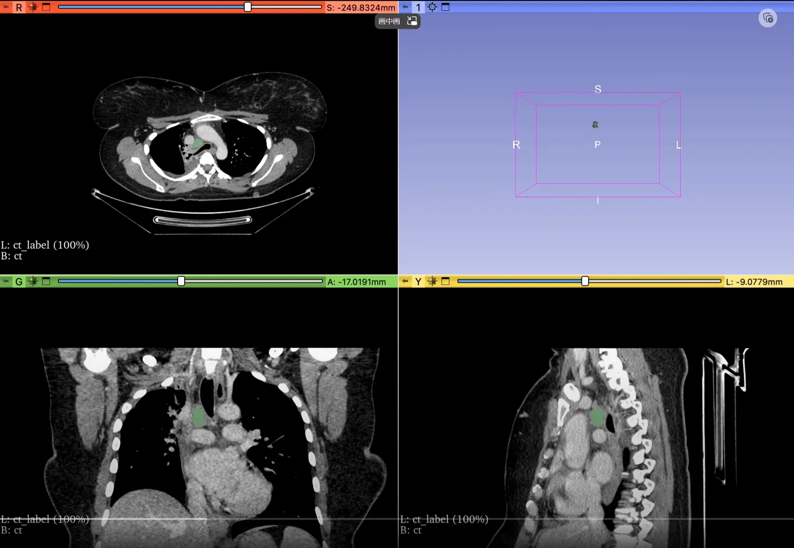
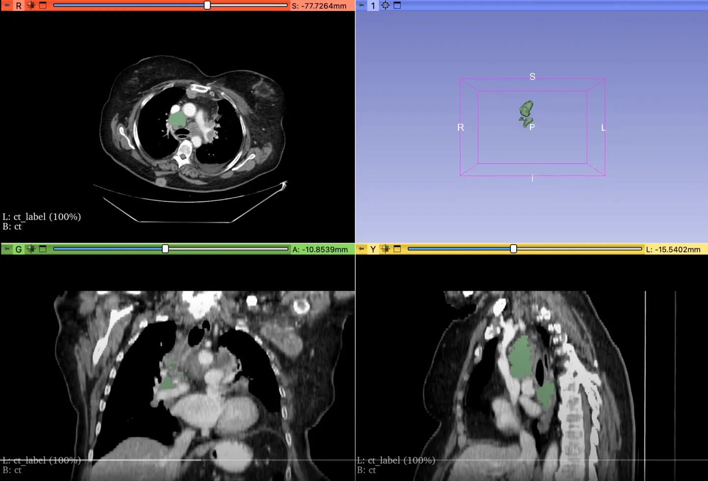

# LNQ 2023

<div align="center">
    <a href="https://github.com/openmedlab/"></a>
</div>
<p style="text-align:center;font-size:10px;"><em></em></p>

## Dataset Information

**The LNQ 2023 (Lymph Node Quantification)** is a CT dataset aimed at developing automated systems capable of accurately segmenting mediastinal lymph nodes and is part of the MICCAI 2023 challenge. The dataset for this challenge contains a unique set of high-quality pixel-level annotations from a subset of clinically relevant lymph nodes in a cancer clinical trial dataset. Participants are required to develop an algorithm that automatically segments all lymph nodes with diameters **greater than 1 centimeter**, with Dice and ASSD as evaluation metrics. It is important to note that the annotations for LNQ2023 are **weakly supervised**, meaning that the annotations on each case are not complete; only a portion of the lymph nodes are annotated. However, the goal is to train a model that does not miss any lymph nodes and segments all of them.

Accurate measurement of lymph node size is crucial for determining the staging of cancer patients, initial treatment management, and assessing treatment effectiveness in follow-up scans. The current routine practice for measuring lymph node size is based on a set of standards that usually involve unidirectional or bidirectional measurements of only a few lymph nodes, often limited to a single transverse section. However, the human body has hundreds of lymph nodes, which may enlarge to varying degrees due to lesions or immune responses. The diameter of normal lymph nodes is about 5 millimeters, but the diameter of pathological lymph nodes may increase to several centimeters. The mediastinal area, located around the lungs and heart, typically contains more than ten lymph nodes, often with more than three exceeding 1 centimeter in diameter. Performing precise 3D segmentation provides more information for evaluating lymph node pathology. A comprehensive 3D segmentation of all abnormal lymph nodes will more accurately detect volume changes to determine the effectiveness of treatment.

## Dataset Meta Information

| Dimensions | Modality | Task Type | Anatomical Structures          | Anatomical Area | Number of Categories | Data Volume | File Format |
|------------|----------|-----------|--------------------------------|-----------------|--------------------|-------------|-------------|
| 3D         | CT       | Segmentation | Lymph Node | Chest           | 1                  | 393 for training, 20 for validation, 100 for test        | nrrd        |

The number of two-dimensional slices in the dataset: 57,289 (based on statistics for 393 training cases).

### Resolution Details

| Dataset Statistics | spacing (mm)     | size            |
|--------------------|------------------|-----------------|
| min                | (0.60, 0.60, 1.00)              | (512, 512, 56)     |
| median             | (0.83, 0.83, 3.00)           | (512, 512, 114) |
| max                | (1.52, 1.52, 5.00)              | (512, 512, 656) |

## Label Information Statistics

| Segmentation Class | Lymph Node  |
|--------------------|-------------|
| Case Count         | 393         |
| Detection Rate     | 100%        |
| Min Volume (cm³)   | 0.41        |
| Median Volume (cm³)| 6           |
| Max Volume (cm³)   | 217         |


## Visualization

<div align="center">
    <a href="https://github.com/openmedlab/"></a>
</div>
<p style="text-align:center;font-size:10px;"><em></em></p>

<div align="center">
    <a href="https://github.com/openmedlab/"></a>
</div>
<p style="text-align:center;font-size:10px;"><em></em></p>

## File Structure

The official files provided are in nrrd format. The approximate file structure in Dropbox is as follows, where png files are preview screenshots from 3D Slicer.

``` 
Dataset
│
├── lnq2023-train-0005-ct.nrrd
├── lnq2023-train-0005-seg.nrrd
├── lnq2023-train-0005.png
├── ...
```

## Authors and Institutions

Ron Kikinis (Mass General Brigham)

Gordon Harris (Mass General Brigham)

Reuben Dorent (Mass General Brigham)

Roya Khajavibajestani (Mass General Brigham)

Tagwa Idris (Mass General Brigham)

Bhanusupriya Somarouthu (Mass General Brigham)


## Source Information

Official Website: https://lnq2023.grand-challenge.org/lnq2023/

Download Link: https://lnq2023.grand-challenge.org/data/

Article Address: TBD

Publication Date: May, 2023.

## Citation

``` 
TBD
```

Original introduction article is [here](https://zhuanlan.zhihu.com/p/663958859).