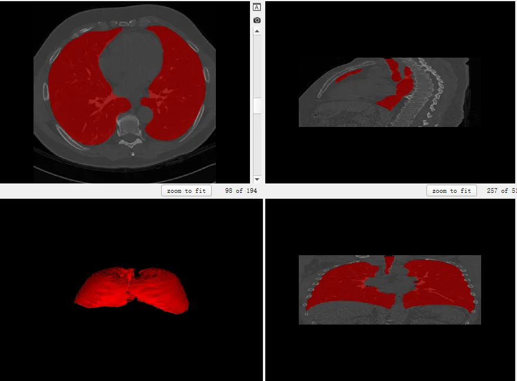
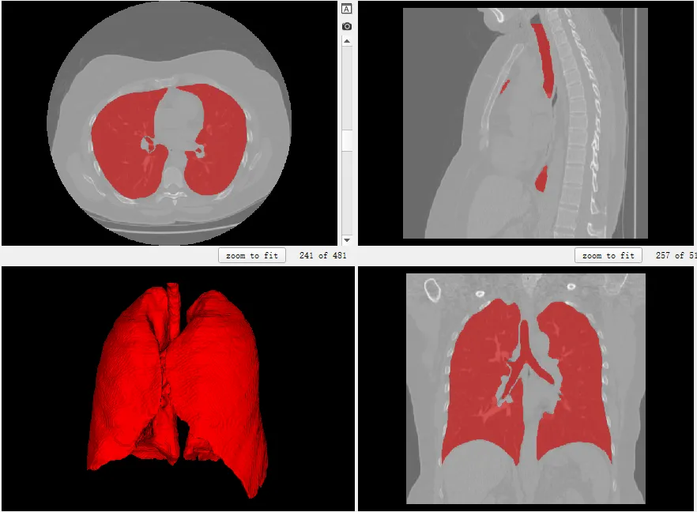
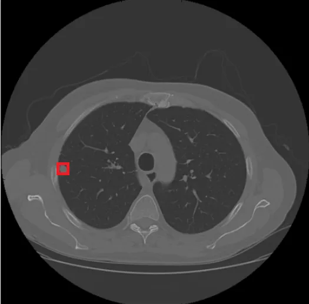

# LUNA16

<div align="center">
    <a href="https://github.com/openmedlab/"></a>
</div>
<p style="text-align:center;font-size:10px;"><em></em></p>

## Dataset Information

**LU**ng **N**odule **A**nalysis 2016 (LUNA16) is a classic benchmark in medical image analysis, derived from the widely used public lung nodule dataset LIDC-IDRI through cleaning and annotating the data. LIDC-IDRI includes 1018 low-dose lung CT images. From LIDC-IDRI, images with a slice thickness greater than 3mm and lung nodules smaller than 3mm were removed, leaving what is now known as the LUNA16 dataset. The main goal of the LUNA16 challenge is to evaluate the performance of automatic lung nodule detection algorithms. Through this challenge, the organizers hope to promote the development of Computer-Aided Detection (CAD) systems designed to help radiologists detect lung nodules more accurately in CT scans, thereby increasing the chances of early lung cancer detection and treatment.

LUNA16 encompasses three tasks: detection, false positive reduction, and segmentation. The detection task includes annotations of the locations and diameters of 1186 lung nodules, while the false positive reduction provides 551,065 candidate locations that need to be classified as true or false positives (simplifying to a binary classification task of whether the candidate location is a lung nodule). The segmentation task provides pixel-level annotations for the whole lung (including parenchyma and airways), generated by automated segmentation algorithms; this task is not part of the Challenge but has been used as a benchmark in subsequent medical image segmentation works. LUNA16 is a typical example of a pre-large-model era AI medical imaging dataset: high-quality, task-specific, limited modality data and annotations to train expert models for specific tasks. In the new era of foundational model development in medicine, LUNA16 is also believed to demonstrate its value, whether in pre-training or fine-tuning.

## Dataset Meta Information

| Dimensions | Modality | Task Type              | Anatomical Structures | Anatomical Area | Number of Categories | Data Volume | File Format |
|------------|----------|------------------------|-----------------------|-----------------|----------------------|-------------|-------------|
| 3D         | CT       | Segmentation/Detection | Lung/Lung Nodule      | Chest           | 1                    | 888         | .mhd     |


### Resolution Details

| Dataset Statistics | spacing (mm)     | size             |
|--------------------|------------------|------------------|
| min                | (1.00, 1.00, 1.00)              | (512, 512, 95)   |
| median             | (1.00, 1.00, 1.00)           | (512, 512, 237)  |
| max                | (1.00, 1.00, 1.00)              | (512, 512, 764)  |

Number of two-dimensional slices in the data set: 227225

## Label Information Statistics

The label information of both tasks was counted. The occurrence ratio of lung nodules exceeded 100% because multiple nodules can appear in a single image.

| Metric        | Lung (Seg) | Lung Nodule (Det) |
|---------------|------------|-------------------|
| Case Count    | 888        | 1186              |
| Coverage      | 49.4%      | 133%              |
| Min Volume (cm³) | 1490       | 0.03              | 
| Median Volume (cm³) | 7216       | 0.27              | 
| Max Volume (cm³) | 37673      | 33.6              |

## Visualization

The segmentation part is visualized as follows. It can be seen that the Lung category in LUNA16 includes both lung parenchyma and trachea, without distinguishing between left and right.

<div align="center">
    <a href="https://github.com/openmedlab/"></a>
</div>
<p style="text-align:center;font-size:10px;"><em></em></p>

<div align="center">
    <a href="https://github.com/openmedlab/"></a>
</div>
<p style="text-align:center;font-size:10px;"><em></em></p>

<div align="center">
    <a href="https://github.com/openmedlab/"></a>
</div>
<p style="text-align:center;font-size:10px;"><em>Lung Nodule Visualization.</em></p>

## File Structure

The data set file structure is as follows. There are 10 subset zip files, which contain images in mhd format. The seg/det labels are in seg-lungs-LUNA16.zip and csv files (some challenge-related but irrelevant content to the data set are omitted) )

``` 
LUNA16
├── subset0.zip
├── subset1.zip
├── ...
├── subset9.zip
├── seg-lungs-LUNA16.zip
├── annotations.csv
├── candidates.csv
```

## Authors and Institutions

Colin Jacobs (Radboud University Medical Center, Nijmegen, The Netherlands)

Arnaud Arindra Adiyoso Setio (Radboud University Medical Center, Nijmegen, The Netherlands)

Alberto Traverso (Polytechnic University of Turin and Turin Section of INFN, Turin, Italy)

Bram van Ginneken (Radboud University Medical Center, Nijmegen, The Netherlands)


## Source Information

Official Website: https://luna16.grand-challenge.org/Home/

Download Link: https://luna16.grand-challenge.org/Download/

Article Address: https://doi.org/10.1016/j.media.2017.06.015

Publication Date: 2016-03

## Citation

``` 
@article{SETIO20171,
title = {Validation, comparison, and combination of algorithms for automatic detection of pulmonary nodules in computed tomography images: The LUNA16 challenge},
journal = {Medical Image Analysis},
volume = {42},
pages = {1-13},
year = {2017},
issn = {1361-8415},
doi = {https://doi.org/10.1016/j.media.2017.06.015},
url = {https://www.sciencedirect.com/science/article/pii/S1361841517301020},
author = {Arnaud Arindra Adiyoso Setio and Alberto Traverso and Thomas {de Bel} and Moira S.N. Berens and Cas van den Bogaard and Piergiorgio Cerello and Hao Chen and Qi Dou and Maria Evelina Fantacci and Bram Geurts and Robbert van der Gugten and Pheng Ann Heng and Bart Jansen and Michael M.J. {de Kaste} and Valentin Kotov and Jack Yu-Hung Lin and Jeroen T.M.C. Manders and Alexander Sóñora-Mengana and Juan Carlos García-Naranjo and Evgenia Papavasileiou and Mathias Prokop and Marco Saletta and Cornelia M Schaefer-Prokop and Ernst T. Scholten and Luuk Scholten and Miranda M. Snoeren and Ernesto Lopez Torres and Jef Vandemeulebroucke and Nicole Walasek and Guido C.A. Zuidhof and Bram van Ginneken and Colin Jacobs}
}
```

Original introduction article is [here](https://zhuanlan.zhihu.com/p/688855198).