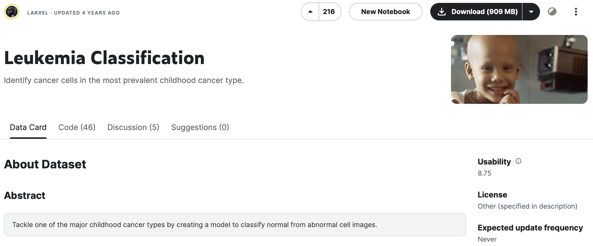
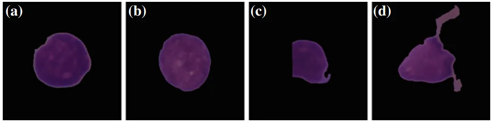

# Leukemia

<div align="center">
    <a href="https://github.com/openmedlab/"></a>
</div>
<p style="text-align:center;font-size:10px;"><em></em></p>

## Dataset Information

The Leukemia dataset is a large collection comprising 1867 images from 118 patients, primarily categorized into two main types: normal cells and leukemia cells. Due to the morphological similarities between normal and leukemia cells, identifying leukemia cells under a microscope has become a challenging task. Therefore, all labels have been personally annotated by oncology experts to ensure accuracy. These cell images are precisely segmented from complex microscopic images and truly reflect the actual scenario, as they contain some noise caused by staining and lighting.

Acute Lymphoblastic Leukemia (ALL) is the most common type of cancer in children, accounting for about one-quarter of all pediatric cancers. The goal of the Leukemia dataset is to build a model that can accurately classify images of normal cells and leukemia cells to assist doctors in more accurately diagnosing and treating this significant proportion of childhood cancers.

## Dataset Meta Information

| Dimensions | Modality          | Task Type                    | Anatomical Structures | Anatomical Area | Number of Categories | Data Volume | File Format |
|------------|-------------------|------------------------------|---------------------|----------------|----------------------|-------------|-------------|
| 2D         | Microscopic Image | Classification               | Cell           | Cell          | 2                    | 1867	       | BMP         |


### Resolution Details

| Dataset Statistics | size        |
|--------------------|-------------|
| min                | (450, 450)  |
| median             | (450, 450)  |
| max                | (450, 450)  |

## Label Information Statistics

| Categories    | Tumor | 
|---------------|-------|
| Normal Cell   | 648   | 
| Leukemia Cell | 1219  |

## Visualization

<div align="center">
    <a href="https://github.com/openmedlab/"></a>
</div>
<p style="text-align:center;font-size:10px;"><em>Example images taken from the training set. a ALL cell. b Normal cell. c ALL cell with partof the cell cut off due to an imperfect segmentation. d Normal cell with superfluous backgrounddue to an imperfect segmentation</em></p>

## File Structure

The file structure of the data set is as follows. images stores images, and the annotations of train, val and test are given in txt format.

``` 
Leukemia
├── image
│   ├── xxx.bmp
│   ├── xxx.bmp
│   │    ...
│   ├── xxx.bmp
│   ├── xxx.bmp
│   │    ...
├── train.txt
├── val.txt
├── test.txt
```

## Authors and Institutions

Amos Gupta (National Institutes of Technology, India)

Rahul Gupta (National Institutes of Technology, India)


## Source Information

Official Website: https://www.kaggle.com/datasets/andrewmvd/leukemia-classification

Download Link: https://tianchi.aliyun.com/dataset/90101

Article Address: https://link.springer.com/content/pdf/10.1007/978-981-15-0798-4.pdf

Publication Date: 2019

## Citation

``` 
@article{gupta2019isbi,
  title={ISBI 2019 C-NMC challenge: Classification in cancer cell imaging},
  author={Gupta, Anubha and Gupta, Ritu},
  journal={Select Proceedings},
  year={2019},
  publisher={Springer}
}
```

Original introduction article is [here](https://zhuanlan.zhihu.com/p/689812582).