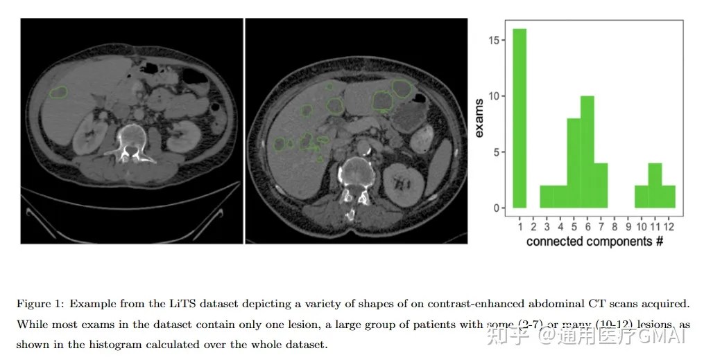
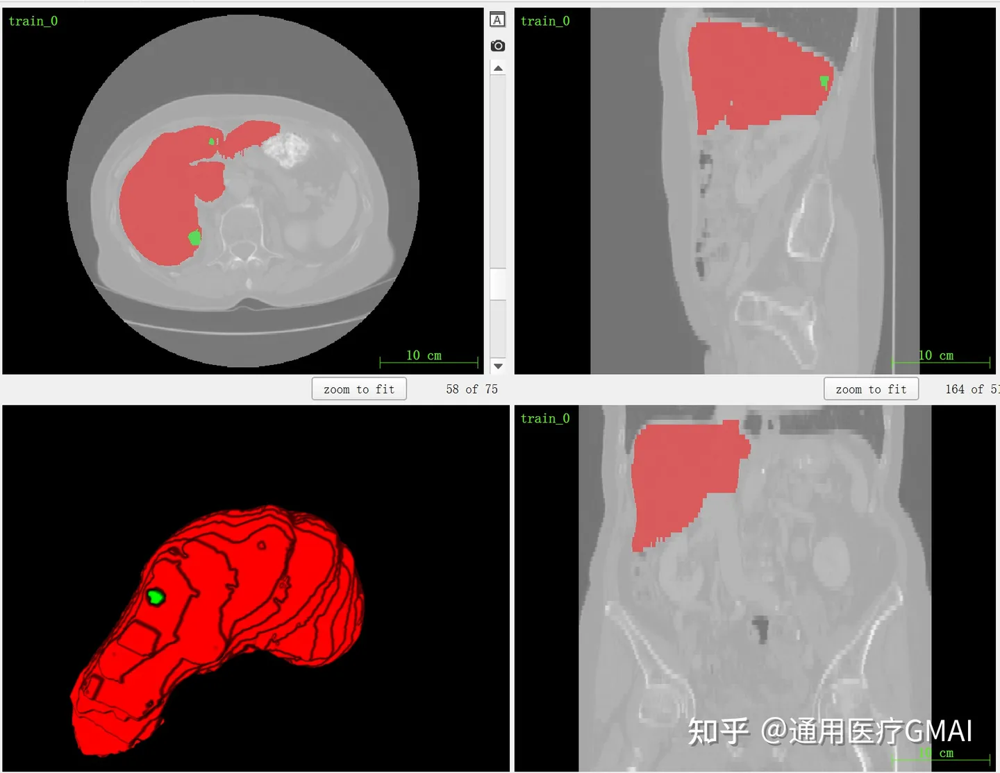

# LiTS

<div align="center">
    <a href="https://github.com/openmedlab/"></a>
</div>
<p style="text-align:center;font-size:10px;"><em></em></p>

## Dataset Information

LiTS (The Liver Tumor Segmentation Benchmark) is a CT dataset focused on the segmentation of the liver and its tumors. The dataset compiles data from 7 different medical centers, comprising 131 training cases and 70 test cases. Based on this dataset, related competitions have been successfully held at ISBI 2017, MICCAI 2017, and MICCAI 2018, and it has been included as Task03 in the MSD (Medical Segmentation Decathlon).

## Dataset Meta Information

| Dimensions | Modality | Task Type | Anatomical Structures | Anatomical Area | Number of Categories | Data Volume                   | File Format |
|------------|----------|-----------|-----------------------|-----------------|----------------------|-------------------------------|-------------|
| 3D         | CT       | Segmentation | Liver                 | abdomen       | 2                    | 131 for training, 70 for test | .nii.gz     |

Total number of slices: 58638 (based on 131 training set statistics)

### Resolution Details

| Dataset Statistics | spacing (mm)    | size             |
|--------------------|-----------------|------------------|
| min                | (0.5566, 0.5566, 0.7000)                | (512, 512, 74)   |
| median             | (0.7676, 0.7676, 1) | (512, 512, 432)  |
| max                | (1, 1, 5) | (512, 512, 987)  |

## Label Information Statistics

| Description  | Liver | Liver Tumor  |
|--------------|----------|---------------------|
| Number of Cases | 131      | 118                 |
| Coverage     | 100%     | 90.08%              |
| Max Volume (cm³) | 3194.77 | 987.66              |
| Median Volume (cm³) | 541.79 | 0.04                |
| Mean Volume (cm³) | 1586.49 | 16.11               |


## Visualization

<div align="center">
    <a href="https://github.com/openmedlab/"></a>
</div>
<p style="text-align:center;font-size:10px;"><em> Official website visualization.</em></p>

<div align="center">
    <a href="https://github.com/openmedlab/"></a>
</div>
<p style="text-align:center;font-size:10px;"><em> ITK-SNAP Visualization.</em></p>

## File Structure

The official file structure is as follows, divided into two batches, with a total of 131 cases having labeled data.

``` 
LiTS
│
├── Traing Batch 1
│   ├── volume-0.nii
│   └── segmentation-0.nii
│   └── ...
│   ├── volume-27.nii
│   └── segmentation-27.nii
│
├── Traing Batch 2
│   ├── volume-28.nii
│   └── segmentation-28.nii
│   └── ...
│   ├── volume-130.nii
│   └── segmentation-130.nii
```

## Authors and Institutions

Patrick Christ, Florian Ettlinger, Felix Gruen, Sebastian Schlecht, Jana Lipkova, Georgios Kassis, Sebastian Ziegelmayer, Fabian Lohöfer, Rickmer Braren & Bjoern Menze (Technical University of Munich)

Julian Holch, Felix Hofmann, Wieland Sommer & Volker Heinemann (Ludwig Maxmilian University of Munich)

Colin Jacobs, Gabriel Efrain HumpireMamani & Bram van Ginneken (Radboudumc)

Gabriel Chartrand, Eugene Vorontsov, An Tang, Michal Drozdzal & Samuel Kadoury (Polytechnique Montréal & CHUM Research Center)

Avi Ben-Cohen, Eyal Klang, Marianne M. Amitai, Eli Konen & Hayit Greenspan (Tel Aviv University & Sheba Medical Center)

Johan Moreau, Alexandre Hostettler & Luc Soler (IRCAD)

Refael Vivanti, Adi Szeskin, Naama Lev-Cohain, Jacob Sosna & Leo Joskowicz (The Hebrew University of Jerusalem & Hadassah University Medical Center)


## Source Information

Official Website: https://competitions.codalab.org/competitions/17094

Download Link: https://competitions.codalab.org/competitions/17094#participate

Article Address: https://arxiv.org/pdf/1901.04056v2.pdf, https://www.sciencedirect.com/science/article/pii/S1361841522003085

Publication Date: 2017-06

## Citation

``` 
@article{bilic2023liver,
  title={The liver tumor segmentation benchmark (lits)},
  author={Bilic, Patrick and Christ, Patrick and Li, Hongwei Bran and Vorontsov, Eugene and Ben-Cohen, Avi and Kaissis, Georgios and Szeskin, Adi and Jacobs, Colin and Mamani, Gabriel Efrain Humpire and Chartrand, Gabriel and others},
  journal={Medical Image Analysis},
  volume={84},
  pages={102680},
  year={2023},
  publisher={Elsevier}
}
```

Original introduction article is [here](https://zhuanlan.zhihu.com/p/655174097).