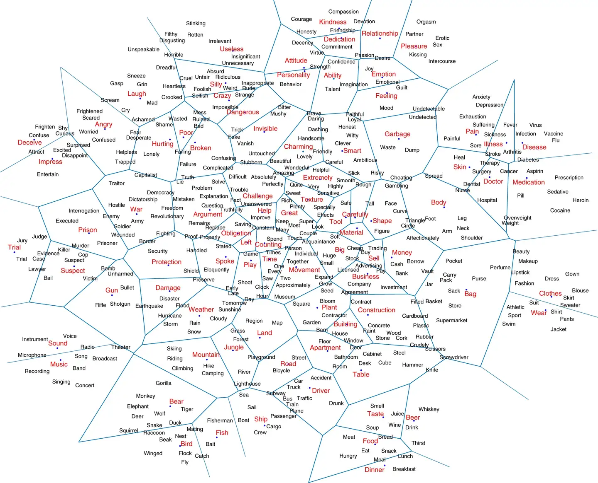
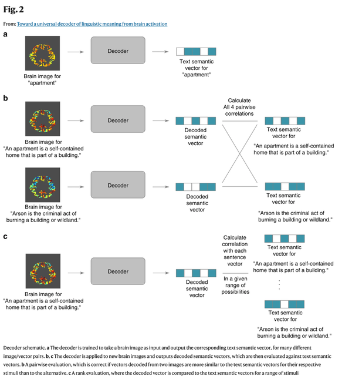

# Linguistic Meaning

<div align="center">
    <a href="https://github.com/openmedlab/"></a>
</div>
<p style="text-align:center;font-size:10px;"><em></em></p>

## Dataset Information

The dataset originates from the paper: "Toward a Universal Decoder of Linguistic Meaning from Brain Activation." This dataset is a multimodal dataset that combines functional magnetic resonance imaging (fMRI) with semantic vector representations, aimed at decoding the semantics of language through brain activation data. It includes brain imaging data of 16 participants reading words and sentences, which can be used to train and evaluate decoding models to predict semantic representations decoded from brain activation patterns.

The dataset comprises three main experiments:

**Experiment 1: Word Concept Decoding**
Participants were asked to read 180 words selected for their representativeness in semantic space. The experimental design included three different paradigms: sentence context, picture assistance, and word cloud display. Each word appeared repeatedly across different paradigms, ensuring that participants understood the specific semantics of the word.

**Experiment 2: Sentence Semantic Decoding 1**
Participants read 96 text passages, each containing 4 sentences. These sentences covered 24 different topics, such as occupations, birds, musical instruments, etc. The experiment aimed to test the decoder's generalization capability at the sentence level.

**Experiment 3: Sentence Semantic Decoding 2**
Participants read 72 text passages, each containing 3 to 4 sentences. This experiment was similar to Experiment 2 but used different text materials covering topics like skiing, dreams, and opera.

## Dataset Meta Information

| Task Type     | Language | fMRI Sampling Rate | Text Format | fMRI Format |
|---------------|----------|--------------------|-------------|-------------|
| Semantic Decoding | English | 2000 ms            | .csv        | .nii.gz     |


## Dataset Information Statistics

- **Participants**: 16 (7 females), aged 21 to 50, all fluent in English with 15 native speakers and 1 bilingual.
- **Data Volume**: 
  - Experiment 1 includes 180 words.
  - Experiment 2 includes 384 sentences.
  - Experiment 3 includes 243 sentences.
- **Voxel Selection**: For each participant, 5000 of the most informative voxels were selected for training the decoder.

## Data Example

<div align="center">
    <a href="https://github.com/openmedlab/"></a>
</div>
<p style="text-align:center;font-size:10px;"><em>Figure 2 illustrates the architecture of the decoder for extracting linguistic semantics from brain activation data and its evaluation method. The figure clearly shows the correspondence between text and fMRI data.</em></p>

## File Structure

``` 
/Pereira_Materials
│
├── Stimuli
│   ├── stimuli_180concepts.txt
│   ├── stimuli_243sentences.txt
│   ├── stimuli_243sentences_dereferencedpronouns.txt
│   ├── stimuli_384sentences.txt
│   ├── stimuli_384sentences_dereferencedpronouns.txt
│   └── stopwords.txt
│   - Contains all stimulus materials and stop word lists used in the experiment.
│
├── Vectors
│   ├── vectors_180concepts.GV42B300.txt
│   ├── vectors_243sentences.GV42B300.average.txt
│   ├── vectors_243sentences_dereferencedpronouns.GV42B300.average.txt
│   ├── vectors_384sentences.GV42B300.average.txt
│   └── vectors_384sentences_dereferencedpronouns.GV42B300.average.txt
│   - Contains semantic vectors for all sentences and concepts, generated using the GV42B300 model.
│
├── Scripts
│   ├── learnDecoder.m
│   ├── trainVoxelwiseTargetPredictionModels.m
│   └── README.md
│   - Contains scripts for decoder learning, voxel prediction model training, and instructions for use.
│
├── Overlap_Data
│   ├── DMN_overlap_n60.zip
│   ├── Language_overlap_n220.zip
│   ├── MD_overlap_n60.zip
│   └── voxellnform_FractionMNI.nii
│   - Contains overlapping data files of DMN, language network, MD network and voxel information files in MNI space.
│
├── IARPA_Experiments
│   ├── IARPA_200clusters.xlsx
│   ├── IARPA_expt1_pres.zip
│   ├── IARPA_expt1_stim_images.zip
│   ├── IARPA_expt1_stim_sents.zip
│   ├── IARPA_expt1_stim_wordclouds.zip
│   ├── IARPA_expt2_stim.zip
│   ├── IARPA_expt3_stim.zip
│   └── IARPA_expts23_pres.zip
│   - Contains all the materials of the IARPA experiment, including pictures, sentences, word clouds, etc. of Experiment 1, materials and demonstration files of Experiments 2 and 3.
│
├── Subjects
│   ├── M01.tar
│   ├── M02.tar
│   ├── M03.tar
│   ├── M04.tar
│   ├── M05.tar
│   ├── M06.tar
│   ├── M07.tar
│   ├── M08.tar
│   ├── M09.tar
│   ├── M10.tar
│   ├── M13.tar
│   ├── M14.tar
│   ├── M15.tar
│   ├── M16.tar
│   ├── M17.tar
│   └── P01.tar
│   - A compressed file containing experimental data for all patients.
```

## Authors and Institutions

Francisco Pereira (Siemens Healthineers, Princeton, NJ)

Bin Lou (Siemens Healthineers, Princeton, NJ)

Brianna Pritchett (MIT, Cambridge, MA)

Sam Ritter (DeepMind, London, UK)

Samuel J. Gershman (Harvard University, Cambridge, MA)

Nancy Kanwisher (MIT, Cambridge, MA)

Matthew Botvinick (DeepMind, London, UK)

Evelina Fedorenko (Harvard Medical School, Boston, MA)

## Source Information

Official Website: https://osf.io/crwz7/

Download Link: https://osf.io/crwz7/

Article Address: https://www.nature.com/articles/s41467-018-03068-4#ethics

Publication Date: 2018-03

## Citation

``` 
@article{pereira2018toward,
  title={Toward a universal decoder of linguistic meaning from brain activation},
  author={Pereira, Francisco and Lou, Bin and Pritchett, Brianna and Ritter, Samuel and Gershman, Samuel J and Kanwisher, Nancy and Botvinick, Matthew and Fedorenko, Evelina},
  journal={Nature communications},
  volume={9},
  number={1},
  pages={963},
  year={2018},
  publisher={Nature Publishing Group UK London}
}
```

Original introduction article is [here](https://zhuanlan.zhihu.com/p/717726760).