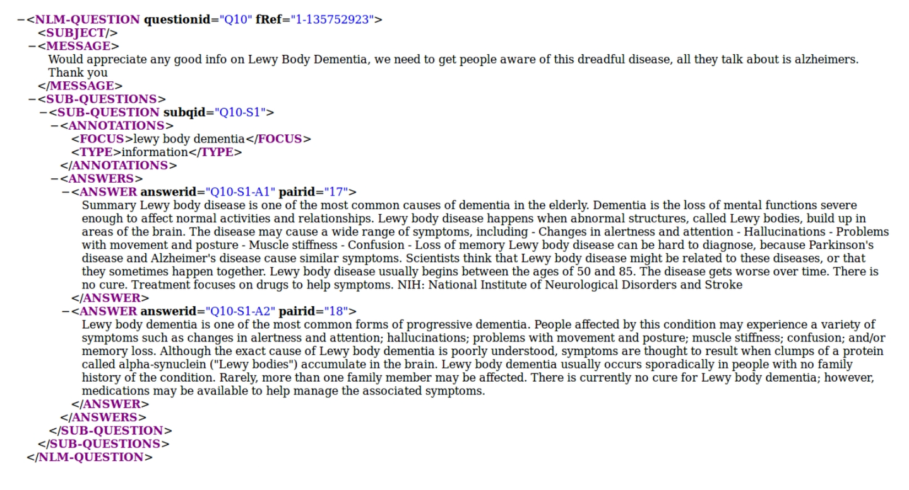
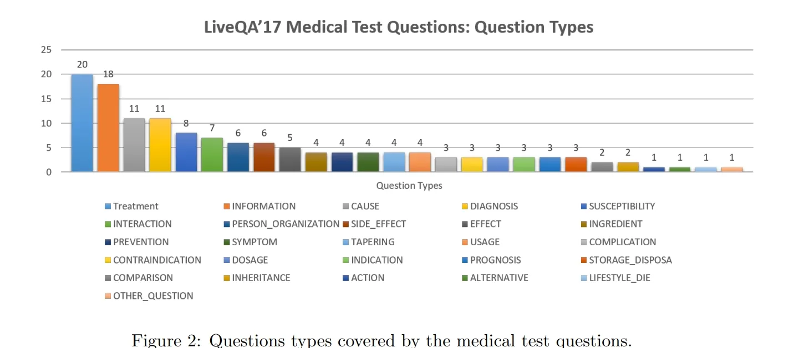
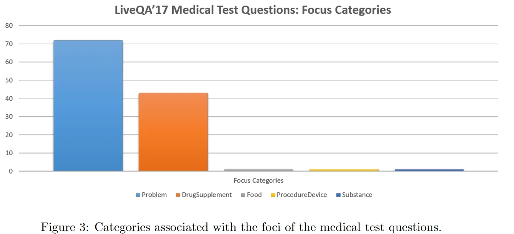
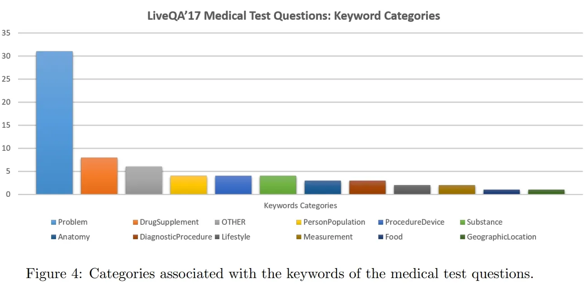

# LiveQA

<div align="center">
    <a href="https://github.com/openmedlab/"></a>
</div>
<p style="text-align:center;font-size:10px;"><em></em></p>

## Dataset Information

The LiveQA competition began in 2015, focusing on providing real-time answers to user questions. In 2017, a medical question-answering task was introduced. The organizers utilized consumer health questions received from the United States National Library of Medicine (NLM) to construct a dataset of medical question-answer pairs for training and testing, along with annotations that could be used for developing question analysis and answer generation systems. LiveQA also served as part of the training data for Google's large medical model, Med-Palm. The official dataset included 634 question-answer (QA) pairs for training, covering 23 types of questions (such as treatment, causes, diagnosis, indications, susceptibility, dosage) across four categories: diseases, medications, treatments, and tests. The test set comprised 104 questions, spanning 26 question types and related to five categories.

Automated medical question-answering systems have improved the quality and efficiency of responses to consumer health questions through the use of artificial intelligence technologies, such as deep learning. This advancement not only enhances the accessibility and accuracy of health information but also positively impacts patient education and self-care capabilities. It enables consumers to receive personalized medical advice in a timely manner, thereby making more informed decisions about managing their health.

## Dataset Meta Information

| Task Type | Language       | Train                                               | Val | Test | File Format | Size |
|-----------|----------------|-----------------------------------------------------|-----|------|-------------|------|
| QA        | English | 634 | -   | 104  | xml         | 1.16MB |


## Dataset Information Statistics

<div align="center">
    <a href="https://github.com/openmedlab/"></a>
</div>
<p style="text-align:center;font-size:10px;"><em></em></p>

<div align="center">
    <a href="https://github.com/openmedlab/"></a>
</div>
<p style="text-align:center;font-size:10px;"><em></em></p>

<div align="center">
    <a href="https://github.com/openmedlab/"></a>
</div>
<p style="text-align:center;font-size:10px;"><em></em></p>

## Dataset Example

<div align="center">
    <a href="https://github.com/openmedlab/"></a>
</div>
<p style="text-align:center;font-size:10px;"><em>Official Visualization.</em></p>

Its text information is below: 

```xml
<NLM-QUESTION questionid="Q10" fRef="1-135752923">
  <SUBJECT/>
  <MESSAGE>
    Would appreciate any good info on Lewy Body Dementia, we need to get people aware of this dreadful disease, all they talk about is alzheimers.
    Thank you
  </MESSAGE>
  <SUB-QUESTIONS>
    <SUB-QUESTION subqid="Q10-S1">
      <ANNOTATIONS>
        <FOCUS>lewy body dementia</FOCUS>
        <TYPE>information</TYPE>
      </ANNOTATIONS>
      <ANSWERS>
        <ANSWER answerid="Q10-S1-Al" pairid="17">
          Summary Lewy body disease is one of the most common causes of dementia in the elderly. Dementia is the loss of mental functions severe enough to affect normal activities and relationships. Lewy body disease happens when abnormal structures, called Lewy bodies, build up in areas of the brain. The disease may cause a wide range of symptoms, including - Changes in alertness and attention - Hallucinations - Problems with movement and posture - Muscle stiffness - Confusion - Loss of memory Lewy body disease can be hard to diagnose, because Parkinson's disease and Alzheimer's disease cause similar symptoms. Scientists think that Lewy body disease might be related to these diseases, or that they sometimes happen together. Lewy body disease usually begins between the ages of 50 and 85. The disease gets worse over time. There is no cure. Treatment focuses on drugs to help symptoms. NIH: National Institute of Neurological Disorders and Stroke
        </ANSWER>
        <ANSWER answerid="Q10-S1-A2" pairid="18">
          Lewy body dementia is one of the most common forms of progressive dementia. People affected by this condition may experience a variety of symptoms such as changes in alertness and attention; hallucinations; problems with movement and posture; muscle stiffness; confusion; and/or memory loss. Although the exact cause of Lewy body dementia is poorly understood, symptoms are thought to result when clumps of a protein called alpha-synuclein ("Lewy bodies") accumulate in the brain. Lewy body dementia usually occurs sporadically in people with no family history of the condition. Rarely, more than one family member may be affected. There is currently no cure for Lewy body dementia; however, medications may be available to help manage the associated symptoms.
        </ANSWER>
      </ANSWERS>
    </SUB-QUESTION>
  </SUB-QUESTIONS>
</NLM-QUESTION>

```

``` 
<NLM-QUESTION questionid="Q1" fRef="11373">
	<SUBJECT></SUBJECT>
	<MESSAGE>Literature on Cardiac amyloidosis.  Please let me know where I can get literature on Cardiac amyloidosis.  My uncle died yesterday from this disorder.  Since this is such a rare disorder, and to honor his memory, I would like to distribute literature at his funeral service.  I am a retired NIH employee, so I am familiar with the campus in case you have literature at NIH that I can come and pick up.  Thank you </MESSAGE>
	<SUB-QUESTIONS>
		<SUB-QUESTION subqid="Q1-S1">
			<ANNOTATIONS>
				<FOCUS>cardiac amyloidosis</FOCUS>
				<TYPE>information</TYPE>
			</ANNOTATIONS>
			<ANSWERS>
				<ANSWER answerid="Q1-S1-A1" pairid="1">Cardiac amyloidosis is a disorder caused by deposits of an abnormal protein (amyloid) in the heart tissue. These deposits make it hard for the heart to work properly.</ANSWER>
				<ANSWER answerid="Q1-S1-A2" pairid="2">The term "amyloidosis" refers not to a single disease but to a collection of diseases in which a protein-based infiltrate deposits in tissues as beta-pleated sheets. The subtype of the disease is determined by which protein is depositing; although dozens of subtypes have been described, most are incredibly rare or of trivial importance. This analysis will focus on the main systemic forms of amyloidosis, both of which frequently involve the heart.</ANSWER>
			</ANSWERS>
		</SUB-QUESTION>
	</SUB-QUESTIONS>
</NLM-QUESTION>
```

## File Structure

The file structure is as follows, the training data is divided into two xml files, and the test data is a single xml file.

``` 
LiveQA/
├── TREC-2017-LiveQA-Medical-Test.xml
├── TREC-2017-LiveQA-Medical-Train-1.xml
└── TREC-2017-LiveQA-Medical-Train-2.xml
```

## Authors and Institutions

Asma Ben Abacha (U.S. National Library of Medicine, Bethesda, MD)

Eugene Agichtein (Emory University, Atlanta, GA)

Yuval Pinter (Georgia Institute of Technology, Atlanta, GA)

Dina Demner-Fushman (U.S. National Library of Medicine, Bethesda, MD)

## Source Information

Official Website: https://github.com/abachaa/LiveQA_MedicalTask_TREC2017

Download Link: https://github.com/abachaa/LiveQA_MedicalTask_TREC2017

Article Address: https://trec.nist.gov/pubs/trec26/papers/Overview-QA.pdf?ref=https://githubhelp.com

Publication Date: 2017

## Citation

``` 
@inproceedings{
    author    = {Asma {Ben Abacha} and Eugene Agichtein and Yuval Pinter and Dina Demner{-}Fushman}, 
    title     = {Overview of the Medical Question Answering Task at TREC 2017 LiveQA}, 
    booktitle = {TREC 2017},
    year      = {2017}
}
```

Original introduction article is [here](https://zhuanlan.zhihu.com/p/682927211).