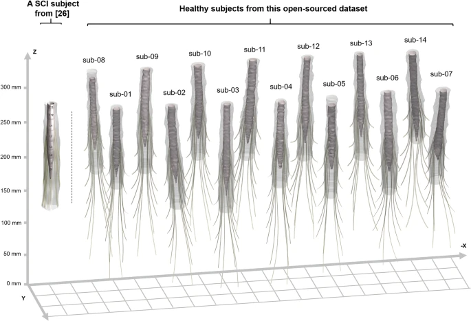

# Lumbosacral Spine MRI Dataset

<div align="center">
    <a href="https://github.com/openmedlab/"></a>
</div>
<p style="text-align:center;font-size:10px;"><em></em></p>

## Dataset Information

**Spinal cord injury (SCI)** is a severe trauma that significantly impairs the ability to produce functional standing and locomotion in affected individuals. While effective rehabilitation therapies for SCI have been very limited over the past decades, recent advancements suggest that neuromodulation holds promise for enabling SCI patients to stand and walk again. Specifically, the neural ensembles crucial for generating standing and gait are often located below the injury site. Therefore, activating intact spinal segments below the injury site through external stimulation can trigger lower limb muscles. **Epidural electrical stimulation (EES)**, a neuromodulation technique proven effective for pain relief, has emerged as a promising therapy for SCI rehabilitation. EES targets the dorsal (sensory) roots, leveraging the spinal cord's inherent ability to use sensory signals as a source for motor control.  

Traditional EES uses constant stimulation parameters. However, standalone constant EES has been shown to be insufficient for motor rehabilitation. Producing natural, dynamic, and smooth lower limb movements requires precise adjustments to time-varying stimulation parameters, activating specific nerve roots during different phases of motion. To address this, a novel approach known as **spatiotemporal EES** has emerged. Spatiotemporal EES precisely targets and switches individual dorsal root nerves at predefined times (open-loop mode) or based on feedback regarding current body posture (closed-loop mode), replicating the natural spatiotemporal activation patterns of the spinal cord during dynamic movement. By modulating specific motor neuron pools, spatiotemporal EES has demonstrated exceptional rehabilitation performance.  

Rowald et al. applied spatiotemporal EES to three complete SCI patients, enabling them to stand, walk, cycle, swim, and manage trunk movements within a single day. Angeli et al. reported that, following customized EES stimulation and intensive physical training, two of four patients with complete motor paralysis successfully regained the ability to walk on the ground. Recent studies have also integrated brain-spine interfaces (BSI) with spatiotemporal EES, achieving natural control over lower limb movements.  

Spatiotemporal EES largely relies on the **precise identification and localization of individual spinal cord nerve roots**. Furthermore, its clinical translation is constrained by inter-individual variability in the human spinal cord. To date, datasets addressing this challenge are extremely scarce. Existing **X-ray** or **computed tomography (CT)** datasets primarily focus on vertebral segmentation, neglecting distinct spinal cord nerve roots. Although **magnetic resonance imaging (MRI)** provides clear neural imaging, current spinal MRI datasets primarily support research on **chronic back pain** and **cervical degenerative diseases**, emphasizing the cervical spine and spinal cord regions rather than nerve roots.  

The lack of MRI datasets with **enhanced resolution** for spinal cord nerve root structures remains a significant gap in EES research. To address this gap, the authors propose a **high-resolution lumbar-sacral spine MRI dataset** specifically designed for spinal cord nerve root structures.

<div align="center">
    <a href="https://github.com/openmedlab/"></a>
</div>
<p style="text-align:center;font-size:10px;"><em>Figure 1. Representative magnetic resonance imaging (MRI) data from a healthy adult participant illustrate the human lumbar-sacral spine as observed from multiple dimensions, along with the subsequent post-processing workflow. The T2-TSE sequence images delineate the spinal cord contours, while the DESS sequence images highlight the localization of nerve ganglia. Additionally, MRI images from the CISS sequence clearly depict the distribution of spinal nerve roots within the lumbar-sacral spine. Geometric information was obtained through manual annotation and subsequently used to automatically construct a comprehensive human lumbar-sacral model, including structures such as the dura mater, cerebrospinal fluid (CSF), and nerve roots spanning from L1 to S2.</em></p>

## Dataset Meta Information

| Dimensions | Modality | Task Type | Anatomical Structures | Anatomical Area    | Number of Categories | Data Volume | File Format    |
|------------|----------|-----------|-----------------------|--------------------|----------------------|-------------|----------------|
| 3D         | MRI      | Detection | Spinal Cord           | Spinal Nerve Roots | 1                    | 14          | .json, .nii.gz |


### Resolution Details

| Dataset Statistics | spacing (mm)        | field of view (mm) |
|--------------------|---------------------|--------------------|
| min                | (0.30, 0.30, 2.00)  | (240, 240)         |
| median             | (0.35, 0.35, 1.80)  | (243, 243)         |
| max                | (0.63, 0.63, 3.00)  | (288, 288)         |

## Label Information Statistics

This section is statistics results of label information.

| Metric        | Tumor    |
|---------------|----------|
| Case Count    | 501      |
| Coverage      | 49.4%    |
| Min Volume (cm³) | 0.1    |
| Median Volume (cm³) | 99 |
| Max Volume (cm³) | 2480   |

## Visualization

<div align="center">
    <a href="https://github.com/openmedlab/"></a>
</div>
<p style="text-align:center;font-size:10px;"><em>Figure 2. Visualization of the human lumbar-sacral models based on MRI data. The 14 models on the right are derived from this study's 14 healthy adult participants. In contrast, the model on the left is from another study involving spinal cord injury participants, where the MRI images, annotations, and models were not publicly shared. Each model includes anatomical structures such as the dura mater, cerebrospinal fluid (CSF), and nerve roots spanning from L1 to S2. The coordinate axes are indicated. The spinal cord models are aligned using the highest plane of the dura mater structure to demonstrate individual variability.</em></p>

## File Structure

The directory structure of the dataset is as follows:  

1. **Raw Data**:  
   - Unprocessed anonymized data are provided in the `/rawdata/sub-#/anat` branch of the root directory, including imaging data from **CISS**, **DESS**, and **T2-TSE sequences**.  

2. **Processed Derivative Data**:  
   - Processed data are organized under the `/derivatives` branch according to their respective workflows. The following annotations are provided:  
     - **Dura Mater Locations**:  
       - `/markers/sub-#/sub-#dura{i}.json`  
       - Where `i` refers to the CISS slice number showing the dura mater.  
     - **Spinal Cord and CSF Boundary**:  
       - `/markers/sub-#/sub-#cord{i}.json`  
       - Where `i` refers to the CISS slice number showing the white matter.  
     - **Nerve Ganglia**:  
       - `/markers/sub-#/sub-#ganglions{segment}{side}.json`  
       - Where `segment` indicates the target level (L1 to S2), and `side` specifies **left** or **right**.  
     - **Nerve Root Trajectories**:  
       - `/markers/sub-#/sub-#nerveroots{segment}{side}.json`  
       - Where `segment` represents the target spinal segment (L1 to S2), and `side` specifies **left** or **right**.  

3. **Models**:  
   - Models generated based on these annotations are stored in the `/model` directory.  

4. **Image Quality Reports**:  
   - Detailed image quality reports for the raw CISS, DESS, and T2-TSE data, generated using **MRIQC19**, are provided in the `/anatqc` directory.  

``` 
rawdata
│
├── participants.json
├── participants.tsv
└── sub-01
    └── anat
        ├── sub-01_CISS.json
        ├── sub-01_CISS.nii.gz
        ├── sub-01_DESS.json
        ├── sub-01_DESS.nii.gz
        ├── sub-01_T2TSE.json
        └── sub-01_T2TSE.nii.gz

derivatives
│
├── anatqc
│   └── sub-01
│       └── anat
│           ├── sub-01_CISS_CNR.csv
│           ├── sub-01_CISS_SNR.csv
│           ├── sub-01_T2TSE_CNR.csv
│           └── sub-01_T2TSE_SNR.csv
│
├── markers
│   └── sub-01
│       ├── sub-01_cord_{i}.json
│       ├── sub-01_dura_{i}.json
│       ├── sub-01_ganglions_{segment}_{side}.json
│       └── sub-01_nerveroots_{segment}_{side}.json
│
└── model
    └── sub-01
        ├── sub-01_Cord.stl
        ├── sub-01_Dura.stl
        └── sub-01_Nerveroots.stl

```

## Authors and Institutions

Jionghui Liu (Fudan University)  

Wenqi Zhang (Fudan University)  

Yuxing Zhou (Fudan University)  

Linhao Xu (Fudan University)  

Ying-Hua Chu (Siemens Healthineers Ltd.)  

Fumin Jia (Fudan University)  

## Source Information

Official Website: https://www.nature.com/articles/s41597-024-03919-4?_gl=1*1b99nma*_up*MQ..&gclid=CjwKCAjw1NK4BhAwEiwAVUHPUBSVE39DcGDKAwkq8XsXXSl6_OUuZnDtj1uQIYvbjU1jXTS4VUmRnBoClvAQAvD_BwE

Download Link: https://figshare.com/collections/An_open-access_lumbosacral_spine_MRI_dataset_with_enhanced_spinal_nerve_root_structure_resolution/7372564

Article Address: https://www.nature.com/articles/s41597-024-03919-4?_gl=1*1b99nma*_up*MQ..&gclid=CjwKCAjw1NK4BhAwEiwAVUHPUBSVE39DcGDKAwkq8XsXXSl6_OUuZnDtj1uQIYvbjU1jXTS4VUmRnBoClvAQAvD_BwE

Publication Date: 2024-10

## Citation

``` 
@article{liu2024open,
  title={An open-access lumbosacral spine MRI dataset with enhanced spinal nerve root structure resolution},
  author={Liu, Jionghui and Zhang, Wenqi and Zhou, Yuxing and Xu, Linhao and Chu, Ying-Hua and Jia, Fumin},
  journal={Scientific Data},
  volume={11},
  number={1},
  pages={1131},
  year={2024},
  publisher={Nature Publishing Group UK London}
}
```

Original introduction article is [here](https://zhuanlan.zhihu.com/p/2134567132).