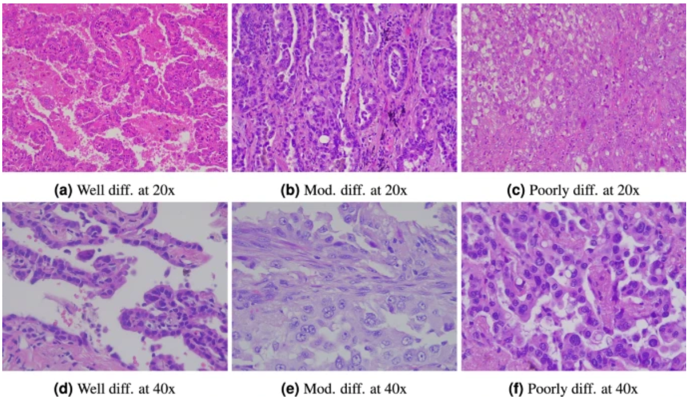
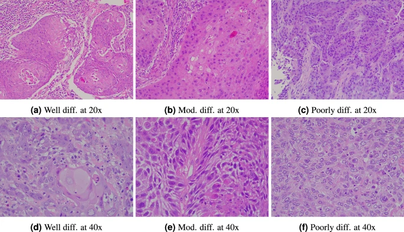
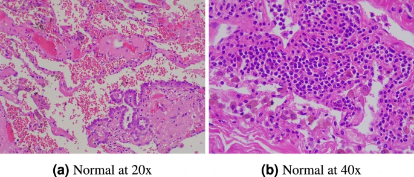

# LungHist700

<div align="center">
    <a href="https://github.com/openmedlab/"></a>
</div>
<p style="text-align:center;font-size:10px;"><em></em></p>

## Dataset Information

Accurate detection and classification of pulmonary malignancies are crucial for early diagnosis, treatment planning, and patient prognosis. Traditional histopathological analysis is time-consuming and labor-intensive, which limits its feasibility in clinical applications. To address this issue, we present a dataset containing 691 high-resolution (1200×1600 pixels) histopathological images of lung tissue, covering adenocarcinoma, squamous cell carcinoma, and normal tissue from 45 patients. These images are categorized into three differentiation levels for the two pathological types: well-differentiated, moderately differentiated, and poorly differentiated, resulting in seven classification categories. The dataset includes images at 20x and 40x magnification, reflecting real clinical diversity. We evaluated image classification using deep neural networks and multiple-instance learning approaches. Each approach was used to classify the 20x and 40x magnified images into three superclasses. Depending on the method and resolution, we achieved an accuracy of 81% to 92%, demonstrating the utility of the dataset.

## Dataset Meta Information

| Dimensions | Modality            | Task Type      | Anatomical Structures                                  | Anatomical Area | Number of Categories | Data Volume | File Format |
|------------|---------------------|----------------|--------------------------------------------------------|-----------------|----------------------|-------------|-------------|
| 2D         | Pathological Images | Classification | Adenocarcinoma, Squamous Cell Carcinoma, Normal Tissue | Lung            | 7                    | 691         | JPG         |


### Resolution Details

| Dataset Statistics | size          |
|--------------------|---------------|
| min                | (1200, 1600)  |
| median             | (1200, 1600)  |
| max                | (1200, 1600)  |

## Label Information Statistics

| Class                              | Differentiation Level                           |
|------------------------------------|-------------------------------------------------|
| Adenocarcinomas                    | Well-differentiated adenocarcinoma              |
|                                    | Moderately differentiated adenocarcinoma        |
|                                    | Poorly differentiated adenocarcinoma            |
| Pulmonary squamous cell carcinoma  | Well differentiated                             |
|                                    | Moderately differentiated                       |
|                                    | Poorly differentiated                           |
| Normal                             | Normal                                          |

## Visualization

<div align="center">
    <a href="https://github.com/openmedlab/"></a>
</div>
<p style="text-align:center;font-size:10px;"><em>Figure 1. Images of adenocarcinomas showing different degrees of differentiation and resolution.</em></p>

<div align="center">
    <a href="https://github.com/openmedlab/"></a>
</div>
<p style="text-align:center;font-size:10px;"><em>Figure 2. Images of squamous cell carcinoma showing different degrees of differentiation and resolution.</em></p>

<div align="center">
    <a href="https://github.com/openmedlab/"></a>
</div>
<p style="text-align:center;font-size:10px;"><em>Figure 3. Normal lung tissue images at different resolutions.</em></p>

## File Structure

``` 
LungHist700/
├── images
│   ├── aca_bd
│   ├── aca_md
│   ├── aca_pd
│   ├── nor
│   ├── scc_bd
│   ├── scc_md
│   ├── scc_pd
├── data.csv
```

## Authors and Institutions

Jorge Diosdado (Dept. of Mathematics and Computer Science, University of Barcelona, Barcelona, Spain)  

Pere Gilabert (Dept. of Mathematics and Computer Science, University of Barcelona, Barcelona, Spain)  

Santi Seguí (Dept. of Mathematics and Computer Science, University of Barcelona, Barcelona, Spain)  

Henar Borrego (University Clinical Hospital of Valladolid, Valladolid, Spain)

## Source Information

Official Website: https://www.nature.com/articles/s41597-024-03944-3

Download Link: https://figshare.com/articles/dataset/LungHist700_A_Dataset_of_Histological_Images_for_Deep_Learning_in_Pulmonary_Pathology/25459174?file=45206104

Article Address: https://www.nature.com/articles/s41597-024-03944-3

Publication Date: 2024-10

## Citation

``` 
@ARTICLE{Diosdado2024-zg,
  title    = "{LungHist700}: A dataset of histological images for deep learning in pulmonary pathology",
  author   = "Diosdado, Jorge and Gilabert, Pere and Segu{\'\i}, Santi and Borrego, Henar",
  journal  = "Scientific Data",
  volume   =  11,
  number   =  1,
  pages    = "1088",
  month    =  oct,
  year     =  2024
}
```

Original introduction article is [here](https://zhuanlan.zhihu.com/p/842122384).