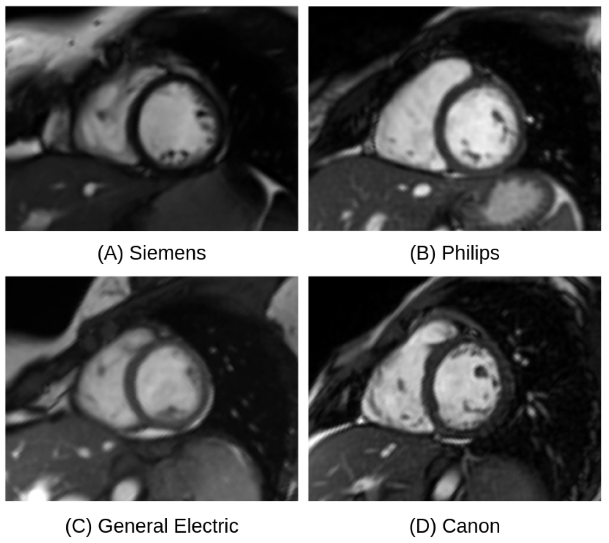
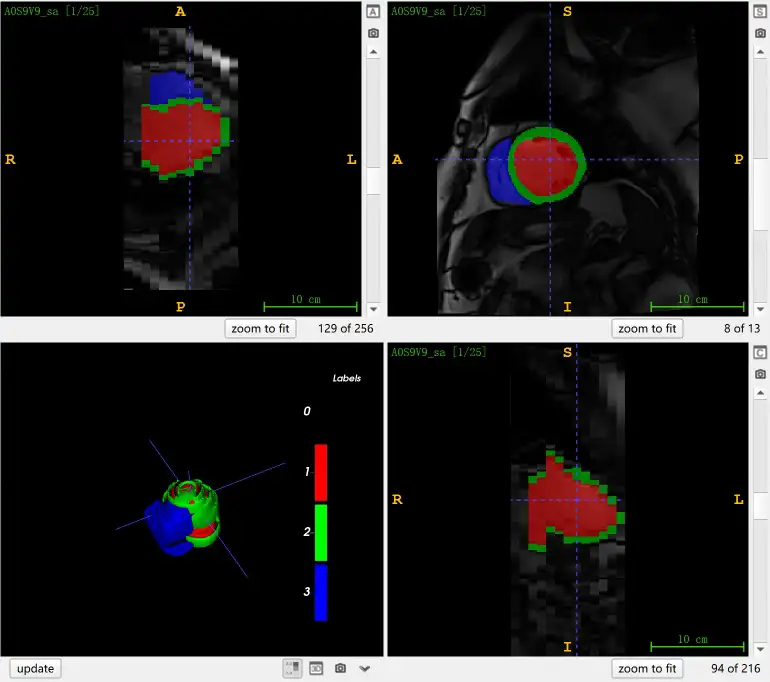

# M&Ms

<div align="center">
    <a href="https://github.com/openmedlab/"></a>
</div>
<p style="text-align:center;font-size:10px;"><em> ITK-SNAP Visualization.</em></p>

## Dataset Information

M&Ms (Multi-Centre, Multi-Vendor & Multi-Disease Cardiac Image Segmentation Challenge) is a dataset focused on cardiac segmentation in cardiac magnetic resonance (CMR) images under multi-center, multi-vendor, and multi-disease conditions, including 375 patients from clinical centers in Spain, Germany, and Canada, featuring both patients with various pathologies and healthy subjects. Subjects underwent magnetic resonance imaging scans using scanners from four different equipment suppliers (Siemens, General Electric, Philips, and Canon). The training set includes 150 annotated images from two different MRI equipment suppliers (75 from each), along with 25 unannotated images from a third supplier. Experienced clinicians have segmented the cardiac magnetic resonance (CMR) images, following the ACDC annotation standards, annotating the contours of the left ventricle (LV), right ventricle (RV) blood pool, and left ventricular myocardium (MYO), with labels as follows: 1 (LV), 2 (MYO), and 3 (RV). The test set includes 200 test cases, comprising 50 new studies from each supplier featured in the training set, and an additional 50 studies from a fourth, previously unseen supplier to test the model's generalization ability. 20% of these datasets are used for validation, while the remainder are reserved for testing.

Information about the 6 centers of the data involved in the data set:

| Name                                       | City      | Country |
|--------------------------------------------|-----------|---------|
| 1. Hospital Vall d'Hebron                  | Barcelona | Spain   |
| 2. Clínica Sagrada Familia                 | Barcelona | Spain   |
| 3. Universitätsklinikum Hamburg-Eppendorf  | Hamburg   | Germany |
| 4. Hospital Universitari Dexeus            | Barcelona | Spain   |
| 5. Clínica Creu Blanca                     | Barcelona | Spain   |
| 6. McGill University Health Centre         | Montreal  | Canada  |

In recent years, many machine learning/deep learning models have been proposed for accurately segmenting cardiac structures in magnetic resonance imaging. However, when these models are tested on unknown datasets obtained from different MRI scanners or clinical centers, their segmentation accuracy may significantly decrease. The goal of the M&Ms challenge is to contribute to the development of generalizable models that can be consistently applied across different clinical centers. Additionally, M&Ms provides the community with a reference dataset for building and evaluating future generalizable models in cardiac magnetic resonance (CMR) segmentation.


## Dataset Meta Information

| Dimensions | Modality | Task Type | Anatomical Structures          | Anatomical Area | Number of Categories | Data Volume | File Format |
|------------|----------|-----------|--------------------------------|-----------------|----------------------|-------------|-------------|
| 3D         | CMR      | Segmentation | Left and right ventricles, myocardium | Heart           | 3                    | 375         | .nii.gz     |


### Resolution Details

Perform image size statistics on the 150 labeled data in the training set. The format of size is (x,y,z,frame)

| Dataset Statistics | spacing (mm)             | size               |
|--------------------|--------------------------|--------------------|
| min                | (0.98, 0.98, 5.0)        | (192, 192, 5, 18)  |
| median             | (1.25, 1.25, 10.0)       | (256, 256, 11, 25) |
| max                | (1.63,1.63, 10.0)        | (384, 384, 16, 30) |


## Label Information Statistics

| Segmentation | LV (Left Ventricle) | RV (Right Ventricle) | MYO (Myocardium) |
|--------------|---------------------|----------------------|------------------|
| Sample Count | 150                 | 150                  | 150              |
| Percentage   | 100%                | 100%                 | 100%             |

| Pathology     | Centre 1 | Centre 2 | Centre 3 | Centre 4 | Centre 5 | Centre 6 |
|---------------|----------|----------|----------|----------|----------|----------|
| Healthy vol.  | 22       | 33       | 32       | 21       | 14       | 3        |
| HCM           | 25       | 37       | 14       | 8        | 15       | 4        |
| DCM           | 37       | -        | 5        | -        | 9        | -        |
| HHD           | -        | 4        | -        | 19       | 1        | 1        |
| ARV           | 12       | -        | -        | 2        | 1        | 1        |
| AHS           | -        | -        | -        | 3        | -        | -        |
| IHD           | -        | -        | -        | 4        | 1        | 3        |
| LVNC          | -        | -        | -        | 2        | 2        | -        |
| Other         | -        | -        | -        | 18       | 7        | 15       |

The distribution of the most common pathologies and healthy volunteers among the centers. The abbreviations correspond to the following pathologies: hypertrophic cardiomyopathy (HCM), dilated cardiomyopathy (DCM), hypertensive heart disease (HHD), arrhythmogenic right ventricular cardiomyopathy (ARV), athlete's heart syndrome (AHS), ischemic heart disease (IHD), and left ventricular non-compaction (LVNC).

## Visualization

<div align="center">
    <a href="https://github.com/openmedlab/"></a>
</div>
<p style="text-align:center;font-size:10px;"><em> The image is from a paper. It shows the visual appearance of mid-ventricular short-axis slices of CMR from anatomically similar subjects from four different suppliers.</em></p>


<div align="center">
    <a href="https://github.com/openmedlab/"></a>
</div>
<p style="text-align:center;font-size:10px;"><em> ITK-SNAP visualization. Red: left ventricle; green: myocardium; blue: right ventricle.</em></p>

## File Structure

The file structure of the dataset is as follows: the dataset is organized into three main directories: training set, validation set, and test set. The training set is further divided into subdirectories for annotated and unannotated data. Each annotated subdirectory contains imaging files of patients along with the corresponding annotation data.

``` 
M&Ms
├── Training
│   ├── Labeled
│   │   ├── A0S9V9
│   │   │   ├── A0S9V9_sa.nii.gz 
│   │   │   └── A0S9V9_sa_gt.nii.gz 
│   │   ├── A1D0Q7
│   │   ├── A1D9Z7
│   │   └── ...
│   └── Unlabeled
├── Validation
├── Testing
└── 211230_M&Ms_Dataset_information_diagnosis_opendataset.csv 
```

## Authors and Institutions

**Technical Team**  

Víctor M. Campello (University of Barcelona, Spain)  

Karim Lekadir (University of Barcelona, Spain)  

**Clinical Team**  

José F. Rodríguez Palomares (Vall d'Hebron Hospital, Spain)

Andrea Guala (Vall d'Hebron Hospital, Spain)  

Lucia La Mura (Vall d'Hebron Hospital, Spain)  

Mahir Karakas (University Hospital Hamburg, Germany)  

Ersin Çavuş (University Hospital Hamburg, Germany)  

Matthias G. Friedrich (McGill University Health Centre, Canada)  

Julie Lebel (McGill University Health Centre, Canada)  

Ria Garg (McGill University Health Centre, Canada)  

Filipe Henriques (McGill University Health Centre, Canada)  

Martín Descalzo (Hospital de Sant Pau i Santa Creu, Spain)  

David Viladés (Hospital de Sant Pau i Santa Creu, Spain)

## Source Information

Official Website: https://www.ub.edu/mnms/

Download Link: https://mega.nz/folder/FxAmhbRJ#Dwugf8isRSR9CCZ6Qnza4w

Article Address: https://ieeexplore.ieee.org/document/9458279

Publication Date: 2020

## Citation

``` 
@article{campello2021multi,
  title={Multi-centre, multi-vendor and multi-disease cardiac segmentation: the M\&Ms challenge},
  author={Campello, Victor M and Gkontra, Polyxeni and Izquierdo, Cristian and Martin-Isla, Carlos and Sojoudi, Alireza and Full, Peter M and Maier-Hein, Klaus and Zhang, Yao and He, Zhiqiang and Ma, Jun and others},
  journal={IEEE Transactions on Medical Imaging},
  volume={40},
  number={12},
  pages={3543--3554},
  year={2021},
  publisher={IEEE}
}

@article{martin2023deep,
  title={Deep learning segmentation of the right ventricle in cardiac mri: The m\&ms challenge},
  author={Mart{\'\i}n-Isla, Carlos and Campello, V{\'\i}ctor M and Izquierdo, Cristian and Kushibar, Kaisar and Sendra-Balcells, Carla and Gkontra, Polyxeni and Sojoudi, Alireza and Fulton, Mitchell J and Arega, Tewodros Weldebirhan and Punithakumar, Kumaradevan and others},
  journal={IEEE Journal of Biomedical and Health Informatics},
  volume={27},
  number={7},
  pages={3302--3313},
  year={2023},
  publisher={IEEE}
}
```

Original introduction article is [here](https://zhuanlan.zhihu.com/p/694831343).