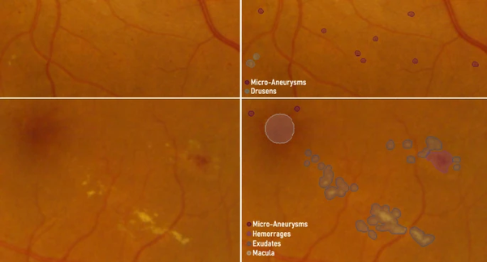
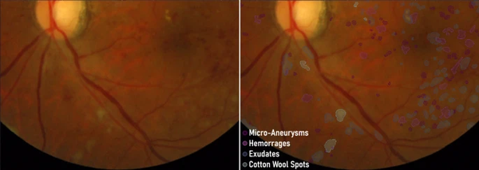
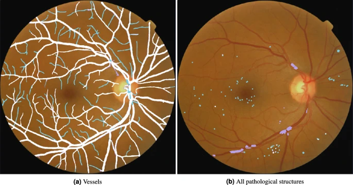

# MAPLES-DR

<div align="center">
    <a href="https://github.com/openmedlab/"></a>
</div>
<p style="text-align:center;font-size:10px;"><em></em></p>

## Dataset Information

Diabetic Retinopathy (DR) is a complication of diabetes (DM) that damages the retinal microvasculature and can lead to impaired vision. The development of DR is progressive, and clinically it is categorized into different stages based on the lesions present on the retina. Non-invasive fundus imaging can detect these lesions, and regular screening of high-risk populations is necessary to ensure early treatment and protect their vision. Despite widespread screening programs in North America, 40% of diabetic patients do not receive DR monitoring. Studies based on these programs have shown that remote ophthalmic screening can increase the proportion of patients monitored, and algorithms for automated DR diagnosis can further improve by reducing costs, increasing the frequency of examinations, and ensuring timely management of referred patients.

In the past decade, machine learning models have been successfully applied for the automatic diagnosis of DR from fundus images. The development of these supervised algorithms is centered around publicly available annotated image datasets, used for training and validation. Among them, the Eyepacs and MESSIDOR datasets have facilitated the development of automated screening algorithms whose performance surpasses FDA requirements and even that of human experts. However, medical personnel still lack confidence in these technologies, which do not meet the standards of explainable AI. We believe that to overcome this limitation, the importance of improving training labels should not be overlooked. In fact, the uncertainty of validation methods and generalization issues call for more diverse, bias-aware validation datasets, and better documentation of the labeling process. The weak explainability of screening models also requires more comprehensive, clinically relevant training labels, not just simple diagnostic categories. In the report "Four Principles of Explainable AI," the National Institute of Standards and Technology emphasizes that proper interpretation of algorithm results should be meaningful to the target audience, which in our case, must be articulated in vocabulary familiar to ophthalmologists. Limiting training labels to DR grades is a significant reduction of medical vocabulary, especially when clinical reasons heavily rely on identifying retinal anatomical and pathological structures (vessels, macula, red or bright lesions, etc.). Therefore, datasets with such structured, pixel-level annotations play a critical role in developing explainable DR screening models, whether by guiding models to learn representations compatible with clinical knowledge or by interpreting these representations post hoc by comparison with known biomarkers. The authors designed the MAPLES-DR (MESSIDOR Anatomy and Pathology Labels for Explainable Diabetic Retinopathy Screening) with this goal in mind.

Pixel-level labeling annotations require more time and effort than image-level diagnostic labels; thus, datasets with such labels are rare. Most of them only publish annotations for one biomarker (e.g., vessels, optic disc, exudates, microaneurysms). According to the authors' research, only four datasets provide labels for four symptomatic DR lesions: microaneurysms, hemorrhages, exudates, and cotton wool spots. FGADR and Retinal Lesions contain a large number of images (1842 and 1593 respectively), but the pathological structures are mostly annotated as large lesion clumps. In contrast, IDRiD and DDR provide precise segmentation for each lesion but have fewer images (81 and 757 respectively). The companion articles for these datasets focus on the performance enhancements they bring to existing screening methods but only offer a superficial description of the protocols used for annotations. They do not include annotations for anatomical structures.

The MAPLES-DR dataset expands the MESSIDOR dataset by supplementing its image-level diagnostic labels with new pixel-level annotations for 10 types of anatomical and pathological structures and new DR and macular edema (ME) grades for 198 images. To our knowledge, no other public dataset provides such a comprehensive range of anatomical and pathological labels for fundus images. This paper details the design choices and labeling protocols for this dataset, as well as its potential biases and inaccuracies. By thoroughly documenting our approach and publishing all the tools and software used to generate the annotations in this paper, we aim to help other research teams build more such datasets for explainable DR screening.

<div align="center">
    <a href="https://github.com/openmedlab/"></a>
</div>
<p style="text-align:center;font-size:10px;"><em>Figure 1. Overview of the MAPLES-DR annotation protocol and schematic diagram of the dataset content.</em></p>

## Dataset Meta Information

| Dimensions | Modality | Task Type     | Anatomical Structures | Anatomical Area | Number of Categories | Data Volume | File Format |
|------------|----------|---------------|-----------------------|-----------------|----------------------|-------------|-------------|
| 2D         | Fundus   | Segmentation  | Retina                | Head and Neck   | 12                   | 198         | JPG         |


### Resolution Details

| Dataset Statistics | size          |
|--------------------|---------------|
| min                | (1500, 1500)  |
| median             | (1500, 1500)  |
| max                | (1500, 1500)  |

## Label Information Statistics

<div align="center">
    <a href="https://github.com/openmedlab/"></a>
</div>
<p style="text-align:center;font-size:10px;"><em>Figure 2. Distribution of the number of individual lesions in the images of each pathological structure type and their total area, grouped by DR severity.</em></p>

| English Term        | Chinese Term    |
|---------------------|-----------------|
| OpticDisc           | 视盘              |
| OpticCup            | 视杯              |
| Macula              | 黄斑              |
| Vessels             | 血管              |
| Exudates            | 渗出物             |
| CottonWoolSpots     | 棉状斑点            |
| Drusens             | 玻璃膜疣星           |
| Microaneurysms      | 微动脉瘤            |
| Hemorrhages         | 出血              |
| Neovascularization  | 新生血管            |
| RedUncertains       | 不确定红色病变         |
| BrightUncertains    | 不确定白色病变         |


## Visualization

<div align="center">
    <a href="https://github.com/openmedlab/"></a>
</div>
<p style="text-align:center;font-size:10px;"><em>Figure 3. Pathological structures in image 20060411_59190_0200_PP. (Left: Unlabeled fundus image).</em></p>

<div align="center">
    <a href="https://github.com/openmedlab/"></a>
</div>
<p style="text-align:center;font-size:10px;"><em>Fig. 4. Pathological structures in image 20051214_57940_0100_PP.</em></p>

<div align="center">
    <a href="https://github.com/openmedlab/"></a>
</div>
<p style="text-align:center;font-size:10px;"><em>Figure 5. Anatomical structures in image 20051205_35354_0400_PP. (Dark blue: optic disc, light blue: optic cup, dark purple: macula, light purple: blood vessels).</em></p>

<div align="center">
    <a href="https://github.com/openmedlab/"></a>
</div>
<p style="text-align:center;font-size:10px;"><em>Figure 6. Example of corrections made when reviewing the pre-annotated segmentation map of image 20060412_61593_0200_PP. (White: unchanged pre-annotations, cyan: manually added segmentations, purple: manually removed pre-annotations).</em></p>

## File Structure

``` 
MAPLES-DR/
├── train&test
│   ├── OpticDisc
│   ├── OpticCup
│   ├── Macula
│   ├── Vessels
│   ├── Exudates
│   ├── CottonWoolSpots
│   ├── Drusens
│   ├── Microaneurysms
│   ├── Hemorrhages
│   ├── Neovascularization
│   ├── RedUncertains
│   ├── BrightUncertains
│   ├── diagnosis.csv
AdditionalData/
├── iomarkers_annotations_infos.xls
├── diagnosis_infos.xls
├── pre_annotations/
├── annotations/
├── MESSIDOR-ROIs.csv
├── pre_annotations/
```

**biomarkers_annotations_infos.xls**: Records which retinal expert annotated specific biomarker categories, the time spent on each annotation (in seconds), any comments they left, and the annotation numbers (with the first annotated image as number 1 and the last as number 200).

**diagnosis_infos.xls**: Contains the DR and ME grades annotated by each retinal expert and the consensus reached. It also includes any comments left by the retinal experts during grading.

**pre_annotations/**: Contains automatic segmentations of vessels, exudates, hemorrhages, and microaneurysms provided as pre-annotations to the retinal experts.

**annotations/**: Stores 12 subfolders (one for each biomarker), each containing all 200 segmented images annotated by the retinal experts, without distinction between training, test, and duplicate sets. Images are stored as PNG binary masks at the resolution used during annotation (1500×1500 pixels), using the regions of interest (ROIs) provided in MESSIDOR-ROIs.csv.

**MESSIDOR-ROIs.csv**: Provides bounding boxes extracted from MESSIDOR images to obtain square regions of interest that minimize the blank margins around the circular fundus area. For each image identified by name, the bounding box is stored as a pair of pixel coordinates for the top-left (x0, y0) and bottom-right (x1, y1). These coordinates are necessary for padding and resizing the maps in annotations/ and pre_annotations/ to match MESSIDOR’s resolution, or conversely, for cropping and resizing MESSIDOR images to match the 1500×1500 resolution of MAPLES-DR segmentation images.

**dataset_record.yaml**: Lists the names of the biomarkers, the image filenames in the training, test, and duplicate sets, and the filenames of samples missing the cup or macula segmentation images (identified as no_cup and no_macula, respectively).

## Authors and Institutions

Gabriel Lepetit-Aimon (Department of Computer and Software Engineering, Polytechnique Montréal, Montréal, QC, Canada)

Clément Playout (Department of Ophthalmology, Université de Montréal, Montréal, Canada; Centre Universitaire d’Ophtalmologie, Hôpital Maisonneuve-Rosemont, Montréal, Canada)

Marie Carole Boucher (Department of Ophthalmology, Université de Montréal, Montréal, Canada; Centre Universitaire d’Ophtalmologie, Hôpital Maisonneuve-Rosemont, Montréal, Canada)

Renaud Duval (Department of Ophthalmology, Université de Montréal, Montréal, Canada; Centre Universitaire d’Ophtalmologie, Hôpital Maisonneuve-Rosemont, Montréal, Canada)

Michael H. Brent (Department of Ophthalmology and Vision Science, University of Toronto, Toronto, Canada)

Farida Cheriet (Department of Computer and Software Engineering, Polytechnique Montréal, Montréal, QC, Canada)

## Source Information

Official Website: https://www.nature.com/articles/s41597-024-03739-6?_gl=1

Download Link: https://github.com/ClementPla/fundus-lesions-toolkit; https://github.com/gabriel-lepetitaimon/fundus-vessels-toolkit

Article Address: https://www.nature.com/articles/s41597-024-03739-6?_gl=1

Publication Date: 2024-08

## Citation

``` 
@article{lepetit2024maples,
  title={MAPLES-DR: MESSIDOR Anatomical and Pathological Labels for Explainable Screening of Diabetic Retinopathy},
  author={Lepetit-Aimon, Gabriel and Playout, Cl{\'e}ment and Boucher, Marie Carole and Duval, Renaud and Brent, Michael H and Cheriet, Farida},
  journal={Scientific Data},
  volume={11},
  number={1},
  pages={914},
  year={2024},
  publisher={Nature Publishing Group UK London}
}
```

Original introduction article is [here](https://zhuanlan.zhihu.com/p/718821084).