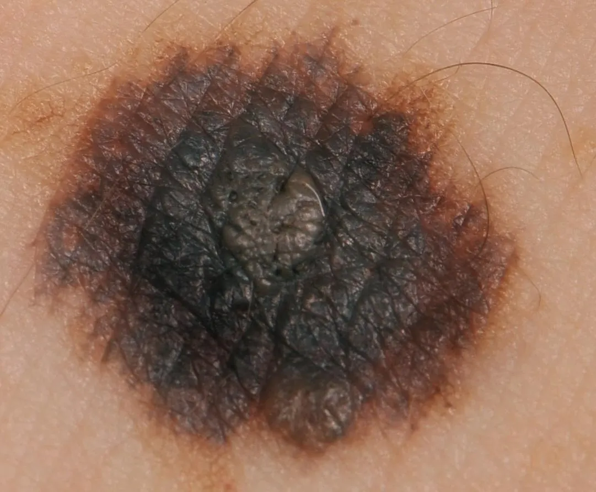
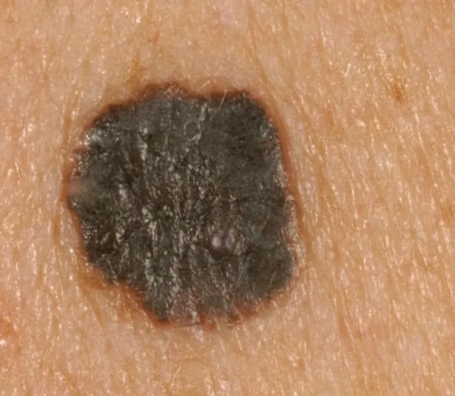

# MED-NODE

<div align="center">
    <a href="https://github.com/openmedlab/"></a>
</div>
<p style="text-align:center;font-size:10px;"><em></em></p>

## Dataset Information

In recent years, the incidence and mortality rates of melanoma have shown an upward trend year by year. In many cases, even professional physicians find it difficult to accurately distinguish it from benign moles. To this end, the authors have proposed the MED-NODE (MElanoma Diagnosis from NOn-DErmoscopic images) dataset, hoping to promote the research of melanoma recognition models and programs to assist clinical physicians in completing this challenging identification task. The images in this dataset are from the Dermatology Department of the University Medical Center Groningen in the Netherlands and consist of 70 melanoma and 100 nevus dermoscopic images.

## Dataset Meta Information

| Dimensions | Modality   | Task Type      | Anatomical Structures | Anatomical Area | Number of Categories | Data Volume | File Format |
|------------|------------|----------------|-----------------------|-----------------|----------------------|-------------|-------------|
| 2D         | dermoscopic | Classification | Skin                  | Skin            | 2                    | 170         |  JPG        |


### Resolution Details

| Dataset Statistics | size         |
|--------------------|--------------|
| min                | [201,257]   |
| median             | [949,801]  |
| max                | [3177,1333]  |

## Label Information Statistics

| Category | Retinal Vessel |
|----------|----------------|
| melanoma | 70             |
| naevus   | 100            |

## Visualization

<div align="center">
    <a href="https://github.com/openmedlab/"></a>
</div>
<p style="text-align:center;font-size:10px;"><em> Melanoma example image.</em></p>

<div align="center">
    <a href="https://github.com/openmedlab/"></a>
</div>
<p style="text-align:center;font-size:10px;"><em> Naevus example image.</em></p>

## File Structure

The file structure of the data set is as follows, including folders that save images of 4 categories.

``` 
MED-NODE Dataset
├── melanoma
│   ├── 896.jpg
│   ├── 2827.jpg
│   │    ...
├── naevus
│   ├── 19085.jpg
│   ├── 21457.jpg
│   ├── ...
```

## Authors and Institutions

Ioannis Giotis (University of Groningen, Netherlands)

Nynke Molders (University of Groningen, Netherlands)

Sander Land (King's College London, United Kingdom)

Michael Biehl (University of Groningen, Netherlands)

Marcel F. Jonkman (University of Groningen, Netherlands)

Nicolai Petkov (University of Groningen, Netherlands)


## Source Information

Official Website: https://www.cs.rug.nl/~imaging/databases/melanoma_naevi/

Download Link: https://www.cs.rug.nl/~imaging/databases/melanoma_naevi/complete_mednode_dataset.zip

Article Address: https://pure.rug.nl/ws/portalfiles/portal/84388355/MED_NODE_A_computer_assisted_melanoma_diagnosis_system_using_non.pdf

Publication Date: 2015-07-26

## Citation

``` 
@article{giotis2015med,
  title={MED-NODE: A computer-assisted melanoma diagnosis system using non-dermoscopic images},
  author={Giotis, Ioannis and Molders, Nynke and Land, Sander and Biehl, Michael and Jonkman, Marcel F and Petkov, Nicolai},
  journal={Expert systems with applications},
  volume={42},
  number={19},
  pages={6578--6585},
  year={2015},
  publisher={Elsevier}
}
```

Original introduction article is [here](https://zhuanlan.zhihu.com/p/671825325).