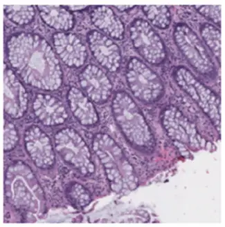
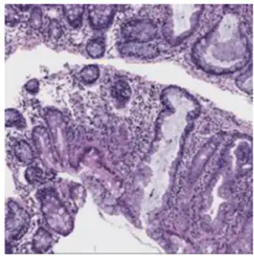

# MHIST

<div align="center">
    <a href="https://github.com/openmedlab/"></a>
</div>
<p style="text-align:center;font-size:10px;"><em></em></p>

## Dataset Information

The MHIST dataset is a colon polyp classification dataset based on H&E staining, containing 3,152 images. Each image has been meticulously annotated based on the opinions of seven pathologists. This dataset is divided into two parts: the training set includes 2,162 images, and the validation set contains 990 images. The dataset covers two types of colon polyps: Hyperplastic Polyps (HP) and Sessile Serrated Adenomas (SSA). Clinically, distinguishing between these two types of polyps is crucial because HPs are generally benign, while SSAs can be precancerous lesions that may develop into cancer if not appropriately managed, necessitating earlier follow-up.

The release of the MHIST dataset aims to foster collaboration within the research community and to promote the development and evaluation of new pathological image analysis methods. This open resource will help reduce disparities in the diagnosis of HP and SSA among pathologists, while providing valuable material for academic and clinical research in digital pathology. In this way, the MHIST dataset not only advances medical imaging analysis technology but also enhances the accuracy and standardization of colon polyp classification.

## Dataset Meta Information

| Dimensions | Modality   | Task Type      | Anatomical Structures | Anatomical Area | Number of Categories | Data Volume | File Format |
|------------|------------|----------------|-----------------------|-----------------|----------------------|-------------|-------------|
| 2D         | pathology  | Classification | Colorectal            | Colorectal      | 2                    | 3,152       | PNG         |


### Resolution Details

You can also write down the resolution details such as size (x, y, z) and spacing information about the dataset.

For example:

| Dataset Statistics | size        |
|--------------------|-------------|
| min                | (224, 224)  |
| median             | (224, 224)  |
| max                | (224, 224)  |

## Label Information Statistics

| Category      | Hyperplastic Polyp (HP) | Sessile Serrated Adenoma (SSA) |
|---------------|-------------------------|--------------------------------|
| Image Count   | 2,162                    | 990                            |
| Percentage    | 68.59%                   | 31.41%                         |

## Visualization

<div align="center">
    <a href="https://github.com/openmedlab/"></a>
</div>
<p style="text-align:center;font-size:10px;"><em>Hyperplastic Polyp (HP).</em></p>

<div align="center">
    <a href="https://github.com/openmedlab/"></a>
</div>
<p style="text-align:center;font-size:10px;"><em>Sessile Serrated Adenoma (SSA).</em></p>

## File Structure

Introduce file structure of original dataset folder.

Take representative MSD dataset for example:

``` 
Dataset
│
├── annotations.csv
├── images
│   ├── image1.png
│   ├── image1.png
│   ├── ...
```

## Authors and Institutions

Jerry Wei (Dartmouth College)

Arief Suriawinata (Dartmouth-Hitchcock Medical Center)

Bing Ren (Dartmouth-Hitchcock Medical Center)

Xiaoying Liu (Dartmouth-Hitchcock Medical Center)

Mikhail Lisovsky (Dartmouth-Hitchcock Medical Center)

Louis Vaickus (Dartmouth-Hitchcock Medical Center)

Charles Brown (Dartmouth-Hitchcock Medical Center)

Michael Baker (Dartmouth-Hitchcock Medical Center)

Naofumi Tomita (Dartmouth College)

Lorenzo Torresani (Dartmouth College)

Jason Wei (Dartmouth College)

Saeed Hassanpour (Dartmouth College)

## Source Information

Official Website: https://bmirds.github.io/MHIST/

Download Link: https://bmirds.github.io/MHIST/

Article Address: https://link.springer.com/chapter/10.1007/978-3-030-77211-6_2

Publication Date: 2021-06

## Citation

``` 
@inproceedings{wei2021petri,
  title={A petri dish for histopathology image analysis},
  author={Wei, Jerry and Suriawinata, Arief and Ren, Bing and Liu, Xiaoying and Lisovsky, Mikhail and Vaickus, Louis and Brown, Charles and Baker, Michael and Tomita, Naofumi and Torresani, Lorenzo and others},
  booktitle={Artificial Intelligence in Medicine: 19th International Conference on Artificial Intelligence in Medicine, AIME 2021, Virtual Event, June 15--18, 2021, Proceedings},
  pages={11--24},
  year={2021},
  organization={Springer}
}
```

Original introduction article is [here](https://zhuanlan.zhihu.com/p/704878191).