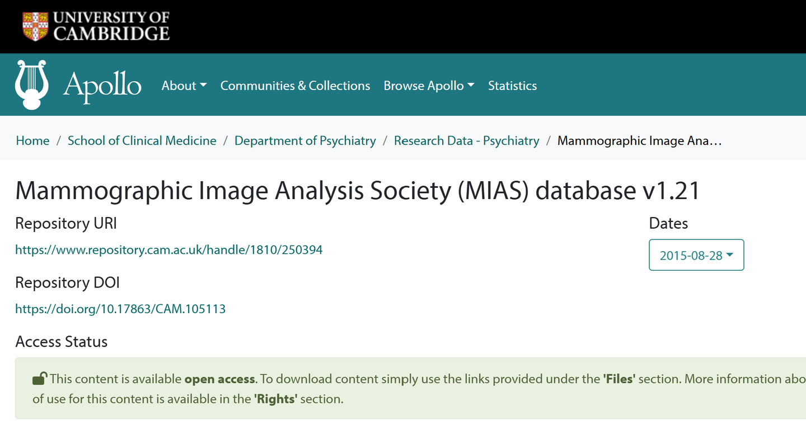
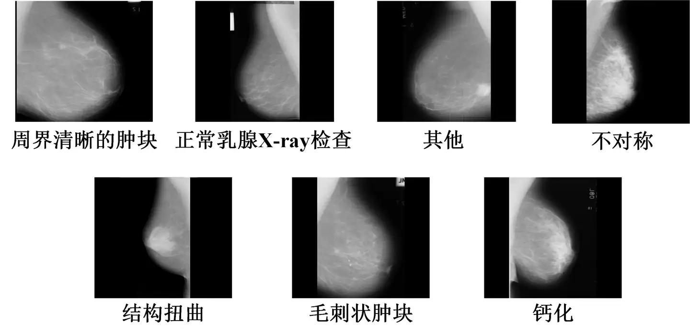

# MIAS

<div align="center">
    <a href="https://github.com/openmedlab/"></a>
</div>
<p style="text-align:center;font-size:10px;"><em></em></p>

## Dataset Information

The MIAS dataset is a very small mammography image set composed of 322 X-ray images, with each image standardized to a resolution of 1024x1024 pixels. The dataset includes seven categories: well-defined masses, normal mammographic exams, other ill-defined masses, asymmetry, architectural distortion, spiculated masses, and calcifications. Due to its size, the dataset is not suitable for training but can be used for exploratory data analysis and as a supplementary testing dataset.

Breast cancer is the second most common cancer among women worldwide. Approximately one in eight U.S. women (about 12.4%) will develop invasive breast cancer over their lifetime. The five-year survival rate for stage 0 or 1 breast cancer is nearly 100%, but this rate dramatically decreases in later stages: 93% for stage II, 72% for stage III, and 22% for stage IV. The human detection recall rate for lesions is estimated to be between 0.75 and 0.92, which means that up to 25% of abnormalities may go undetected.

## Dataset Meta Information

| Dimensions | Modality | Task Type      | Anatomical Structures | Anatomical Area | Number of Categories | Data Volume | File Format |
|------------|----------|----------------|-----------------------|-----------------|----------------------|-------------|-------------|
| 2D         | X-ray    | Classification | Chest                 | Breast          | 7                    | 322         | PNG         |


### Resolution Details

| Dataset Statistics | size             | 
|--------------------|------------------|
| min                | (1024, 1024, 1)  | 
| median             | (1024, 1024, 1)  |
| max                | (1024, 1024, 1)  |

## Label Information Statistics

| Category                | Code | Count |
|-------------------------|------|-------|
| Circumscribed masses    | 0    | 23    |
| Normal mammography scans| 1    | 207   |
| Other                   | 2    | 14    |
| Asymmetry               | 3    | 15    |
| Architectural distortion| 4    | 19    |
| Spiculated masses       | 5    | 19    |
| Calcification           | 6    | 25    |

## Visualization

<div align="center">
    <a href="https://github.com/openmedlab/"></a>
</div>
<p style="text-align:center;font-size:10px;"><em>Local visualization.</em></p>

## File Structure

The file structure of the dataset is as follows: images are stored in the 'images' folder, and annotations for 'train' and 'test' are provided in TXT format.

``` 
MIAS
├── images
│   ├── xxx.png
│   ├── xxx.png
│   │    ...
├── train.txt
├── test.txt
```

## Authors and Institutions

Suckling, John (UNIVERSITYOF CAMBRIDGE)

Parker, J. (UNIVERSITYOF CAMBRIDGE)


## Source Information

Official Website: https://doi.org/10.17863/CAM.105113

Download Link: https://www.kaggle.com/datasets/kmader/mias-mammography

Article Address: https://github.com/escuccim/mias-mammography/blob/master/Report.md

Publication Date: 2015

## Citation

``` 
@misc{suckling2015mammographic,
  author = {Suckling, Jeremy and Parker, John and Dance, David and Astley, Susan and Hutt, Ian and Boggis, Caroline and Ricketts, Ian and Stamatakis, Emmanuel and Cerneaz, Nico and Kok, Stefanie and Taylor, Peter and Betal, Dhiraj and Savage, Jessica},
  title = {Mammographic Image Analysis Society ({MIAS}) database v1.21},
  year = {2015},
  howpublished = {Apollo - University of Cambridge Repository},
  url = {https://doi.org/10.17863/CAM.105113}
}
```

Original introduction article is [here](https://zhuanlan.zhihu.com/p/702788120).