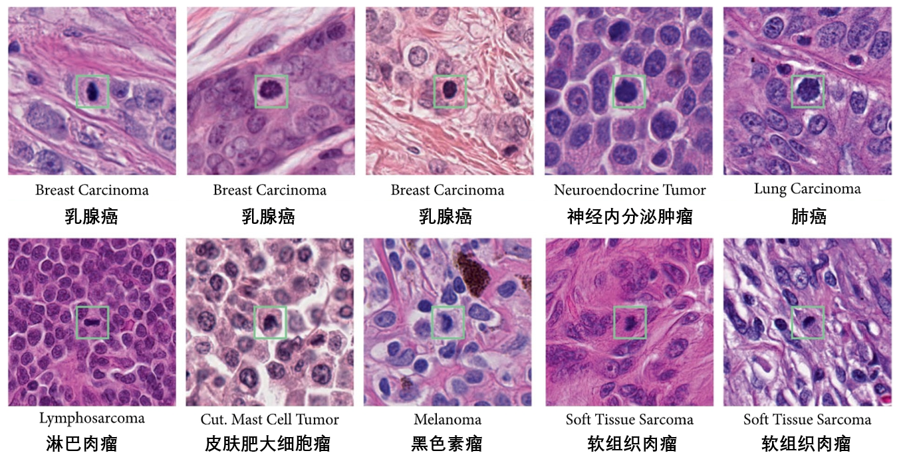

# MIDOG++

<div align="center">
    <a href="https://github.com/openmedlab/"></a>
</div>
<p style="text-align:center;font-size:10px;"><em></em></p>

## Dataset Information

The **MIDOG++** dataset is a pathology dataset for image classification, and it is an extended version of the MIDOG 2021 and 2022 challenge datasets. This dataset contains images of regions of interest from 503 histological specimens of seven different tumor types, with a total of 11,937 mitotic images and 14,351 non-mitotic images. The covered tumor types include breast cancer, lung cancer, lymphoma, neuroendocrine tumors, and more, with all specimens processed by multiple laboratories using different scanners.

Due to significant domain shifts across scanners, laboratories, and species, this poses challenges for the performance of deep learning methods. To address this shift, researchers developed the MIDOG++ dataset, the first dataset to consider mitotic images from different tumor types, laboratory environments, whole-slide image scanning techniques, and species differences. This dataset is crucial for evaluating the prognostic value of mitotic images in tumor tissues and holds great research and application value, particularly in the field of automated pathology image analysis.

## Dataset Meta Information

| Dimensions | Modality      | Task Type         | Anatomical Area                      | Number of Categories | Data Volume | File Format |
|------------|---------------|-------------------|--------------------------------------|----------------------|-------------|-------------|
| 2D         | pathology     | Classification    | Breast, lung, lymph and other areas  | 2                    | 22688        | PNG         |


### Resolution Details

| Dataset Statistics    | size        |
|-----------------------|-------------|
| min                   | (128, 128)  |
| median                | (128, 128)  |
| max                   | (128, 128)  |

## Label Information Statistics

Distribution of annotations of mitotic and non-mitotic images from different fields and tumor types:

| Domain | Tumor Type                         | Mitotic Type | Number of Occurrences | Percentage of Occurrences |
|--------|------------------------------------|--------------|-----------------------|---------------------------|
| 1a     | Breast carcinoma (human)           | Mitotic      | 451                       | 0.01715612                 |
| 1a     | Breast carcinoma (human)           | Non-Mitotic  | 724                       | 0.02754108                 |
| 1b     | Breast carcinoma (human)           | Mitotic      | 582                       | 0.02213938                 |
| 1b     | Breast carcinoma (human)           | Non-Mitotic  | 1066                      | 0.04055083                 |
| 1c     | Breast carcinoma (human)           | Mitotic      | 688                       | 0.02617164                 |
| 1c     | Breast carcinoma (human)           | Non-Mitotic  | 924                       | 0.03514912                 |
| 2      | Lung carcinoma (canine)            | Mitotic      | 855                       | 0.03252435                 |
| 2      | Lung carcinoma (canine)            | Non-Mitotic  | 952                       | 0.03621424                 |
| 3      | Lymphosarcoma (canine)             | Mitotic      | 3959                      | 0.15060103                 |
| 3      | Lymphosarcoma (canine)             | Non-Mitotic  | 4257                      | 0.16193701                 |
| 4      | Cutaneous mast cell tumor (canine) | Mitotic      | 2327                      | 0.08851948                 |
| 4      | Cutaneous mast cell tumor (canine) | Non-Mitotic  | 1366                      | 0.05196287                 |
| 5      | Neuroendocrine tumor (human)       | Mitotic      | 639                       | 0.02430767                 |
| 5      | Neuroendocrine tumor (human)       | Non-Mitotic  | 1762                      | 0.06702678                 |
| 6a     | Soft tissue sarcoma (canine)       | Mitotic      | 1097                      | 0.04173007                 |
| 6a     | Soft tissue sarcoma (canine)       | Non-Mitotic  | 2072                      | 0.07881923                 |
| 6b     | Soft tissue sarcoma (canine)       | Mitotic      | 189                       | 0.00718959                 |
| 6b     | Soft tissue sarcoma (canine)       | Non-Mitotic  | 303                       | 0.01152167                 |
| 7      | Melanoma (human)                   | Mitotic      | 1150                      | 0.0437462                  |
| 7      | Melanoma (human)                   | Non-Mitotic  | 925                       | 0.03518716                 |

## Visualization

<div align="center">
    <a href="https://github.com/openmedlab/"></a>
</div>
<p style="text-align:center;font-size:10px;"><em></em></p>

## File Structure

The authors provide a detailed database of all mitotic image annotations in the MIDOG++ dataset, along with a script, **Setup.ipynb**, for downloading the data.

- The **databases** folder contains all databases stored in **SQLite SlideRunner** and **MS COCO** formats.
- The **slide** folder includes data loaders for handling whole slide images (WSIs).
- The **images** folder is initially empty, and the data will be downloaded into this folder after running **Setup.ipynb**.

``` 
MIDOGpp
│
├── databases
├── slide
├── images
├── Setup.ipynb
├── ...
```

## Authors and Institutions

Marc Aubreville（Technische Hochschule Ingolstadt）

Frauke Wilm (Pattern Recognition Lab, Friedrich-Alexander-Universität Erlangen-Nürnberg & Department Artificial Intelligence in Biomedical Engineering, Friedrich-Alexander-Universität Erlangen-Nürnberg)

Nikolas Stathonikos (Department of Pathology, University Medical Center Utrecht)

Katharina Breininger (Department Artificial Intelligence in Biomedical Engineering, Friedrich-Alexander-Universität Erlangen-Nürnberg)

Taryn a. Donovan (Schwarzman Animal Medical Center)

Samir Jabari (Department of Neuropathology, Universitätsklinikum Erlangen, Friedrich-Alexander-Universität Erlangen-Nürnberg)

Mitko Veta (Medical Image Analysis Group, Eindhoven University of Technology)

Jonathan Ganz (Technische Hochschule Ingolstadt)

Jonas Ammeling (Technische Hochschule Ingolstadt)

Paul J. van Diest (Department Artificial Intelligence in Biomedical Engineering, Friedrich-Alexander-Universität Erlangen-Nürnberg)

Robert Klopfleisch (Institute of Veterinary Pathology, Freie Universität Berlin)

Christof A. Bertram (Institute of Pathology, University of Veterinary Medicine Vienna)

## Source Information

Official Website: https://github.com/DeepMicroscopy/MIDOGpp/tree/main

Download Link: https://github.com/DeepMicroscopy/MIDOGpp/tree/main

Article Address: https://www.nature.com/articles/s41597-023-02327-4

Publication Date: 2023-07

## Citation

``` 
@article{aubreville2023comprehensive,
  title={A comprehensive multi-domain dataset for mitotic figure detection},
  author={Aubreville, Marc and Wilm, Frauke and Stathonikos, Nikolas and Breininger, Katharina and Donovan, Taryn A and Jabari, Samir and Veta, Mitko and Ganz, Jonathan and Ammeling, Jonas and van Diest, Paul J and others},
  journal={Scientific data},
  volume={10},
  number={1},
  pages={484},
  year={2023},
  publisher={Nature Publishing Group UK London}
}
```

Original introduction article is [here](https://zhuanlan.zhihu.com/p/713078312).