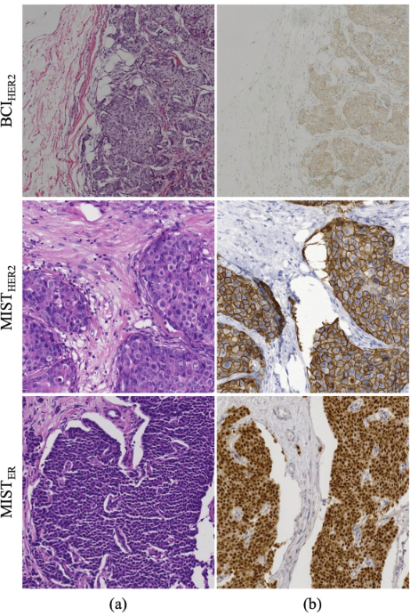

# MIST-HER2

<div align="center">
    <a href="https://github.com/openmedlab/"></a>
</div>
<p style="text-align:center;font-size:10px;"><em></em></p>

## Dataset Information

The MIST dataset is a staining transformation dataset related to breast cancer diagnosis, containing aligned H&E-IHC images for four crucial biomarkers in breast cancer diagnosis: HER2, Ki67, ER, and PR. Specifically, the MIST dataset provides over 4000 training samples and 1000 test samples of aligned H&E-IHC images for each biomarker's IHC staining.

Due to the correlation between the morphological information of H&E stained sections and the molecular information of IHC stained sections, the transformation from H&E to IHC staining is feasible. Compared to H&E staining, IHC staining is significantly more costly, including higher labor demands and more expensive laboratory equipment. The MIST dataset supports the development of H&E to IHC image staining transformation technologies, which not only helps reduce experimental costs and manual labor but also enhances the accuracy and efficiency of breast cancer diagnosis.

## Dataset Meta Information

| Dimensions | Modality    | Task Type               | Number of Categories | Data Volume | File Format |
|------------|-------------|-------------------------|----------------------|-------------|-------------|
| 2D         | pathology   | Image Transformation    | 4                    | 22688       | JPG         |


### Resolution Details

| Dataset Statistics | size          |
|--------------------|---------------|
| min                | (1024, 1024)  |
| median             | (1024, 1024)  |
| max                | (1024, 1024)  |

## Label Information Statistics

| Biomarker | HER2 | Ki67 | ER   | PR   |
|-----------|------|------|------|------|
| Count     | 5642 | 5361 | 5153 | 5139 |
| Percentage| 27.82% | 26.44% | 25.41% | 25.34% |

## Visualization

<div align="center">
    <a href="https://github.com/openmedlab/"></a>
</div>
<p style="text-align:center;font-size:10px;"><em>H&E image (a) and corresponding IHC image (b), from the original paper.</em></p>

## File Structure

``` 
MIST
│
├── PR
├────TrainValAB
├─────trainA
├──────1.jpg
├──────2.jpg
├──────...
├─────trainB
├─────valA
├─────valB
├── Ki67
├── HER2
├── ER
```

## Authors and Institutions

Fangda Li (Purdue University, West Lafayette)

Zhiqiang Hu (Sensetime Research)

Wen Chen (Sensetime Research)

Avinash Kak (Purdue University, West Lafayette)

## Source Information

Official Website: https://link.springer.com/chapter/10.1007/978-3-031-43987-2_61

Download Link: https://drive.google.com/drive/folders/146V99Zv1LzoHFYlXvSDhKmflIL-joo6p?usp=sharing

Article Address: https://link.springer.com/chapter/10.1007/978-3-031-43987-2_61

Publication Date: 2023-10

## Citation

``` 
@inproceedings{li2023adaptive,
  title={Adaptive supervised patchnce loss for learning h\&e-to-ihc stain translation with inconsistent groundtruth image pairs},
  author={Li, Fangda and Hu, Zhiqiang and Chen, Wen and Kak, Avinash},
  booktitle={International Conference on Medical Image Computing and Computer-Assisted Intervention},
  pages={632--641},
  year={2023},
  organization={Springer}
}
```

Original introduction article is [here]().