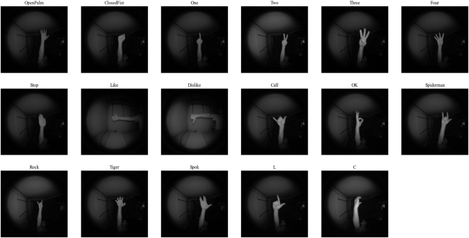
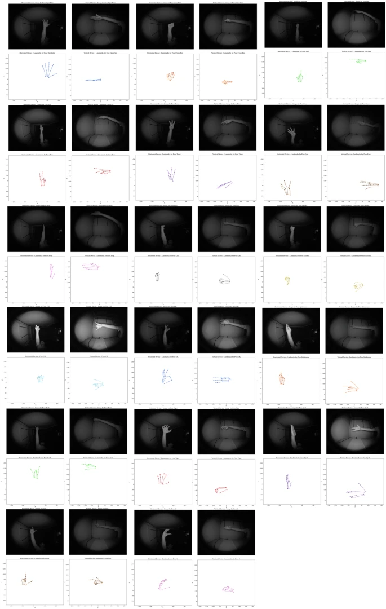

# ML2HP

<div align="center">
    <a href="https://github.com/openmedlab/"></a>
</div>
<p style="text-align:center;font-size:10px;"><em></em></p>

## Dataset Information

**Hand pose recognition based on computer vision** is a fascinating component of human-computer interface design. It enables the identification and understanding of hand configurations and movements. This field can be framed within the broader context of **human activity recognition**, a domain where vision-based methods have attracted significant interest and exploration. These methods aim to understand and interpret human behaviors and actions through visual data. Specifically, hand pose recognition spans a diverse range of applications, from **virtual reality (VR)** and **augmented reality (AR)** to **sign language recognition** and **gesture-based interfaces**. At its core, hand pose recognition seeks to bridge the gap between human communication methods and digital systems, enabling seamless interaction between users and technology through natural hand gestures and movements.

### **Limitations of Existing Datasets**
To advance the field of hand pose recognition, several notable datasets have been developed, each presenting interesting features and certain limitations. Most existing datasets focus on **sign language recognition tasks**, while others include general hand poses for human-computer interaction applications. While valuable for training multi-view hand pose estimation models due to their large number of instances, these datasets often rely heavily on **synthetic data**. This reliance can limit the applicability of the datasets in real-world scenarios, as they may fail to fully capture the complexity and variability of real human hands. This critical limitation affects the generalization capabilities of models trained on such datasets. Additionally, existing datasets often include a limited number of instances and artificially substitute sets with random backgrounds, providing hand poses in constrained environments.

### **Proposed Dataset: ML2HP**
To address these limitations, the proposed dataset introduces a **multi-view dataset recorded using the Leap Motion Controller 2**, a cutting-edge device capable of capturing both accurate hand landmarks and images simultaneously. This dual capability allows for the creation of a richly detailed dataset, offering comprehensive visual data and precise landmark information that is crucial for developing and testing advanced hand pose recognition systems. By using this new device, the dataset ensures unmatched accuracy in capturing the nuances of hand movements and poses, enhancing its value for research and applications in various technical fields.

The **dual-view setup** of the device mitigates ambiguities that may arise from a single viewpoint by capturing details that might be occluded in one view but visible in another. This allows for more accurate detection of hand poses. The dataset offers a new opportunity to address challenges such as **pose variations** and **occlusions**, effectively leveraging the information from two cameras. Furthermore, its versatility extends to scenarios where only a single camera viewpoint is available, enabling the evaluation of hand pose recognition systems under constrained conditions. This dual functionality not only enhances the robustness and adaptability of recognition models but also provides valuable insights into the trade-offs between multi-view and single-view approaches.

### **Key Contributions**
1. **Introduction of the ML2HP Dataset**:  
   - A novel **multi-view Leap2 hand pose dataset**, the first dataset captured using a **Leap Motion Controller 2** multi-view recording setup.  
   - It comprehensively covers diverse hand poses from different angles.

2. **Data Collection with Leap Motion Controller 2**:  
   - The dataset leverages the capabilities of the Leap Motion Controller 2, including **images** and **precise frame-level automatic hand attributes**, enhancing its richness and usability.

3. **Balanced Variability Across Subjects, Hand Poses, and Usage**:  
   - The dataset features diverse subjects, hand poses, and hand usage (right or left hand), ensuring variability, balance, and richness in recorded instances.  
   - This variability supports the development of robust and generalized hand pose recognition models trained on the dataset.

## Dataset Meta Information

| Dimension | Modality       | Task Type | Anatomical Structure | Number of Classes | Quantity | File Format   |
|-----------|----------------|-----------|-----------------------|-------------------|----------|---------------|
| 2D        | Multimodal: RGB + Text | Classification | Hand                 | 17                | 714,000  | .bmp, .csv    |

| ID  | Label (English)                                                                                                          | Label (Chinese)                  |
|-----|--------------------------------------------------------------------------------------------------------------------------|----------------------------------|
| 0   | Open Palm, where all fingers are extended and spread apart.                                                              | 张开手掌，所有手指伸展并分开。                  |
| 1   | Closed Fist, with all fingers clenched into the palm.                                                                    | 握拳，所有手指紧握在手掌中。                   |
| 2   | One, where only the index finger is extended with the other fingers clenched.                                            | 数字一，只有食指伸展，其他手指紧握。               |
| 3   | Two, with the index and middle fingers extended together and the remaining fingers clenched.                             | 数字二，食指和中指一起伸展，其余手指紧握。            |
| 4   | Three, where the index, middle, and ring fingers are extended.                                                           | 数字三，食指、中指和无名指一起伸展，而小指和拇指紧握。      |
| 5   | Four, with all fingers except the thumb extended and held together.                                                      | 数字四，除了拇指外所有手指伸展并拢。               |
| 6   | Stop, involving the hand held with the palm facing outward and all fingers extended together, resembling a stop gesture. | 停止手势，手掌向外，所有手指一起伸展，类似于停止的手势。     |
| 7   | Like, featuring the thumb extended upward with the other fingers clenched into a fist.                                   | 点赞，拇指向上伸展，其他手指紧握成拳。              |
| 8   | Dislike, with the thumb extended downward and the other fingers clenched into a fist.                                    | 不喜欢，拇指向下伸展，其他手指紧握成拳。             |
| 9   | Call, where the thumb and pinky fingers are extended.                                                                    | 打电话，拇指和小指伸展。                     |
| 10  | OK Sign, with the thumb and index finger forming a circle while the other fingers are extended.                          | OK手势，拇指和食指形成一个圆圈，而其他手指伸展。        |
| 11  | Spiderman, where the fist is clenched while the thumb, index, and pinky are extended.                                    | 蜘蛛侠手势，拳头紧握，拇指、食指和小指伸展。           |
| 12  | Rock, where the fist is clenched while the index and pinky are extended.                                                 | 石头手势，拳头紧握，食指和小指伸展。               |
| 13  | Tiger, with all fingers extended and slightly curled, emphasizing the nails.                                             | 老虎手势，所有手指伸展并略微弯曲，强调指甲。           |
| 14  | Spok, with the middle and ring fingers separated, creating a "V" shape, while the thumb is extended away from the palm.  | 瓦肯手势，中指和无名指分开，形成一个“V”形，拇指远离手掌伸展。 |
| 15  | L, where the thumb and index finger are extended perpendicular to each other forming an L shape.                         | L形手势，拇指和食指伸展并垂直于彼此，形成一个L形。       |
| 16  | C, with the thumb and rest of fingers curved to form a C shape.                                                          | C形手势，拇指和其余手指弯曲形成一个C形。            |


## Data Visualizatin

<div align="center">
    <a href="https://github.com/openmedlab/"></a>
</div>
<p style="text-align:center;font-size:10px;"><em>Figure 1. Samples of each gesture.</em></p>

<div align="center">
    <a href="https://github.com/openmedlab/"></a>
</div>
<p style="text-align:center;font-size:10px;"><em>Figure 2. An example of information about finger joints and coordinates of finger landmarks.</em></p>

<div align="center">
    <a href="https://github.com/openmedlab/"></a>
</div>
<p style="text-align:center;font-size:10px;"><em>Figure 3. Example images and 2D landmark representations of different categories acquired using both devices.</em></p>

## File Structure

``` 
MultiViewLeap2_Dataset
│
├── subjects_info.csv
├── 001
│   ├── Right_Hand
│   │   ├── OpenPalm
│   │   │   ├── Horizontal
│   │   │   │   ├── hand_properties.csv
│   │   │   │   └── images
│   │   │   │       ├── 001_left.bmp
│   │   │   │       ├── 001_right.bmp
│   │   │   │       ├── ...
│   │   │   │       └── 1000_right.bmp
│   │   │   ├── Vertical
│   │   │       ├── hand_properties.csv
│   │   │       └── images
│   │   │           ├── 001_left.bmp
│   │   │           ├── 001_right.bmp
│   │   │           ├── ...
│   │   │           └── 1000_right.bmp
│   │   ├── ClosedFist
│   │   │   └── ...
│   │   ├── One
│   │   │   └── ...
│   │   ├── Two
│   │   │   └── ...
│   │   ├── Three
│   │   │   └── ...
│   │   ├── Four
│   │   │   └── ...
│   │   ├── Stop
│   │   │   └── ...
│   │   ├── Like
│   │   │   └── ...
│   │   ├── Dislike
│   │   │   └── ...
│   │   ├── Call
│   │   │   └── ...
│   │   ├── OK
│   │   │   └── ...
│   │   ├── Spiderman
│   │   │   └── ...
│   │   ├── Rock
│   │   │   └── ...
│   │   ├── Tiger
│   │   │   └── ...
│   │   ├── Spok
│   │   │   └── ...
│   │   ├── L
│   │   │   └── ...
│   │   ├── C
│   │       └── ...
│   ├── Left_Hand
│       └── ...
├── 002
│   └── ...
├── ...
└── 021
    └── ...
```

## Authors and Institutions

- Manuel Gil-Martín (Universidad Politécnica de Madrid)  

- Marco Raoul Marini (Sapienza University)  

- Rubén San-Segundo (Universidad Politécnica de Madrid)  

- Luigi Cinque (Sapienza University)  

## Source Information

Official Website: https://www.nature.com/articles/s41597-024-03968-9?_gl=1*ikljf0*_up*MQ..&gclid=Cj0KCQjwpvK4BhDUARIsADHt9sTKeJdkTiVgts02Lx7tkFajPSGA9upeXML9AePHRgmojqIZejtL75kaAktZEALw_wcB

Download Link: https://edatos.consorciomadrono.es/dataset.xhtml?persistentId=doi:10.21950/ZKWE6Z

Article Address: https://www.nature.com/articles/s41597-024-03968-9.pdf?_gl=1*wlvrzr*_up*MQ..&gclid=Cj0KCQjwpvK4BhDUARIsADHt9sTKeJdkTiVgts02Lx7tkFajPSGA9upeXML9AePHRgmojqIZejtL75kaAktZEALw_wcB

Publication Date: 2024-09

## Citation

``` 
@article{gil2024dual,
  title={Dual Leap Motion Controller 2: A Robust Dataset for Multi-view Hand Pose Recognition},
  author={Gil-Mart{\'\i}n, Manuel and Marini, Marco Raoul and San-Segundo, Rub{\'e}n and Cinque, Luigi},
  journal={Scientific Data},
  volume={11},
  number={1},
  pages={1102},
  year={2024},
  publisher={Nature Publishing Group UK London}
}
```

Original introduction article is [here](https://zhuanlan.zhihu.com/p/3343880507).