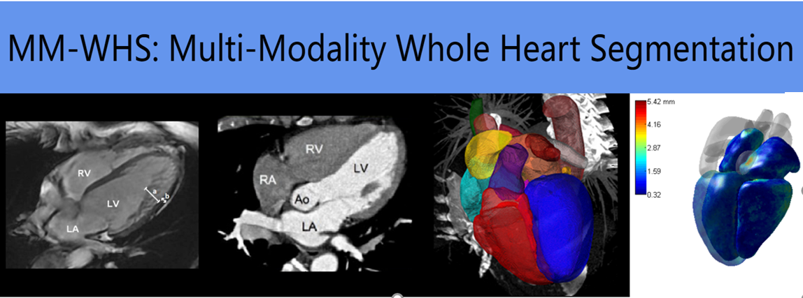
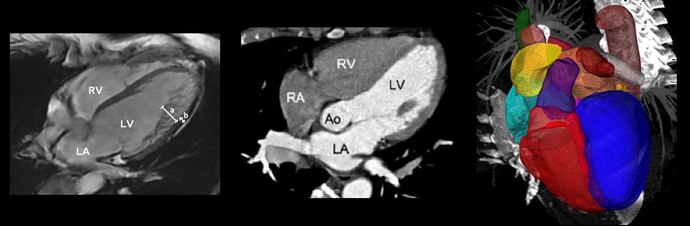
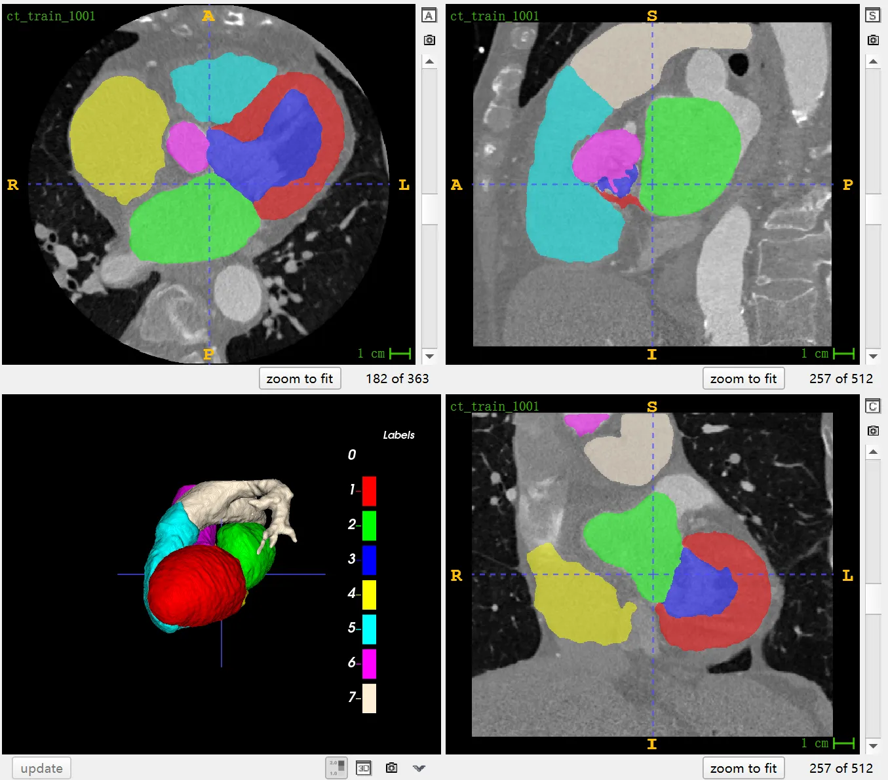
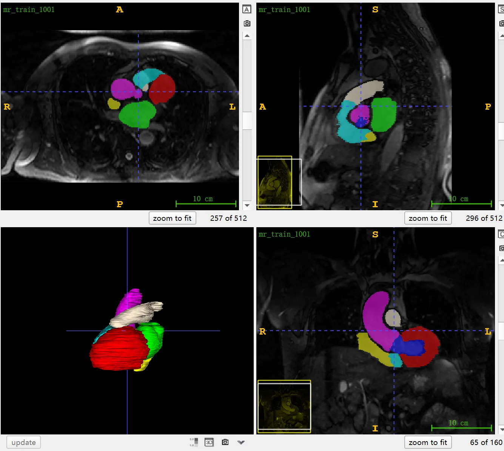

# MM-WHS

<div align="center">
    <a href="https://github.com/openmedlab/"></a>
</div>
<p style="text-align:center;font-size:10px;"><em></em></p>

## Dataset Information

The MM-WHS (Multi-Modality Whole Heart Segmentation) is a challenge from MICCAI 2017, featuring a dataset comprising a total of 120 multimodal cardiac images, which includes 60 cases of cardiac CT/CTA and 60 cases of cardiac MRI images. These images encompass the entire heart and its important substructures, all acquired in real clinical settings and used for clinical diagnosis. Due to the diverse sources of the images, their quality varies, with some images being of relatively poor quality. However, this diversity is essential for testing the robustness of algorithms in real clinical environments. The dataset is divided into a training set (with 20 CT and 20 MRI samples) and a test set (with 40 CT and 40 MRI samples). For the training set, manual segmentation annotations are provided, including seven major cardiac substructures such as the left and right ventricular cavities, left and right atrial cavities, left ventricular myocardium, ascending aorta, and pulmonary artery.

Cardiac diseases are one of the major challenges to global health, and multimodal cardiac imaging that combines the strengths of CT and MRI can present more comprehensive details of cardiac structures. Detailed segmentation of cardiac substructures is extremely valuable to clinicians, helping them to understand the characteristics of heart diseases more accurately and to develop more precise treatment plans for patients. The MM-WHS challenge offers research teams an open and fair platform to test and validate their methods in the field of multimodal whole heart segmentation. This challenge not only provides a benchmark test for various cardiac segmentation algorithms but also covers broader topics such as cardiac image segmentation, registration, and modeling, thereby promoting the development of cardiology and medical imaging.

## Dataset Meta Information

| Dimensions | Modality | Task Type | Anatomical Structures          | Anatomical Area | Number of Categories | Data Volume | File Format |
|------------|----------|-----------|--------------------------------|-----------------|----------------------|-------------|-------------|
| 3D         | CT, MR   | Segmentation | Seven cardiac substructures | Heart       | 7                    | 120         | .nii.gz     |


### Resolution Details

CT image statistics of 20 cases in the training set:

| Dataset Statistics | spacing (mm)     | size            |
|--------------------|------------------|-----------------|
| min                | (0.28, 0.28, 0.45)              | (512, 512, 177)     |
| median             | (0.44, 0.44, 0.625)          | (512, 512, 261) |
| max                | (0.59, 0.59, 0.625)              | (512, 512, 363) |

Number of 2D slices: 5,305

MR image statistics of 20 cases in the training set:

| Dataset Statistics | spacing (mm)     | size             |
|--------------------|------------------|------------------|
| min                | (0.78, 0.78, 0.90)              | (256, 256, 112)  |
| median             | (0.97, 0.97, 1.05)          | (288, 288, 137)  |
| max                | (1.21, 1.21, 1.60)              | (512, 512, 200)  |

Number of 2D slices: 2,898

## Label Information Statistics

### CT image statistics of 20 cases in the training set:

| Label | Description           | Cases | Percentage | Min Volume (cm³) | Median Volume (cm³) | Max Volume (cm³) |
|-------|-----------------------|-------|------------|------------------|---------------------|------------------|
| 200   | LV normal myocardium  | 25    | 100.00%    | 51.73             | 87.52               | 142.19           |
| 500   | LV blood pool         | 25    | 100.00%    | 44.43             | 86.62               | 144.39           |
| 600   | RV blood pool         | 25    | 100.00%    | 51.83             | 93.55               | 200.67           |
| 1220  | LV myocardial edema   | 25    | 100.00%    | 3.71              | 18.89               | 68.44            |
| 2221  | LV myocardial scars   | 25    | 100.00%    | 3.31              | 26.1                | 63.83            |

### MR image statistics of 20 cases in the training set:

| Label | Description                        | Cases | Percentage | Min Volume (cm³) | Median Volume (cm³) | Max Volume (cm³) |
|-------|------------------------------------|-------|------------|------------------|---------------------|------------------|
| 1     | heart_left_ventricular_myocardium  | 20    | 100%        | 68.91             | 110.78             | 182.81           |
| 2     | heart_left_atrium_blood_cavity     | 20    | 100%        | 28.35             | 78.55              | 130.27           |
| 3     | heart_left_ventricle_blood_cavity  | 20    | 100%        | 29.66             | 83.02              | 150.36           |
| 4     | heart_right_atrium_blood_cavity    | 20    | 100%        | 32.87             | 75.09              | 132.8            |
| 5     | heart_right_ventricle_blood_cavity | 20    | 100%        | 61.41             | 110.76             | 195.46           |
| 6     | heart_ascending_aorta              | 20    | 100%        | 28.92             | 56.92              | 118.12           |
| 7     | pulmonary_artery                   | 20    | 100%        | 29.1              | 64.94              | 102.72           |


## Visualization


<div align="center">
    <a href="https://github.com/openmedlab/"></a>
</div>
<p style="text-align:center;font-size:10px;"><em> Official Visualization.</em></p>

<div align="center">
    <a href="https://github.com/openmedlab/"></a>
</div>
<p style="text-align:center;font-size:10px;"><em> CT ITK-SNAP Visualization.</em></p>

<div align="center">
    <a href="https://github.com/openmedlab/"></a>
</div>
<p style="text-align:center;font-size:10px;"><em> MR ITK-SNAP Visualization.</em></p>

## File Structure

The MM-WHS dataset consists of several folders: `ct_test` and `ct_train` folders contain test and training data for cardiac CT images, while `mr_test` and `mr_train` folders contain test and training data for cardiac MRI images. For the training data, each image file is accompanied by a corresponding label file, identified by the suffix `_label`. These label files contain manually segmented information on substructures of the heart. The test data, on the other hand, only includes the image files without corresponding label files. Each image file is stored in the `.nii.gz` format.

``` 
MM-WHS 2017 Dataset
│
├── ct_train
│   ├── ct_train_1001_image.nii.gz
│   ├── ct_train_1001_label.nii.gz
│   ├── ct_train_1002_image.nii.gz
│   ├── ct_train_1002_label.nii.gz
│   └── ...
│
├── ct_test
│   ├── ct_test_2001_image.nii.gz
│   ├── ct_test_2002_image.nii.gz
│   └── ...
│
├── mr_train
│   ├── mr_train_1001_image.nii.gz
│   ├── mr_train_1001_label.nii.gz
│   ├── mr_train_1002_image.nii.gz
│   ├── mr_train_1002_label.nii.gz
│   └── ...
│
└── mr_test
    ├── mr_test_2001_image.nii.gz
    ├── mr_test_2002_image.nii.gz
    └── ...
```

## Authors and Institutions

Xiahai Zhuang (Fudan University)


## Source Information

Official Website: https://zmiclab.github.io/zxh/0/mmwhs/

Download Link: https://mega.nz/folder/UNMF2YYI#1cqJVzo4p_wESv9P_pc8uA

Article Address: https://www.sciencedirect.com/science/article/pii/S1361841523001494, https://ieeexplore.ieee.org/document/8458220/, https://ieeexplore.ieee.org/document/9965747, https://ieeexplore.ieee.org/document/9921323

Publication Date: 2017

## Citation

``` 
@article{GAO2023102889,
title = {BayeSeg: Bayesian modeling for medical image segmentation with interpretable generalizability},
journal = {Medical Image Analysis},
volume = {89},
pages = {102889},
year = {2023},
issn = {1361-8415},
doi = {https://doi.org/10.1016/j.media.2023.102889},
url = {https://www.sciencedirect.com/science/article/pii/S1361841523001494},
author = {Shangqi Gao and Hangqi Zhou and Yibo Gao and Xiahai Zhuang},
keywords = {Image segmentation, Interpretation and generalization, Statistical modeling, Variational Bayes},
abstract = {Due to the cross-domain distribution shift aroused from diverse medical imaging systems, many deep learning segmentation methods fail to perform well on unseen data, which limits their real-world applicability. Recent works have shown the benefits of extracting domain-invariant representations on domain generalization. However, the interpretability of domain-invariant features remains a great challenge. To address this problem, we propose an interpretable Bayesian framework (BayeSeg) through Bayesian modeling of image and label statistics to enhance model generalizability for medical image segmentation. Specifically, we first decompose an image into a spatial-correlated variable and a spatial-variant variable, assigning hierarchical Bayesian priors to explicitly force them to model the domain-stable shape and domain-specific appearance information respectively. Then, we model the segmentation as a locally smooth variable only related to the shape. Finally, we develop a variational Bayesian framework to infer the posterior distributions of these explainable variables. The framework is implemented with neural networks, and thus is referred to as deep Bayesian segmentation. Quantitative and qualitative experimental results on prostate segmentation and cardiac segmentation tasks have shown the effectiveness of our proposed method. Moreover, we investigated the interpretability of BayeSeg by explaining the posteriors and analyzed certain factors that affect the generalization ability through further ablation studies. Our code is released via https://zmiclab.github.io/projects.html.}
}

@ARTICLE{8458220,
  author={Zhuang, Xiahai},
  journal={IEEE Transactions on Pattern Analysis and Machine Intelligence}, 
  title={Multivariate Mixture Model for Myocardial Segmentation Combining Multi-Source Images}, 
  year={2019},
  volume={41},
  number={12},
  pages={2933-2946},
  doi={10.1109/TPAMI.2018.2869576}}

@ARTICLE{9965747,
  author={Luo, Xinzhe and Zhuang, Xiahai},
  journal={IEEE Transactions on Pattern Analysis and Machine Intelligence}, 
  title={$\mathcal {X}$-Metric: An N-Dimensional Information-Theoretic Framework for Groupwise Registration and Deep Combined Computing}, 
  year={2023},
  volume={45},
  number={7},
  pages={9206-9224},
  doi={10.1109/TPAMI.2022.3225418}}

@ARTICLE{9921323,
  author={Wu, Fuping and Zhuang, Xiahai},
  journal={IEEE Transactions on Pattern Analysis and Machine Intelligence}, 
  title={Minimizing Estimated Risks on Unlabeled Data: A New Formulation for Semi-Supervised Medical Image Segmentation}, 
  year={2023},
  volume={45},
  number={5},
  pages={6021-6036},
  doi={10.1109/TPAMI.2022.3215186}}
```

Original introduction article is [here](https://zhuanlan.zhihu.com/p/669360834).