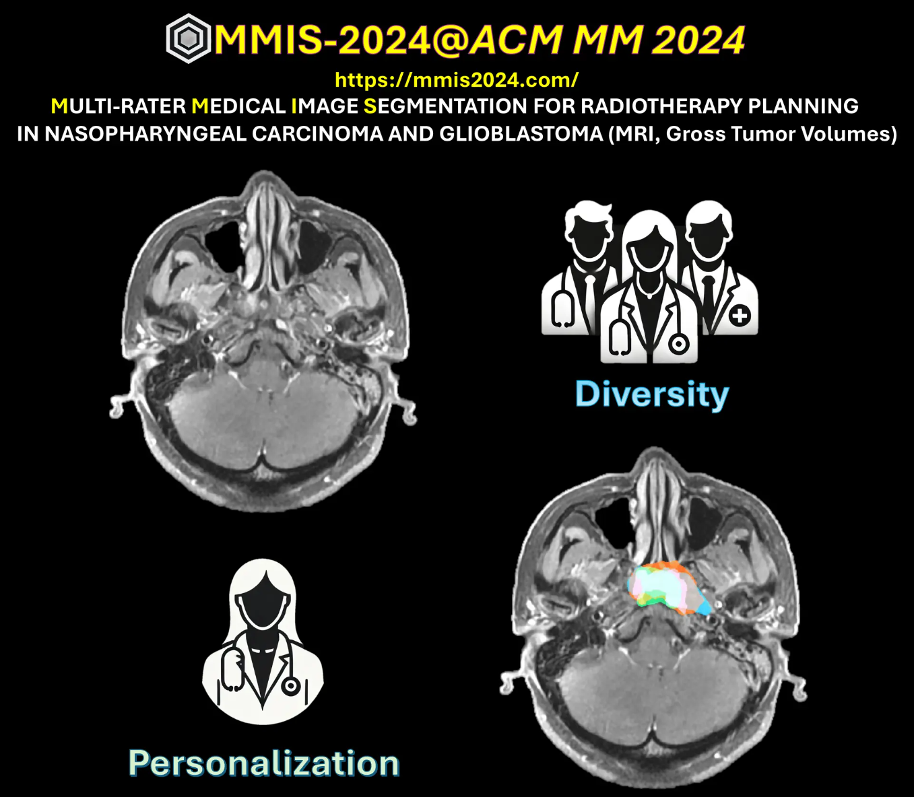

# MMIS-2024

<div align="center">
    <a href="https://github.com/openmedlab/"></a>
</div>
<p style="text-align:center;font-size:10px;"><em></em></p>

## Dataset Information

In the medical field, image segmentation inherently involves subjectivity due to data-level ambiguity and varying expert preferences. These factors lead to different interpretations of the same target, limiting the application of AI models in clinical settings. The MMIS-2024 challenge invites researchers to address the multi-rater problem by focusing on segmenting diverse and personalized gross tumor volumes (GTVs) from MRI data, which is crucial for radiotherapy planning for nasopharyngeal carcinoma and glioblastoma. 

Diverse segmentation provides a comprehensive view of potential interpretations, capturing the full range of expert opinions and enhancing the robustness of AI models in clinical decision-making. This approach ensures that critical variations in interpretations are not overlooked, which is especially valuable in complex cases. On the other hand, personalized segmentation tailors results to align with the specific preferences and methodologies of individual clinicians, resulting in more relevant treatment plans and reducing clinicians' workload. 

In clinical applications, these methods support improved radiotherapy planning by accommodating the variability of expert assessments and the need for personalized treatment strategies.

<div align="center">
    <a href="https://github.com/openmedlab/"></a>
</div>
<p style="text-align:center;font-size:10px;"><em></em></p>

## Task Introduction

**Task 1**  
Three types of MRI sequences (T1, T2, and T1 contrast-enhanced) are provided, with different sequences of a single sample rigidly registered to a common subject space. For each sample, four experienced radiologists from different locations (each with approximately 5-10 years of experience) independently annotated the GTV (gross tumor volume) for nasopharyngeal carcinoma. We divided the 170 subjects into training, validation, and test sets, with 100, 20, and 50 subjects, respectively.

**Task 2**  
An imaging dataset for glioblastoma was compiled from three publicly available repositories (LUMIERE, RHUH, and UPENN-GBM), including post-operative and recurrent MRI scans. Each MRI study consists of four sequences: T1-weighted, T2-weighted, FLAIR, and gadolinium-enhanced T1-weighted. Four annotators (two radiation oncologists and two radiology residents) segmented the tumor on the T1 contrast-enhanced sequence. The training set includes 120 scans evenly distributed among the annotators, with each annotator responsible for 30 scans. The validation set includes an additional 20 scans, each annotated by all annotators.

## Model Evaluation

For evaluation, the methods outlined in references [1] and [2] are followed to assess multi-rater medical image segmentation. Overall, the segmentation results are evaluated from two perspectives:

1. **Diversity Performance**: This is assessed by comparing the similarity between the result set and the label set using the GED score, Dice soft score, and two set-level metrics, DiceMatch and DiceMax.
   
2. **Personalized Performance**: The Dice score is calculated for each individual expert, and the average of these scores is used as the final metric.

For each task, the final ranking will be determined using a composite score based on these metrics.

References:
- [1] Luo, X., Liao, W., He, Y., Tang, F., Wu, M., Shen, Y., Huang, H., Song, T., Li, K., Zhang, S., et al.: Deep learning-based accurate delineation of primary gross tumor volume of nasopharyngeal carcinoma on heterogeneous magnetic resonance imaging: A large-scale and multi-center study. Radiotherapy and Oncology 180, 109480 (2023)

- [2] Wu, Y., Luo, X., Xu, Z., Guo, X., Ju, L., Ge, Z., Liao, W., Cai, J.: Diversified and personalized multi-rater medical image segmentation. In: Proceedings of the IEEE/CVF Conference on Computer Vision and Pattern Recognition (CVPR). pp. 11470–11479 (June 2024)
- 
## Dataset Meta Information

| Dimensions | Modality | Task Type    | Anatomical Structures | Anatomical Area      | Number of Categories | Data Volume            | File Format  |
|------------|----------|--------------|-----------------------|----------------------|----------------------|------------------------|--------------|
| 4D         | MRI      | Segmentation | Gross tumor           | Nasopharynx & Brain  | 2                    | task1: 170, task2: 140 | .h5, .nii.gz |


### Resolution Details

| Dataset Statistics | spacing (mm)        | size             |
|--------------------|---------------------|------------------|
| min                | (0.34, 0.34, 0.60)  | (192, 256, 24)   |
| median             | (0.98, 0.98, 1.00)  | (256, 256, 160)  |
| max                | (1.00, 1.00, 6.00)  | (512, 512, 252)  |

## Label Information Statistics

| Metric               | Tumor |
|----------------------|-------|
| Case Count           | 120   |
| Coverage             | 100%  |
| Min Volume (cm³)     | 0.01  |
| Median Volume (cm³)  | 3.91  |
| Max Volume (cm³)     | 18.56 |

## File Structure

``` 
Dataset
│
├── MMIS2024TASK1
│   ├── training
│   │   ├── Sample_0.h5
│   │   ├── Sample_1.h5
│   │   ├── ...
│   ├── training_2d
│   │   ├── Sample_0_slice_0.h5
│   │   ├── Sample_0_slice_1.h5
│   │   ├── ...
│   ├── validation
│   │   ├── Sample_0.h5
│   │   ├── Sample_1.h5
│   │   ├── ...
├── MMIS2024TASK2_train
│   ├── Annotator_1
│   │   ├── Patient-018 week-034
│   │   │    ├── CT1.nii.gz
│   │   │    ├── CT1_seg.nii.gz
│   │   │    ├── FLAIR.nii.gz
│   │   │    ├── T1.nii.gz
│   │   │    ├── T2.nii.gz
│   │   ├── RHUH-0002
│   │   │    ├── RHUH-0002_2_flair.nii.gz
│   │   │    ├── RHUH-0002_2_t1.nii.gz
│   │   │    ├── RHUH-0002_2_t1ce.nii.gz
│   │   │    ├── RHUH-0002_2_t1ce_seg.nii.gz
│   │   │    ├── RHUH-0002_2_t2.nii.gz
│   │   ├── UPENN-GBM-00052_21
│   │   │    ├── UPENN-GBM-00052_21_FLAIR.nii
│   │   │    ├── UPENN-GBM-00052_21_T1.nii.gz
│   │   │    ├── UPENN-GBM-00052_21_T1GD.nii.gz
│   │   │    ├── UPENN-GBM-00052_21_T1GD_seg.nii.gz
│   │   │    ├── UPENN-GBM-00052_21_T2.nii.gz
│   ├── Annotator_2
│   ├── ...
├── MMIS2024TASK2_test
│   ├── Sample_0
│   │   ├── FLAIR.nii.gz
│   │   ├── T1.nii.gz
│   │   ├── T1contrast.nii.gz
│   │   ├── T2.nii.gz
│   ├── Sample_1
│   ├── ...
```

## Authors and Institutions

### Organizer Team

Yicheng Wu, Monash University, Australia

Yutong Xie, Australian Institute for Machine Learning (AIML), University of Adelaide, Australia

Xiangde Luo, Sichuan Cancer Hospital & Institute, Sichuan Cancer Center, China.

### Clinician Team

Wenjun Liao, Sichuan Cancer Hospital & Institute, Sichuan Cancer Center, China.

Minh-Son To, Flinders Health and Medical Research Institute, Flinders University, Australia

Peter Gorayski, Australian Bragg Centre for Proton Therapy, South Australia Health and Medical Research Institute, Australia

Hien Le, Australian Bragg Centre for Proton Therapy, South Australia Health and Medical Research Institute, Australia

### Advisor Team

Jianfei Cai, Monash University, Australia

Qi Wu, Australian Institute for Machine Learning (AIML), University of Adelaide, Australia

Weidong Cai, University of Sydney, Australia

Zhaolin Chen, Monash University, Australia

Yong Xia, Northwestern Polytechnical University, China

### Contributors

Siqi Chen, Australian Institute for Machine Learning (AIML), University of Adelaide, Australia

Zihao Tang, University of Sydney, Australia

## Source Information

Official Website: https://mmis2024.com/

Download Link: https://mmis2024.com/

Article Address: TBD

Publication Date: 2024-07

## Citation

``` 
@misc{mmis2024,
  author = {Wu, Yicheng and Xie, Yutong and Luo, Xiangde and others},
  title = {MMIS-2024@ACM MM 2024: Multi-rater Medical Image Segmentation for Radiotherapy Planning in Nasopharyngeal Carcinoma and Glioblastoma},
  howpublished = {Web Page},
  url = {https://mmis2024.com/},
  year = {2024},
  note = {Accessed: 2024-07-28}
}
```

Original introduction article is [here](https://zhuanlan.zhihu.com/p/660179601).
