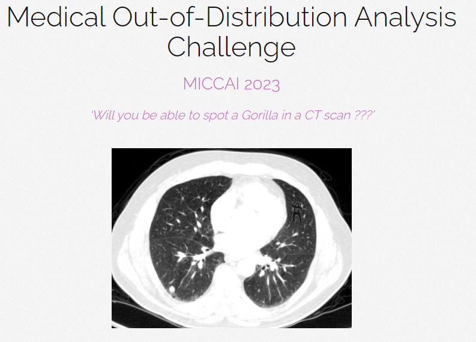
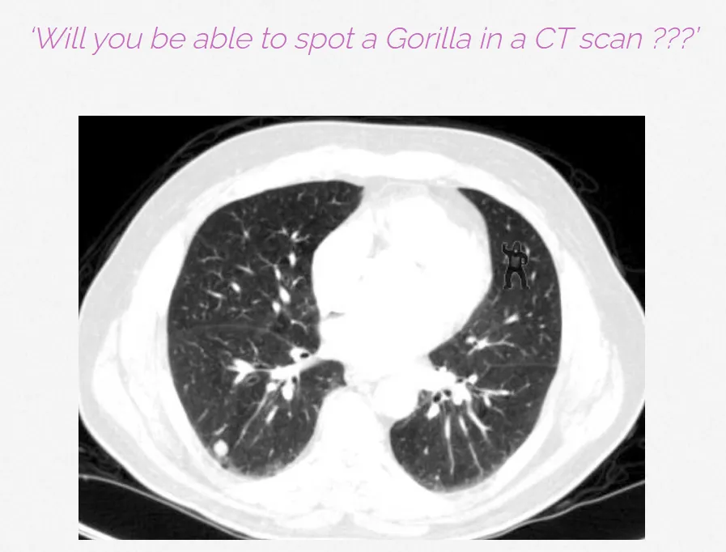

# MOOD 2023

<div align="center">
    <a href="https://github.com/openmedlab/"></a>
</div>
<p style="text-align:center;font-size:10px;"><em></em></p>

## Dataset Information

This part is introduction and summarization of the dataset.

## Dataset Meta Information

| Dimensions | Modality | Task Type      | Anatomical Structures | Anatomical Area | Number of Categories | Data Volume | File Format |
|------------|----------|----------------|-----------------------|-----------------|----------------------|-------------|-------------|
| 3D         | CT, MR   | OOD Prediction | None                  | brain, abdomen  | 1                    | 1300        | .nii.gz     |


### Resolution Details

The images have been standardized and cropped, with all sizes being either 256 x 256 x 256 or 512 x 512 x 512.

## Visualization

<div align="center">
    <a href="https://github.com/openmedlab/"></a>
</div>
<p style="text-align:center;font-size:10px;"><em> OOD example.</em></p>

The image above is an official sample image. It's worth noting that the image actually hides a picture of a chimpanzee (in the top right corner of the lung area), which fits well with the task of Out-Of-Distribution (OOD) detection.

## File Structure

In addition to the official data, the official also provides toy dataset download. The overall file structure is as follows:

``` 
Dataset
│
├── brain
│   ├── brain_train
│   │   ├── xxx.nii.gz
│   │   ├── ...
│   │   ├── xxx.nii.gz
│   ├── toy
│   ├── toy_label
├── abdom
│   ├── abdom_train
│   │   ├── xxx.nii.gz
│   │   ├── ...
│   │   ├── xxx.nii.gz
│   ├── toy
│   ├── toy_label
```

## Authors and Institutions

David Zimmerer (German Cancer Research Center)

Jens Petersen (German Cancer Research Center)

Gregor Köhler (German Cancer Research Center)

Paul Jäger (German Cancer Research Center)

Peter Full (German Cancer Research Center)

Klaus Maier-Hein (German Cancer Research Center)

Tobias Roß (German Cancer Research Center)

Tim Adler (German Cancer Research Center)

Annika Reinke (German Cancer Research Center)

Lena Maier-Hein (German Cancer Research Center)


## Source Information

Official Website: http://medicalood.dkfz.de/web/

Download Link: http://medicalood.dkfz.de/BzlSoOiDmh/dd.html

Article Address: TBD

Publication Date: 2023-04

## Citation

``` 
@article{zimmerer2022mood,
title={MOOD 2020: A public Benchmark for Out-of-Distribution Detection and Localization on medical Images},
author={Zimmerer, David and Full, Peter M and Isensee, Fabian and J{\"a}ger, Paul and Adler, Tim and Petersen, Jens and K{\"o}hler, Gregor and Ross, Tobias and Reinke, Annika and Kascenas, Antanas and others},
journal={IEEE Transactions on Medical Imaging},
volume={41},
number={10},
pages={2728--2738},
year={2022},
publisher={IEEE}
} 
```

Original introduction article is [here](https://zhuanlan.zhihu.com/p/664563925).