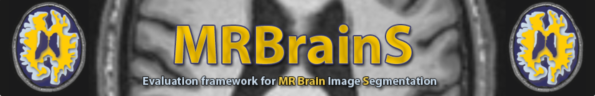

# MRBrains13

<div align="center">
    <a href="https://github.com/openmedlab/"></a>
</div>
<p style="text-align:center;font-size:10px;"><em></em></p>

## Dataset Information

MRBrains13 is a publicly available brain image segmentation dataset. This dataset provides brain 3T-MR images of high image quality, with the goal of segmenting anatomical structures such as gray matter, white matter, and cerebrospinal fluid in brain MR images. Additionally, the dataset offers multi-sequence MR images, including fully annotated T1-weighted, T1-weighted inversion recovery sequences, and FLAIR MR images. Each sequence includes 20 cases. Masks of these anatomical structures were annotated by experts and reviewed and corrected by other experts not involved in the initial annotation process. The dataset includes 5 cases for training and 15 for testing, with the testing set not providing annotated results.

Accurately segmenting brain structures such as gray matter, white matter, and cerebrospinal fluid is crucial for analyzing and diagnosing brain diseases. To alleviate the burden on doctors and improve segmentation accuracy, there is a growing need to develop semi-automatic or fully automatic algorithms for brain anatomical structure segmentation. Additionally, high-field (3T) multi-sequence MRI data is increasingly common in clinical settings. The dataset's provision of annotated brain segmentations in 3T multi-sequence MR images helps in developing medical image analysis algorithms that can be applied to high-field multi-sequence data, which is very important for advancing the medical imaging community.

## Dataset Meta Information

| Dimensions | Modality            | Task Type    | Anatomical Structures                           | Anatomical Area | Number of Categories | Data Volume | File Format |
|------------|---------------------|--------------|-------------------------------------------------|-----------------|----------------------|-------------|-------------|
| 3D         | MR: T1, T1IR, FLAIR | Segmentation | Gray matter, white matter, cerebrospinal fluid  | Brain           | 3                    | 20          | .nii        |


### Resolution Details

Only 5 cases in the training set are counted.

| Dataset Statistics | spacing (mm)           | size          |
|--------------------|------------------------|---------------|
| min                | (0.95833,0.95833,3.00) | (240,240,48)  |
| median             | (0.95833,0.95833,3.00) | (240,240,48)  |
| max                | (0.95833,0.95833,3.00) | (240,240,48)  |

Number of 2D slices in the dataset: 720.

## Label Information Statistics

Multiple sequence images share one annotation result, so there are only 5 annotation masks in total

| Segmented Tissue         | Skull    | Lung      | Spleen    |
|--------------------------|----------|-----------|-----------|
| Number of Instances      | 5        | 5         | 5         |
| Percentage of Occurrence | 100.00%  | 100.00%   | 100.00%   |
| Minimum Volume (cm³)     | 355.22   | 451.13    | 289.48    |
| Median Volume (cm³)      | 408.99   | 475.25    | 358.72    |
| Maximum Volume (cm³)     | 452.06   | 601.03    | 379.54    |


## Visualization

As shown in the figure, the dataset visualization and three-dimensional structure are displayed, where red indicates gray matter, green indicates white matter, and blue indicates cerebrospinal fluid.

<div align="center">
    <a href="https://github.com/openmedlab/"></a>
</div>
<p style="text-align:center;font-size:10px;"><em></em></p>

## File Structure

``` 
MRBrainS13DataNii
│
├── TestData
│   ├── 1
│   │   ├── T1_1mm.nii
│   │   ├── T1_IR.nii
│   │   ├── T1.nii
│   │   └── T2_FLAIR.nii
│   ├── 2
│   │   ├── T1_1mm.nii
│   │   ├── T1_IR.nii
│   │   ├── T1.nii
│   │   └── T2_FLAIR.nii
│   ├── 3
│       ├── T1_1mm.nii
│       ├── T1_IR.nii
│       ├── T1.nii
│       └── T2_FLAIR.nii
│   └── ...
│
├── TrainingData
│   ├── 1
│   │   ├── LabelsForTesting.nii
│   │   ├── LabelsForTraining.nii
│   │   ├── T1_1mm.nii
│   │   ├── T1_IR.nii
│   │   ├── T1.nii
│   │   └── T2_FLAIR.nii
│   ├── 2
│   │   ├── LabelsForTesting.nii
│   │   ├── LabelsForTraining.nii
│   │   ├── T1_1mm.nii
│   │   ├── T1_IR.nii
│   │   ├── T1.nii
│   │   └── T2_FLAIR.nii
│   ├── 3
│       ├── LabelsForTesting.nii
│       ├── LabelsForTraining.nii
│       ├── T1_1mm.nii
│       ├── T1_IR.nii
│       ├── T1.nii
│       └── T2_FLAIR.nii
│   └── ...
│
└── ...
```

## Authors and Institutions

Adrienne Mendrik (Image Sciences Institute, University Medical Center Utrecht, Netherlands)

Geert Jan Biessels (Department of Neurology, University Medical Center Utrecht, Netherlands)

Hugo Kuijf (Image Sciences Institute, University Medical Center Utrecht, Netherlands)

Koen Vincken (Image Sciences Institute, University Medical Center Utrecht, Netherlands)

Max Viergever (Image Sciences Institute, University Medical Center Utrecht, Netherlands)

## Source Information

Official Website: https://mrbrains13.isi.uu.nl/index.html

Download Link: https://mrbrains13.isi.uu.nl/index.html

Article Address: https://onlinelibrary.wiley.com/doi/full/10.1155/2015/813696

Publication Date: 2013

## Citation

``` 
@article{mendrik2015mrbrains,
  title={MRBrainS challenge: online evaluation framework for brain image segmentation in 3T MRI scans},
  author={Mendrik, Adri{\"e}nne M and Vincken, Koen L and Kuijf, Hugo J and Breeuwer, Marcel and Bouvy, Willem H and De Bresser, Jeroen and Alansary, Amir and De Bruijne, Marleen and Carass, Aaron and El-Baz, Ayman and others},
  journal={Computational intelligence and neuroscience},
  volume={2015},
  number={1},
  pages={813696},
  year={2015},
  publisher={Wiley Online Library}
}
```

Original introduction article is [here](https://zhuanlan.zhihu.com/p/707917182).