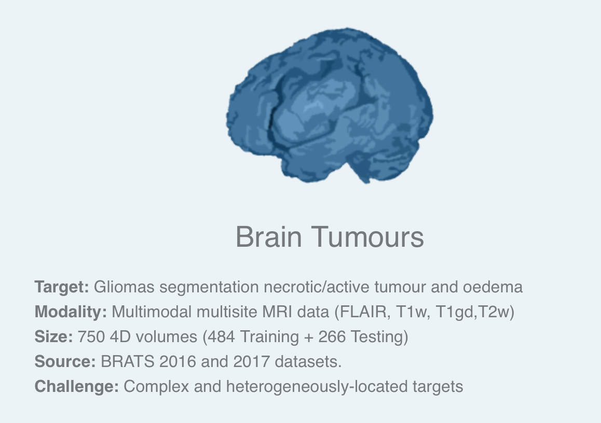
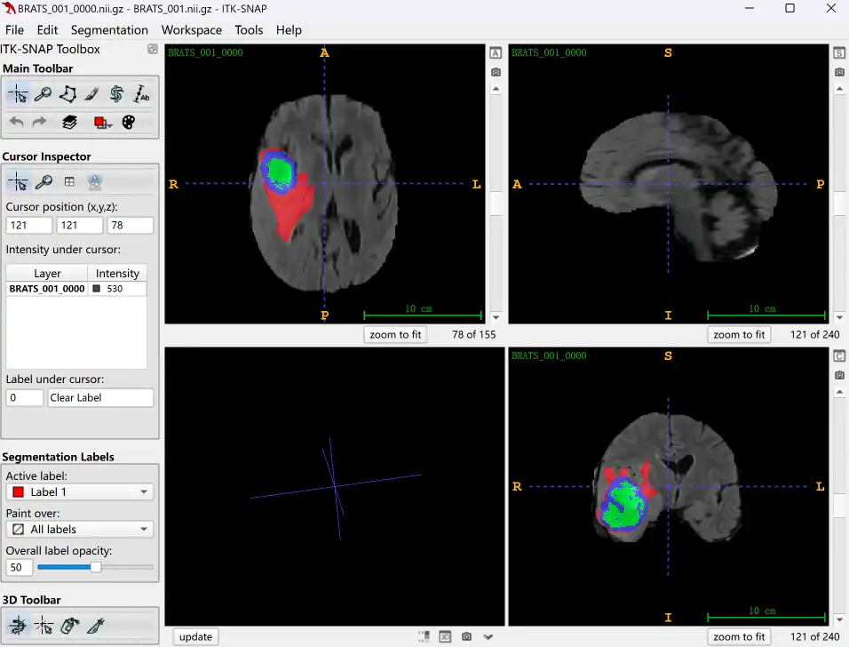

# MSD Brain

<div align="center">
    <a href="https://github.com/openmedlab/"></a>
</div>
<p style="text-align:center;font-size:10px;"><em></em></p>

## Dataset Information

The **MSD Brain dataset** is Task01 of the Medical Segmentation Decathlon (MSD), focusing on segmenting three tumor sub-regions from multi-parametric magnetic resonance images, specifically the edema, enhancing, and non-enhancing regions. The used sequences include native T1-weighted (T1), Gadolinium (Gd) enhanced T1-weighted (T1-Gd), native T2-weighted (T2), and T2 Fluid Attenuated Inversion Recovery (FLAIR). MSD selected this dataset due to the challenge of "locating these complex and heterogeneously distributed targets". The dataset consists of MR images from patients diagnosed with glioblastoma or low-grade glioma, officially divided into 484 training cases and 266 test cases. The test cases can be evaluated by submitting segmentation results via the official website. This dataset includes **cases identical to those from the 2016 and 2017 Brain Tumor Segmentation (BraTS) challenges**, with filenames altered to prevent participants from mapping cases between the two challenges.

## Dataset Meta Information

| Dimensions | Modality | Task Type    | Anatomical Structures | Anatomical Area | Number of Categories | Data Volume                       | File Format |
|------------|----------|--------------|-----------------------|-----------------|----------------------|-----------------------------------|-------------|
| 3D         | mpMR     | Segmentation | Glioma                | Head            | 3                    | 484 for train, 266 for validation | .nii.gz     |


### Resolution Details

The spacing and size of all images in the dataset have been preprocessed to be uniform.

| Dataset Statistics | spacing (mm)    | size            |
|--------------------|-----------------|-----------------|
| min                | (1.0, 1.0, 1.0) | (240, 240, 155) |
| median             | (1.0, 1.0, 1.0) | (240, 240, 155) |
| max                | (1.0, 1.0, 1.0) | (240, 240, 155) |

Number of 2D slices in the 484 training cases: 300080 (75,020 × 4).

## Label Information Statistics

| Category     | ET (Enhancing Tumor) | ED (Peritumoral Edema) | NCR (Necrotic Core) |
|--------------|----------------------|------------------------|---------------------|
| Cases        | 484                  | 484                    | 472                 |
| Availability | 100%                 | 100%                   | 97.52%              |
| Minimum Size (cm³) | 3.68          | 0.05                   | 0.01                |
| Median Size (cm³)  | 54.19         | 11.7                   | 15.35               |
| Maximum Size (cm³) | 216.1         | 114.5                  | 116.73              |

Here are the categories defined:

- ET (Enhancing Tumor): The enhanced tumor visible on post-contrast T1-weighted images.
- ED (Peritumoral Edema): The surrounding area of swelling depicted on T2/FLAIR images.
- NCR (Necrotic Core): Non-enhancing tumor core usually seen on T1-weighted images post-contrast as necrotic or non-enhancing tumor parts.

## Visualization

<div align="center">
    <a href="https://github.com/openmedlab/"></a>
</div>
<p style="text-align:center;font-size:10px;"><em> ITK-SNAP Visualization.</em></p>

## File Structure

The official file structure provided is as follows. It contains three main folders: `imagesTr`, `labelsTr`, and `imagesTs`, which are used to store training images, training labels, and test images, respectively. In addition, there is a file named `dataset.json`, responsible for storing metadata of the dataset, such as modality and categories.


``` 
Task01_BrainTumour
│
├── imagesTr
│   ├── BRATS_001.nii.gz
│   └── ...
├── labelsTr
│   ├── BRATS_001.nii.gz
│   └── ...
├── imagesTs
│   ├── BRATS_485.nii.gz
│   └── ...
└── dataset.json
```

## Authors and Institutions

Bennett Landman (Technical University of Munich, Germany)

Spyridon Bakas (University of Pennsylvania, USA)

## Source Information

Official Website: http://medicaldecathlon.com/

Download Link: https://drive.google.com/drive/folders/1HqEgzS8BV2c7xYNrZdEAnrHk7osJJ--2?usp=sharing

Article Address: https://www.nature.com/articles/s41467-022-30695-9, https://arxiv.org/abs/1902.09063

Publication Date: 2019-02.

## Citation

``` 
@article{antonelli2022medical,
  title={The Medical Segmentation Decathlon},
  author={Antonelli, Michela and Reinke, Annika and Bakas, Spyridon and others},
  journal={Nature Communications},
  year={2022}, 
  doi={10.1038/s41467-022-30695-9}
}

@misc{simpson2019large,
      title={A large annotated medical image dataset for the development and evaluation of segmentation algorithms}, 
      author={Amber L. Simpson and Michela Antonelli and Spyridon Bakas and Michel Bilello and Keyvan Farahani and Bram van Ginneken and Annette Kopp-Schneider and Bennett A. Landman and Geert Litjens and Bjoern Menze and Olaf Ronneberger and Ronald M. Summers and Patrick Bilic and Patrick F. Christ and Richard K. G. Do and Marc Gollub and Jennifer Golia-Pernicka and Stephan H. Heckers and William R. Jarnagin and Maureen K. McHugo and Sandy Napel and Eugene Vorontsov and Lena Maier-Hein and M. Jorge Cardoso},
      year={2019},
      eprint={1902.09063},
      archivePrefix={arXiv},
      primaryClass={cs.CV}
}
```

Original introduction article is [here](https://zhuanlan.zhihu.com/p/708543999).