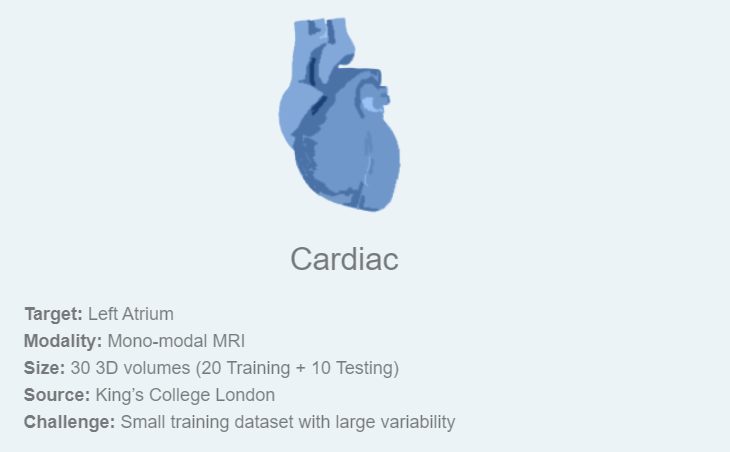
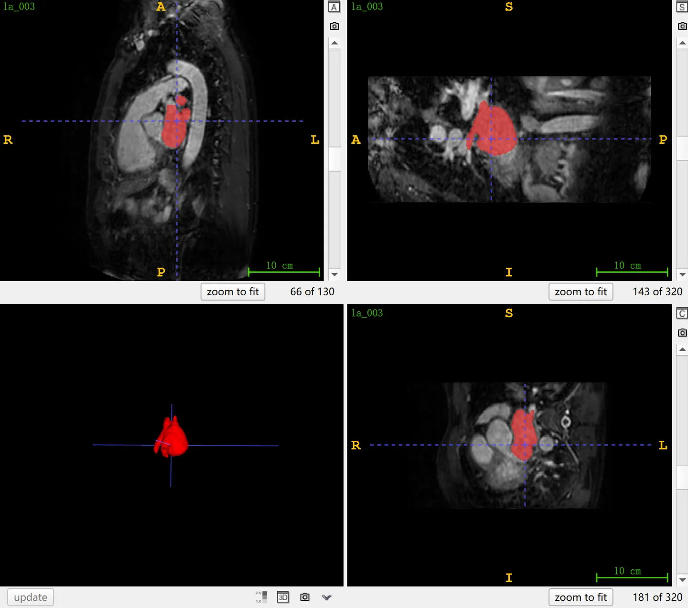

# MSD Cardiac

<div align="center">
    <a href="https://github.com/openmedlab/"></a>
</div>
<p style="text-align:center;font-size:10px;"><em></em></p>

## Dataset Information

The **MSD Cardiac dataset**, also known as MSD Heart, is the second sub-task (Task02) of the Medical Segmentation Decathlon (MSD), with the goal of segmenting the left atrium from single-modality MR images. The dataset was chosen for the MSD due to "the small amount of training data but large variability." The dataset includes MR images from 30 patients, divided by the officials into 20 cases for the training set and 10 cases for the test set. Test results can be submitted through the official website for evaluation.

The heart is the core organ of the human circulatory system, responsible for pumping blood throughout the body. The left atrium, as one of the main chambers of the heart, plays a critical role in receiving oxygenated blood from the lungs and delivering it to the left ventricle, which then pumps it into the systemic circulation. Magnetic Resonance Imaging (MRI) can clearly delineate the structure of the left atrium, which is crucial for detecting cardiac diseases such as atrial fibrillation. Accurate segmentation of the left atrium helps doctors assess the size, shape, and functional status of the atrium, which in turn allows for more accurate diagnosis and treatment planning for cardiac diseases.

## Dataset Meta Information

| Dimensions | Modality | Task Type | Anatomical Structures          | Anatomical Area | Number of Categories | Data Volume | File Format |
|------------|----------|-----------|--------------------------------|-----------------|----------------------|-------------|-------------|
| 3D         | MR       | Segmentation | atrium | Chest           | 1                    | 30          | .nii.gz     |


### Resolution Details

| Dataset Statistics | spacing (mm)        | size             |
|--------------------|---------------------|------------------|
| min                | (1.25, 1.25, 1.37)  | (320, 320, 90)   |
| median             | (1.25, 1.25, 1.37)  | (320, 320, 115)  |
| max                | (1.25, 1.25, 1.37)  | (320, 320, 130)  |

Number of 2D slices: 2,271 (based on 20 examples of training set statistics)

## Label Information Statistics

| Structure   | Left Atrium |
|-------------|-------------------|
| Case Count  | 20                |
| Percentage  | 100%              |
| Min Volume (cm³) | 69          |
| Median Volume (cm³) | 98          |
| Max Volume (cm³) | 146         |


## Visualization

<div align="center">
    <a href="https://github.com/openmedlab/"></a>
</div>
<p style="text-align:center;font-size:10px;"><em> ITK-SNAP Visualization. Red: left atrium.</em></p>

## File Structure

The official file structure provided is as follows. It contains three main folders: `imagesTr`, `labelsTr`, and `imagesTs`, which are used to store training images, training labels, and test images, respectively. In addition, there is a file named `dataset.json`, responsible for storing metadata of the dataset, such as modality and categories.

``` 
Task02_Heart
│
├── imagesTr
│   ├── la_003.nii.gz
│   └── ...
├── labelsTr
│   ├── la_003.nii.gz
│   └── ...
├── imagesTs
│   ├── la_001.nii.gz
│   └── ...
└── dataset.json
```

## Authors and Institutions

M. Jorge Cardoso (King's College London, UK)


## Source Information

Official Website: http://medicaldecathlon.com/

Download Link: https://drive.google.com/drive/folders/1HqEgzS8BV2c7xYNrZdEAnrHk7osJJ--2?usp=sharing

Article Address: https://www.nature.com/articles/s41467-022-30695-9, https://arxiv.org/abs/1902.09063

Publication Date: 2019-02.

## Citation

``` 
@article{antonelli2022medical,
  title={The Medical Segmentation Decathlon},
  author={Antonelli, Michela and Reinke, Annika and Bakas, Spyridon and others},
  journal={Nature Communications},
  year={2022}, 
  doi={10.1038/s41467-022-30695-9}
}

@misc{simpson2019large,
      title={A large annotated medical image dataset for the development and evaluation of segmentation algorithms}, 
      author={Amber L. Simpson and Michela Antonelli and Spyridon Bakas and Michel Bilello and Keyvan Farahani and Bram van Ginneken and Annette Kopp-Schneider and Bennett A. Landman and Geert Litjens and Bjoern Menze and Olaf Ronneberger and Ronald M. Summers and Patrick Bilic and Patrick F. Christ and Richard K. G. Do and Marc Gollub and Jennifer Golia-Pernicka and Stephan H. Heckers and William R. Jarnagin and Maureen K. McHugo and Sandy Napel and Eugene Vorontsov and Lena Maier-Hein and M. Jorge Cardoso},
      year={2019},
      eprint={1902.09063},
      archivePrefix={arXiv},
      primaryClass={cs.CV}
}
```

Original introduction article is [here](https://zhuanlan.zhihu.com/p/666170466).